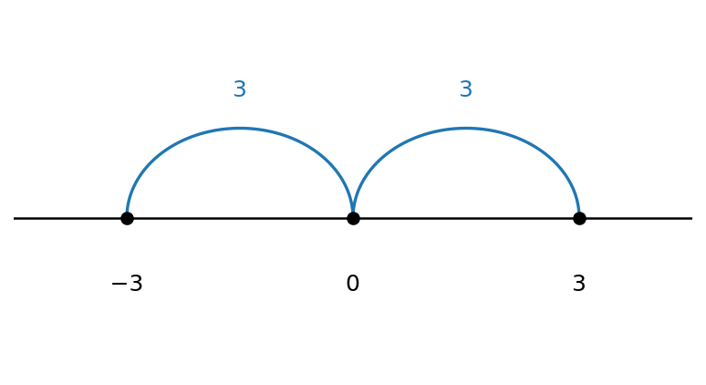
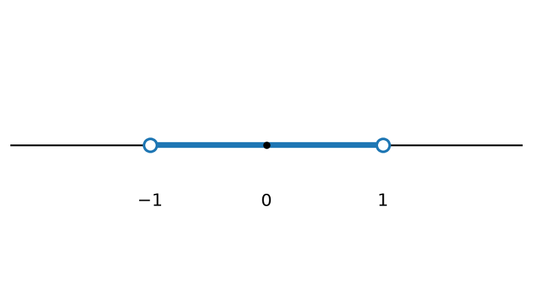
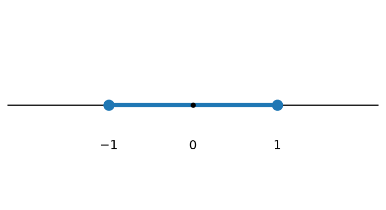
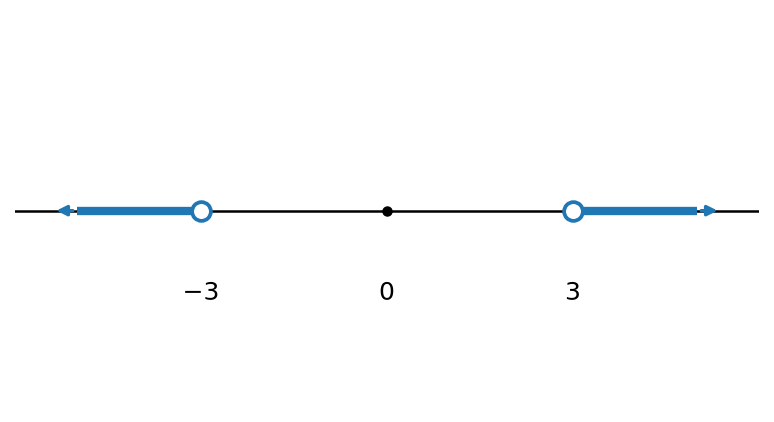
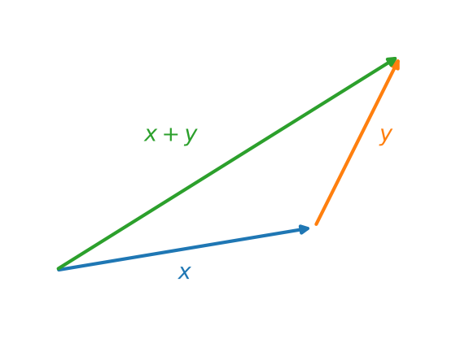
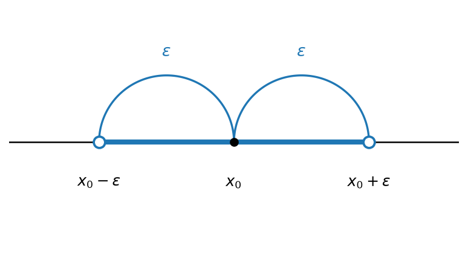

# ערך מוחלט וקטעים {chapter="4"}

## קטעים

::: {#box-def-interval .thmdef}
יהיו $a, b \in \mathbb{R}$ המקיימים $.a \leq b$ נגדיר את ארבע הקבוצות הבאות:

$$\left(a,\ b\right) = \left\{x \in \mathbb{R} \mid a < x < b\right\}
\qquad
\left[a,\ b\right] = \left\{x \in \mathbb{R} \mid a \leq x \leq b\right\}$$

$$\left[a,\ b\right) = \left\{x \in \mathbb{R} \mid a \leq x < b\right\}
\qquad
\left(a,\ b\right] = \left\{x \in \mathbb{R} \mid a < x \leq b\right\}$$

הראשונה נקראת **קטע פתוח**, השנייה **קטע סגור**, ושתי האחרונות **קטעים חצי-פתוחים**. המספרים $a$ ו-$b$ נקראים **קצות** הקטע.
:::

::: {#box-def-unbounded-interval .thmdef}
בסימון דומה נגדיר גם קטעים אינסופיים:

$$\left(a,\ \infty\right) = \left\{x \in \mathbb{R} \mid x > a\right\}
\qquad
\left[a,\ \infty\right) = \left\{x \in \mathbb{R} \mid x \geq a\right\}$$

$$\left(-\infty,\ b\right) = \left\{x \in \mathbb{R} \mid x < b\right\}
\qquad
\left(-\infty,\ b\right] = \left\{x \in \mathbb{R} \mid x \leq b\right\}$$

וכן $.\left(-\infty,\ \infty\right) = \mathbb{R}$
:::

## ערך מוחלט


::: {#box-def-absolute-value .thmdef}
לכל מספר $x$ ממשי, הערך המוחלט של $x$ מסומן ומוגדר ע"י: $$|x| =
\begin{cases}
x & : x \geq 0 \\
-x & : x < 0
\end{cases}$$
:::

::: {#box-exm-abs-values .thmexm}
$$|5| = 5, \quad |-3| = 3$$
:::

ערך מוחלט של $x$ זה המרחק של $x$ מ-$0$, ולכן אין שלילי במרחק.

::::: {#box-exm-abs-distance .thmexm}
$$|-3| = |3| = 3$$

```{python}
#| echo: false
#| output: false
import numpy as np
import matplotlib.pyplot as plt

fig, ax = plt.subplots(figsize=(6.4, 3.4))

# number line
ax.axhline(0, color="black", lw=1.2, zorder=1)
for x in [-3, 0, 3]:
    ax.plot([x], [0], "o", color="black", ms=6, zorder=3)
    ax.annotate("", xy=(x, 0.03), xytext=(x, -0.03))
ax.text(-3, -0.22, r"$-3$", ha="center", va="top", fontsize=12)
ax.text(0, -0.22, r"$0$", ha="center", va="top", fontsize=12)
ax.text(3, -0.22, r"$3$", ha="center", va="top", fontsize=12)

# distance arcs (both sides)
th = np.linspace(0, np.pi, 100)
for (a, b) in [(-3, 0), (0, 3)]:
    cx = (a + b) / 2.0
    r = (b - a) / 2.0
    ax.plot(cx + r * np.cos(th), 0.35 * np.sin(th), color="C0", lw=1.6)
    ax.text(cx, 0.45, r"$3$", ha="center", va="bottom", fontsize=12, color="C0")

ax.set_xlim(-4.5, 4.5)
ax.set_ylim(-0.6, 0.8)
ax.axis("off")

fig.savefig("figures/c04_fig01.png", dpi=150, bbox_inches="tight")
plt.close(fig)
```

```{=latex}
\par\medskip
\noindent\beginL\hbox to \linewidth{\hss\includegraphics[width=0.62\linewidth]{figures/c04_fig01.png}\hss}\endL\par
\medskip
```

::: {.content-visible when-format="pdf" style="text-align:center"}
תרשים: ציר מספרים עם הנקודות $-3$, $0$, $3$ וקשתות "מרחק 3" משני הצדדים.
:::

::: {.content-visible when-format="html"}
{#fig-c01_fig01 width="62%" fig-align="center"}
:::
:::::

לכן המרחק בין שני מספרים $a,b \in R$ הוא: $|a-b| = |b-a|$.

::: {#box-exm-abs-no-solution .thmexm}
$$|x| = -2$$ ל-$x$ חיובי או אפס ולכן אין פתרון.
:::

::::: {#box-exm-abs-open-interval .thmexm}
$$|x| < 1$$ הקטע הפתוח: $\{x \mid -1 < x < 1\} = (-1,1)$

```{python}
#| echo: false
#| output: false
import numpy as np
import matplotlib.pyplot as plt

fig, ax = plt.subplots(figsize=(6.4, 3.4))

ax.axhline(0, color="black", lw=1.2, zorder=1)

# open interval (-1, 1): highlight segment
ax.plot([-1, 1], [0, 0], color="C0", lw=4, solid_capstyle="butt", zorder=2)

# open circles at -1 and 1
for x in [-1, 1]:
    ax.plot([x], [0], "o", ms=9, markerfacecolor="white",
            markeredgecolor="C0", markeredgewidth=1.8, zorder=3)
ax.plot([0], [0], "o", color="black", ms=4, zorder=3)

ax.text(-1, -0.18, r"$-1$", ha="center", va="top", fontsize=12)
ax.text(0, -0.18, r"$0$", ha="center", va="top", fontsize=12)
ax.text(1, -0.18, r"$1$", ha="center", va="top", fontsize=12)

ax.set_xlim(-2.2, 2.2)
ax.set_ylim(-0.5, 0.5)
ax.axis("off")

fig.savefig("figures/c04_fig02.png", dpi=150, bbox_inches="tight")
plt.close(fig)
```

```{=latex}
\par\medskip
\noindent\beginL\hbox to \linewidth{\hss\includegraphics[width=0.62\linewidth]{figures/c04_fig02.png}\hss}\endL\par
\medskip
```

::: {.content-visible when-format="pdf" style="text-align:center"}
תרשים: ציר מספרים עם נקודות פתוחות ב-$-1$ וב-$1$, והקטע הפתוח ביניהן.
:::

::: {.content-visible when-format="html"}
{#fig-c01_fig02 width="62%" fig-align="center"}
:::
:::::

::::: {#box-exm-abs-closed-interval .thmexm}
$$|x| \leq 1$$ הקטע הסגור: $\{x \mid -1 \leq x \leq 1\} = [-1,1]$

```{python}
#| echo: false
#| output: false
import numpy as np
import matplotlib.pyplot as plt

fig, ax = plt.subplots(figsize=(6.4, 3.4))

ax.axhline(0, color="black", lw=1.2, zorder=1)

# closed interval [-1, 1]: highlight segment
ax.plot([-1, 1], [0, 0], color="C0", lw=4, solid_capstyle="butt", zorder=2)

# closed (filled) circles at -1 and 1
for x in [-1, 1]:
    ax.plot([x], [0], "o", ms=9, markerfacecolor="C0",
            markeredgecolor="C0", markeredgewidth=1.8, zorder=3)
ax.plot([0], [0], "o", color="black", ms=4, zorder=3)

ax.text(-1, -0.18, r"$-1$", ha="center", va="top", fontsize=12)
ax.text(0, -0.18, r"$0$", ha="center", va="top", fontsize=12)
ax.text(1, -0.18, r"$1$", ha="center", va="top", fontsize=12)

ax.set_xlim(-2.2, 2.2)
ax.set_ylim(-0.5, 0.5)
ax.axis("off")

fig.savefig("figures/c04_fig03.png", dpi=150, bbox_inches="tight")
plt.close(fig)
```

```{=latex}
\par\medskip
\noindent\beginL\hbox to \linewidth{\hss\includegraphics[width=0.62\linewidth]{figures/c04_fig03.png}\hss}\endL\par
\medskip
```

::: {.content-visible when-format="pdf" style="text-align:center"}
תרשים: ציר מספרים עם נקודות סגורות ב-$-1$ וב-$1$, והקטע הסגור ביניהן.
:::

::: {.content-visible when-format="html"}
{#fig-c01_fig03 width="62%" fig-align="center"}
:::
:::::

::::: {#box-exm-abs-greater .thmexm}
$$|x| > 3$$ $$\{x \mid x > 3 \cup x < -3\} = (3,\infty) \cup (-\infty,-3)$$

```{python}
#| echo: false
#| output: false
import numpy as np
import matplotlib.pyplot as plt

fig, ax = plt.subplots(figsize=(6.4, 3.4))

ax.axhline(0, color="black", lw=1.2, zorder=1)

# outer rays: x < -3 and x > 3
ax.plot([-3, -5], [0, 0], color="C0", lw=4, solid_capstyle="butt", zorder=2)
ax.plot([3, 5], [0, 0], color="C0", lw=4, solid_capstyle="butt", zorder=2)

# arrowheads on the rays
ax.annotate("", xy=(-5.4, 0), xytext=(-5, 0),
            arrowprops=dict(arrowstyle="-|>", color="C0", lw=1.6))
ax.annotate("", xy=(5.4, 0), xytext=(5, 0),
            arrowprops=dict(arrowstyle="-|>", color="C0", lw=1.6))

# open circles at -3 and 3
for x in [-3, 3]:
    ax.plot([x], [0], "o", ms=9, markerfacecolor="white",
            markeredgecolor="C0", markeredgewidth=1.8, zorder=3)
ax.plot([0], [0], "o", color="black", ms=4, zorder=3)

ax.text(-3, -0.18, r"$-3$", ha="center", va="top", fontsize=12)
ax.text(0, -0.18, r"$0$", ha="center", va="top", fontsize=12)
ax.text(3, -0.18, r"$3$", ha="center", va="top", fontsize=12)

ax.set_xlim(-6, 6)
ax.set_ylim(-0.5, 0.5)
ax.axis("off")

fig.savefig("figures/c04_fig04.png", dpi=150, bbox_inches="tight")
plt.close(fig)
```

```{=latex}
\par\medskip
\noindent\beginL\hbox to \linewidth{\hss\includegraphics[width=0.62\linewidth]{figures/c04_fig04.png}\hss}\endL\par
\medskip
```

::: {.content-visible when-format="pdf" style="text-align:center"}
תרשים: ציר מספרים עם נקודות פתוחות ב-$-3$ וב-$3$, והקרניים החיצוניות מסומנות.
:::

::: {.content-visible when-format="html"}
{#fig-c01_fig04 width="62%" fig-align="center"}
:::
:::::

### אי שוויון המשולש

```{python}
#| echo: false
#| output: false
import numpy as np
import matplotlib.pyplot as plt

fig, ax = plt.subplots(figsize=(6.4, 3.4))

O = np.array([0.0, 0.0])
x = np.array([3.0, 0.5])
y = np.array([1.0, 2.0])

# vector x from origin
ax.annotate("", xy=O + x, xytext=O,
            arrowprops=dict(arrowstyle="-|>", color="C0", lw=2))
# vector y starting at tip of x (tip-to-tail)
ax.annotate("", xy=O + x + y, xytext=O + x,
            arrowprops=dict(arrowstyle="-|>", color="C1", lw=2))
# resultant x+y from origin
ax.annotate("", xy=O + x + y, xytext=O,
            arrowprops=dict(arrowstyle="-|>", color="C2", lw=2))

ax.text(*(O + x / 2 + np.array([0.0, -0.35])), r"$x$",
        color="C0", fontsize=13, ha="center")
ax.text(*(O + x + y / 2 + np.array([0.25, 0.0])), r"$y$",
        color="C1", fontsize=13, ha="left")
ax.text(*(O + (x + y) / 2 + np.array([-0.35, 0.25])), r"$x+y$",
        color="C2", fontsize=13, ha="right")

ax.set_xlim(-0.5, 4.5)
ax.set_ylim(-0.7, 3.0)
ax.set_aspect("equal")
ax.axis("off")

fig.savefig("figures/c04_fig05.png", dpi=150, bbox_inches="tight")
plt.close(fig)
```

```{=latex}
\par\medskip
\noindent\beginL\hbox to \linewidth{\hss\includegraphics[width=0.62\linewidth]{figures/c04_fig05.png}\hss}\endL\par
\medskip
```

::: {.content-visible when-format="pdf" style="text-align:center"}
תרשים: סקיצת משולש וקטורים — וקטור $x$, וקטור $y$ והווקטור $x+y$, להמחשת אי-שוויון המשולש.
:::

::: {.content-visible when-format="html"}
{#fig-c01_fig05 width="62%" fig-align="center"}
:::

אורך כל צלע במשולש קטן או שווה לסכום אורכי שתי הצלעות האחרות.

::: {#box-thm-triangle-inequality .thmthm title="אי-שוויון המשולש"}
לכל $x, y \in \mathbb{R}$ מתקיים $$.\left|x+y\right| \leq \left|x\right| + \left|y\right|$$
:::

::: {#box-exm-triangle-inequality .thmexm}
$$x = 2, y = -1$$ $$|x+y| < |x| + |y|$$ $$|1| < |2| + |(-1)|$$ $$1 < 2 + 1 = 3$$
:::

## סביבת-$\varepsilon$ של נקודה


(נחוצה לתורת הגבולות) <!-- בדיקה: הערה בכתב יד -->

::: {#box-def-epsilon-neighborhood .thmdef}
יהיו $x_0 \in \mathbb{R}$ ו-$.\varepsilon > 0$ **סביבת $\varepsilon$ של $x_0$** היא קבוצת כל המספרים שמרחקם מ-$x_0$ קטן מ-$,\varepsilon$ כלומר

$$.\left\{x \in \mathbb{R} \mid \left|x - x_0\right| < \varepsilon\right\}$$
:::

פתיחת הערך המוחלט מראה שזהו בדיוק קטע פתוח:

$$\left\{x \in \mathbb{R} \mid \left|x - x_0\right| < \varepsilon\right\}
= \left\{x \in \mathbb{R} \mid -\varepsilon < x - x_0 < \varepsilon\right\}
= \left\{x \in \mathbb{R} \mid x_0 - \varepsilon < x < x_0 + \varepsilon\right\}$$

$$.= \left(x_0 - \varepsilon,\ x_0 + \varepsilon\right)$$

```{python}
#| echo: false
#| output: false
import numpy as np
import matplotlib.pyplot as plt

fig, ax = plt.subplots(figsize=(6.4, 3.4))

ax.axhline(0, color="black", lw=1.2, zorder=1)

x0 = 0.0
eps = 1.5

# open neighborhood (x0-eps, x0+eps)
ax.plot([x0 - eps, x0 + eps], [0, 0], color="C0", lw=4,
        solid_capstyle="butt", zorder=2)
for x in [x0 - eps, x0 + eps]:
    ax.plot([x], [0], "o", ms=9, markerfacecolor="white",
            markeredgecolor="C0", markeredgewidth=1.8, zorder=3)
ax.plot([x0], [0], "o", color="black", ms=6, zorder=3)

ax.text(x0 - eps, -0.22, r"$x_0-\varepsilon$", ha="center", va="top", fontsize=12)
ax.text(x0, -0.22, r"$x_0$", ha="center", va="top", fontsize=12)
ax.text(x0 + eps, -0.22, r"$x_0+\varepsilon$", ha="center", va="top", fontsize=12)

# epsilon arcs on both sides
th = np.linspace(0, np.pi, 100)
for (a, b) in [(x0 - eps, x0), (x0, x0 + eps)]:
    cx = (a + b) / 2.0
    r = (b - a) / 2.0
    ax.plot(cx + r * np.cos(th), 0.45 * np.sin(th), color="C0", lw=1.6)
    ax.text(cx, 0.55, r"$\varepsilon$", ha="center", va="bottom",
            fontsize=13, color="C0")

ax.set_xlim(x0 - eps - 1, x0 + eps + 1)
ax.set_ylim(-0.7, 0.9)
ax.axis("off")

fig.savefig("figures/c04_fig06.png", dpi=150, bbox_inches="tight")
plt.close(fig)
```

```{=latex}
\par\medskip
\noindent\beginL\hbox to \linewidth{\hss\includegraphics[width=0.62\linewidth]{figures/c04_fig06.png}\hss}\endL\par
\medskip
```

::: {.content-visible when-format="pdf" style="text-align:center"}
תרשים: ציר מספרים עם הנקודות $x_0-\varepsilon$, $x_0$, $x_0+\varepsilon$ וקשתות באורך $\varepsilon$ משני צדי $x_0$.
:::

::: {.content-visible when-format="html"}
{#fig-c01_fig06 width="62%" fig-align="center"}
:::

::: {#box-exm-epsilon-neighborhood .thmexm}
סביבת $\frac{1}{2}$ של $2$ היא: $\left(\frac{3}{2}, \frac{5}{2}\right)$.
:::

## פתרון אי-שוויונות עם ערך מוחלט

כשבביטוי מופיע יותר מערך מוחלט אחד, אי אפשר ״לפתוח״ את כולם בבת אחת: לכל ערך מוחלט יש שני מקרים, והם תלויים בסימן של הביטוי שבתוכו. השיטה היא לחלק את ציר המספרים לקטעים לפי הנקודות שבהן מתאפסים הביטויים, ולפתור בכל קטע בנפרד.

::: {#box-qst-abs-sum-inequality .thmexr}
פתרו את אי-השוויון $$.\left|x-1\right| + \left|x-2\right| < 2$$
:::

::: {.thmsol}
הביטויים שבתוך הערכים המוחלטים מתאפסים ב-$x = 1$ וב-$,x = 2$ ולכן שתי הנקודות האלה מחלקות את הישר לשלושה קטעים. נטפל בכל אחד מהם בנפרד.

**המקרה הראשון: $.x < 1$** כאן $x - 1 < 0$ וגם $,x - 2 < 0$ ולכן $\left|x-1\right| = -(x-1)$ ו-$.\left|x-2\right| = -(x-2)$ אי-השוויון נעשה

$$,-(x-1) - (x-2) < 2 \iff -2x + 3 < 2 \iff 1 < 2x \iff \frac{1}{2} < x$$

ויחד עם ההנחה $x < 1$ מתקבל הקטע $.\left(\frac{1}{2},\ 1\right)$

**המקרה השני: $.1 \leq x \leq 2$** כאן $x - 1 \geq 0$ ואילו $,x - 2 \leq 0$ ולכן $\left|x-1\right| = x-1$ ו-$.\left|x-2\right| = -(x-2)$ אי-השוויון נעשה

$$,(x-1) - (x-2) < 2 \iff 1 < 2$$

וזה נכון תמיד. לכן כל הקטע $\left[1,\ 2\right]$ הוא פתרון.

**המקרה השלישי: $.x > 2$** כאן שני הביטויים אי-שליליים, ולכן

$$,(x-1) + (x-2) < 2 \iff 2x - 3 < 2 \iff x < \frac{5}{2}$$

ויחד עם ההנחה $x > 2$ מתקבל הקטע $.\left(2,\ \frac{5}{2}\right)$

קבוצת הפתרונות היא איחוד שלושת הקטעים:

$$.\left(\frac{1}{2},\ 1\right) \cup \left[1,\ 2\right] \cup \left(2,\ \frac{5}{2}\right) = \left(\frac{1}{2},\ \frac{5}{2}\right)$$
:::

## קבוצות חסומות

::: {#box-def-bounded-set .thmdef}
תהי $A \subseteq \mathbb{R}$ קבוצה. נאמר כי $A$ **חסומה** אם קיימים $m, M \in \mathbb{R}$ כך שלכל $x \in A$ מתקיים $$.m \leq x \leq M$$
:::

::: {#box-thm-bounded-center-radius .thmthm}
תהי $A \subseteq \mathbb{R}$ קבוצה. אז $A$ חסומה אם ורק אם קיימים $c \in \mathbb{R}$ ו-$r \geq 0$ כך שלכל $x \in A$ מתקיים $$.\left|x - c\right| \leq r$$
:::

::: thmproof
נניח תחילה שקיימים $c$ ו-$r$ כאלה. אי-השוויון $\left|x - c\right| \leq r$ שקול ל-$,c - r \leq x \leq c + r$ וזוהי [ההגדרה](#box-def-bounded-set) עם $m = c - r$ ועם $.M = c + r$

בכיוון השני, נניח ש-$A$ חסומה ויהיו $m, M$ כבהגדרה. נבחר את אמצע הקטע ואת חצי אורכו:

$$.c = \frac{m + M}{2} \qquad,\qquad r = \frac{M - m}{2}$$

מכיוון ש-$,m \leq M$ אכן $.r \geq 0$ לכל $x \in A$ מתקיים $,m \leq x \leq M$ כלומר $,c - r \leq x \leq c + r$ ומכאן $.\left|x - c\right| \leq r$
:::

הקבוצה $A$ מוכלת אפוא בקטע הסגור $\left[c-r,\ c+r\right]$. אם רוצים קטע **פתוח**, די להגדיל מעט את הרדיוס: לכל $r' > r$ מתקיים $.A \subseteq \left(c-r',\ c+r'\right)$

::: {#box-thm-bounded-any-center .thmthm}
תהי $A \subseteq \mathbb{R}$ קבוצה. אם קיים $c \in \mathbb{R}$ אחד ו-$r \geq 0$ שעבורם $\left|x - c\right| \leq r$ לכל $,x \in A$ אז **לכל** $c' \in \mathbb{R}$ קיים $r' \geq 0$ שעבורו $\left|x - c'\right| \leq r'$ לכל $.x \in A$
:::

::: thmproof
יהי $c' \in \mathbb{R}$ כלשהו. לכל $x \in A$ נכתוב $x - c' = \left(x - c\right) + \left(c - c'\right)$ ונפעיל את [אי-שוויון המשולש](#box-thm-triangle-inequality):

$$.\left|x - c'\right| \leq \left|x - c\right| + \left|c - c'\right| \leq r + \left|c - c'\right|$$

לכן הבחירה $r' = r + \left|c - c'\right|$ מתאימה. שימו לב ש-$r'$ אינו תלוי ב-$,x$ אלא רק ב-$c'$ שנבחר.
:::

המקרה החשוב ביותר הוא $,c = 0$ שבו האי-שוויון מקבל את הצורה הקצרה ביותר.

::: {#box-cor-bounded-abs .thmcor}
תהי $A \subseteq \mathbb{R}$ קבוצה. אז $A$ חסומה אם ורק אם קיים $M \geq 0$ כך שלכל $x \in A$ מתקיים $$.\left|x\right| \leq M$$
:::

::: thmproof
זהו המקרה $c = 0$ של שני המשפטים הקודמים: לפי הראשון $A$ חסומה אם ורק אם יש נקודת ייחוס כלשהי, ולפי השני אפשר לקחת אותה להיות $0$ בדיוק.
:::

אפשר גם להגיע ל-$M$ ישירות מן ההגדרה, וכדאי לראות כיצד. נניח ש-$m \leq x \leq M_0$ לכל $,x \in A$ ונסמן $.M = \max\left\{\left|m\right|,\ \left|M_0\right|\right\}$ אז לכל $x \in A$

$$,-M \leq -\left|m\right| \leq m \leq x \leq M_0 \leq \left|M_0\right| \leq M$$

כלומר $.\left|x\right| \leq M$ שרשרת אי-השוויונות הזאת תקפה בכל שלושת המצבים האפשריים — שני הקצוות אי-שליליים, שניהם אי-חיוביים, או אחד מכל סוג — משום שלא הנחנו דבר על הסימנים: היא נשענת רק על $-\left|t\right| \leq t \leq \left|t\right|$ המתקיים לכל $t$ ממשי.

```{python}
#| echo: false
#| output: false
import matplotlib.pyplot as plt

# Static stand-in for the widget, in the print edition: one picture of the general case
# (zero strictly between the ends), which is the one where max{|k|,|K|} does real work.
k, K = -2.0, 3.5
M = max(abs(k), abs(K))

fig, ax = plt.subplots(figsize=(6.4, 1.9))
ax.axhline(0, color="0.2", lw=1.3)

ax.axvspan(-M, M, ymin=0.30, ymax=0.70, color="tab:green", alpha=0.12)
for x in (-M, M):
    ax.plot([x, x], [-0.22, 0.22], color="tab:green", lw=1.7)
ax.annotate("$-M$", xy=(-M, 0.30), ha="center", fontsize=13, color="tab:green")
ax.annotate("$M$", xy=(M, 0.30), ha="center", fontsize=13, color="tab:green")

ax.plot([k, K], [0, 0], color="0.25", lw=4, alpha=0.55, solid_capstyle="butt")
ax.plot([k], [0], "o", ms=8, color="tab:blue", zorder=4)
ax.plot([K], [0], "o", ms=8, color="tab:red", zorder=4)
ax.annotate("$k$", xy=(k, -0.44), ha="center", fontsize=13, color="tab:blue")
ax.annotate("$K$", xy=(K, -0.44), ha="center", fontsize=13, color="tab:red")
ax.plot([0], [0], "o", ms=4, color="0.2", zorder=4)
ax.annotate("$0$", xy=(0, -0.44), ha="center", fontsize=12, color="0.2")

ax.set_xlim(-4.6, 4.6)
ax.set_ylim(-0.62, 0.58)
ax.axis("off")
fig.savefig("figures/c04_fig07.png", dpi=150, bbox_inches="tight")
plt.close(fig)
```

:::::: {#box-sim-bounded-set .thmsim title="מ-$[k,\\ K]$ אל החסם הסימטרי"}
::: {.content-visible when-format="html"}
```{=html}
<iframe class="widget-frame" src="widgets/ch04/bounded-set-M.html" loading="lazy" title="ציר מספרים ובו הקטע שבין k ל-K, והקטע הסימטרי שבין מינוס M ל-M המכיל אותו"></iframe>
```
:::

הזיזו את $k$ ואת $K$ ועקבו אחר $.M$ שלושת המצבים שתוארו למעלה מתקבלים כאן זה אחר זה, וההודעה שמתחת מציינת באיזה מהם אתם נמצאים; הקטע הסימטרי $\left[-M,\ M\right]$ מכיל את $\left[k,\ K\right]$ בכולם.

:::: {.content-visible when-format="pdf"}
```{=latex}
\par\medskip
\noindent\beginL\hbox to \linewidth{\hss\includegraphics[width=0.62\linewidth]{figures/c04_fig07.png}\hss}\endL\par
\medskip
```

::: {style="text-align:center"}
תרשים: הקטע $\left[k,\ K\right]$ והקטע הסימטרי $\left[-M,\ M\right]$ המכיל אותו, עבור $.M = \max\left\{\left|k\right|,\ \left|K\right|\right\}$
:::
::::
::::::
