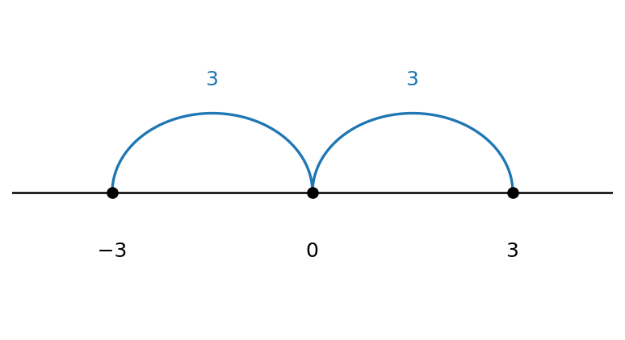
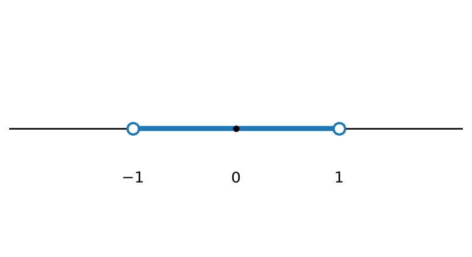
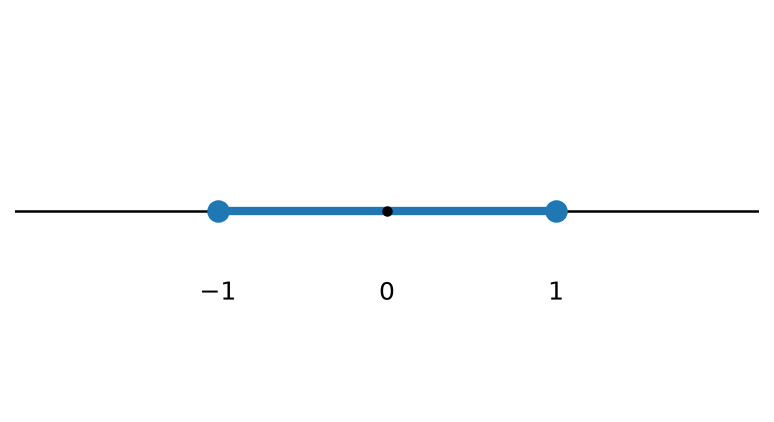
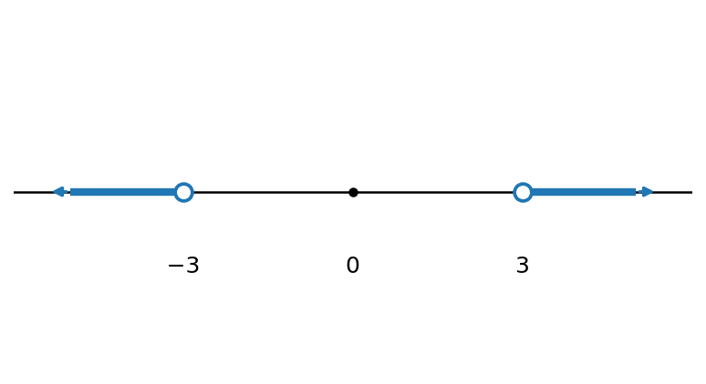
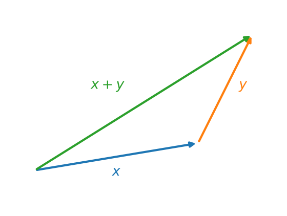
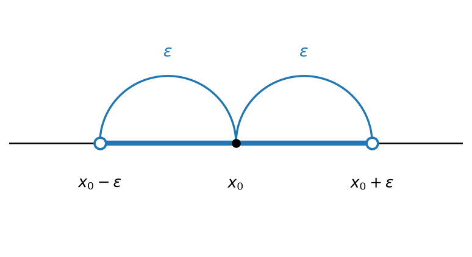

# ערך מוחלט וקטעים {chapter="4"}

בפרק הזה נפתח את הכלים שבעזרתם מודדים **מרחק** על ציר המספרים: קטעים, ערך מוחלט ואי-שוויונות. כל ההגדרות המרכזיות בהמשך הקורס, ובראשן הגדרת הגבול, מנוסחות בשפה הזאת: ״$x$ קרוב ל-$a$״ פירושו ״$\left|x - a\right|$ קטן״. לכן כדאי להשקיע כאן, ולעבוד לאט ובזהירות.

## קטעים

::: {#box-def-interval .thmdef}
יהיו $a, b \in \mathbb{R}$ המקיימים $.a \leq b$ נגדיר את ארבע הקבוצות הבאות:

$$\left(a,\ b\right) = \left\{x \in \mathbb{R} \mid a < x < b\right\}
\qquad
\left[a,\ b\right] = \left\{x \in \mathbb{R} \mid a \leq x \leq b\right\}$$

$$\left[a,\ b\right) = \left\{x \in \mathbb{R} \mid a \leq x < b\right\}
\qquad
\left(a,\ b\right] = \left\{x \in \mathbb{R} \mid a < x \leq b\right\}$$

הראשונה נקראת **קטע פתוח**, השנייה **קטע סגור**, ושתי האחרונות **קטעים חצי-פתוחים**. המספרים $a$ ו-$b$ נקראים **קצות** הקטע.
:::

::: {#box-def-unbounded-interval .thmdef}
בסימון דומה נגדיר גם קטעים אינסופיים:

$$\left(a,\ \infty\right) = \left\{x \in \mathbb{R} \mid x > a\right\}
\qquad
\left[a,\ \infty\right) = \left\{x \in \mathbb{R} \mid x \geq a\right\}$$

$$\left(-\infty,\ b\right) = \left\{x \in \mathbb{R} \mid x < b\right\}
\qquad
\left(-\infty,\ b\right] = \left\{x \in \mathbb{R} \mid x \leq b\right\}$$

וכן $.\left(-\infty,\ \infty\right) = \mathbb{R}$
:::

למשל, קבוצת כל המספרים שאינם קטנים מ-$2$ היא הקטע $,\left[2,\ \infty\right)$ ואילו קבוצת כל המספרים הקטנים מ-$2$ היא $.\left(-\infty,\ 2\right)$ הסימן $\infty$ אומר רק שבצד הזה ״אין הגבלה״; הוא אינו מספר, ולכן אין נקודת קצה שאפשר לכלול.

::: {#box-warn-infinity-closed .thmwarn title="אין סוגר מרובע ליד $\\infty$"}
הכתיבים $\left[a,\ \infty\right]$ וגם $\left[-\infty,\ b\right)$ **שגויים**. מכיוון ש-$\infty$ אינו מספר, אין מספר $x$ המקיים $,x = \infty$ ולכן ליד $\infty$ וליד $-\infty$ תמיד כותבים סוגר עגול.
:::

## ערך מוחלט


::: {#box-def-absolute-value .thmdef}
לכל $,x \in \mathbb{R}$ ה**ערך המוחלט** של $,x$ המסומן $,\left|x\right|$ מוגדר על ידי $$|x| =
\begin{cases}
x & : x \geq 0 \\
-x & : x < 0
\end{cases}$$
:::

::: {#box-exm-abs-values .thmexm}
$$|5| = 5, \quad |-3| = 3$$

במקרה השני $,-3 < 0$ ולכן לפי ההגדרה $.\left|-3\right| = -\left(-3\right) = 3$ הערך המוחלט ״מוחק את הסימן״ של מספר שלילי.
:::

למה לערך המוחלט יש משמעות: $\left|x\right|$ הוא ה**מרחק** של $x$ מ-$0$ על ציר המספרים. מרחק אינו שלילי, ולכן $\left|x\right| \geq 0$ לכל $.x$

::::: {#box-exm-abs-distance .thmexm}
$$|-3| = |3| = 3$$

```{python}
#| echo: false
#| output: false
import numpy as np
import matplotlib.pyplot as plt

fig, ax = plt.subplots(figsize=(6.4, 3.4))

# number line
ax.axhline(0, color="black", lw=1.2, zorder=1)
for x in [-3, 0, 3]:
    ax.plot([x], [0], "o", color="black", ms=6, zorder=3)
    ax.annotate("", xy=(x, 0.03), xytext=(x, -0.03))
ax.text(-3, -0.22, r"$-3$", ha="center", va="top", fontsize=12)
ax.text(0, -0.22, r"$0$", ha="center", va="top", fontsize=12)
ax.text(3, -0.22, r"$3$", ha="center", va="top", fontsize=12)

# distance arcs (both sides)
th = np.linspace(0, np.pi, 100)
for (a, b) in [(-3, 0), (0, 3)]:
    cx = (a + b) / 2.0
    r = (b - a) / 2.0
    ax.plot(cx + r * np.cos(th), 0.35 * np.sin(th), color="C0", lw=1.6)
    ax.text(cx, 0.45, r"$3$", ha="center", va="bottom", fontsize=12, color="C0")

ax.set_xlim(-4.5, 4.5)
ax.set_ylim(-0.6, 0.8)
ax.axis("off")

fig.savefig("figures/c04_fig01.png", dpi=150, bbox_inches="tight")
plt.close(fig)
```

```{=latex}
\par\medskip
\noindent\beginL\hbox to \linewidth{\hss\includegraphics[width=0.62\linewidth]{figures/c04_fig01.png}\hss}\endL\par
\medskip
```

::: {.content-visible when-format="pdf" style="text-align:center"}
תרשים: ציר מספרים עם הנקודות $-3$, $0$, $3$ וקשתות "מרחק 3" משני הצדדים.
:::

::: {.content-visible when-format="html"}
{#fig-c01_fig01 width="62%" fig-align="center"}
:::
:::::

באותו אופן, המרחק בין שני מספרים $a, b \in \mathbb{R}$ הוא $.\left|a - b\right|$ המרחק מ-$a$ ל-$b$ שווה למרחק מ-$b$ ל-$,a$ ואכן $.\left|a - b\right| = \left|b - a\right|$

::: {#box-exm-abs-no-solution .thmexm}
למשוואה $\left|x\right| = -2$ **אין** פתרון: הערך המוחלט של כל מספר הוא מרחק, ולכן אינו שלילי, ואינו יכול להיות שווה למספר $.-2$
:::

::::: {#box-exm-abs-open-interval .thmexm}
$\left|x\right| < 1$ פירושו שהמרחק של $x$ מ-$0$ קטן מ-$,1$ כלומר $x$ נמצא בקטע הפתוח $:\left(-1,\ 1\right)$ $.\left\{x \mid -1 < x < 1\right\} = \left(-1,\ 1\right)$ הקצוות אינם כלולים, שכן בהם המרחק שווה ל-$1$ בדיוק.

```{python}
#| echo: false
#| output: false
import numpy as np
import matplotlib.pyplot as plt

fig, ax = plt.subplots(figsize=(6.4, 3.4))

ax.axhline(0, color="black", lw=1.2, zorder=1)

# open interval (-1, 1): highlight segment
ax.plot([-1, 1], [0, 0], color="C0", lw=4, solid_capstyle="butt", zorder=2)

# open circles at -1 and 1
for x in [-1, 1]:
    ax.plot([x], [0], "o", ms=9, markerfacecolor="white",
            markeredgecolor="C0", markeredgewidth=1.8, zorder=3)
ax.plot([0], [0], "o", color="black", ms=4, zorder=3)

ax.text(-1, -0.18, r"$-1$", ha="center", va="top", fontsize=12)
ax.text(0, -0.18, r"$0$", ha="center", va="top", fontsize=12)
ax.text(1, -0.18, r"$1$", ha="center", va="top", fontsize=12)

ax.set_xlim(-2.2, 2.2)
ax.set_ylim(-0.5, 0.5)
ax.axis("off")

fig.savefig("figures/c04_fig02.png", dpi=150, bbox_inches="tight")
plt.close(fig)
```

```{=latex}
\par\medskip
\noindent\beginL\hbox to \linewidth{\hss\includegraphics[width=0.62\linewidth]{figures/c04_fig02.png}\hss}\endL\par
\medskip
```

::: {.content-visible when-format="pdf" style="text-align:center"}
תרשים: ציר מספרים עם נקודות פתוחות ב-$-1$ וב-$1$, והקטע הפתוח ביניהן.
:::

::: {.content-visible when-format="html"}
{#fig-c01_fig02 width="62%" fig-align="center"}
:::
:::::

::::: {#box-exm-abs-closed-interval .thmexm}
$\left|x\right| \leq 1$ פירושו שהמרחק של $x$ מ-$0$ אינו עולה על $,1$ ועכשיו גם הקצוות כלולים: $.\left\{x \mid -1 \leq x \leq 1\right\} = \left[-1,\ 1\right]$

```{python}
#| echo: false
#| output: false
import numpy as np
import matplotlib.pyplot as plt

fig, ax = plt.subplots(figsize=(6.4, 3.4))

ax.axhline(0, color="black", lw=1.2, zorder=1)

# closed interval [-1, 1]: highlight segment
ax.plot([-1, 1], [0, 0], color="C0", lw=4, solid_capstyle="butt", zorder=2)

# closed (filled) circles at -1 and 1
for x in [-1, 1]:
    ax.plot([x], [0], "o", ms=9, markerfacecolor="C0",
            markeredgecolor="C0", markeredgewidth=1.8, zorder=3)
ax.plot([0], [0], "o", color="black", ms=4, zorder=3)

ax.text(-1, -0.18, r"$-1$", ha="center", va="top", fontsize=12)
ax.text(0, -0.18, r"$0$", ha="center", va="top", fontsize=12)
ax.text(1, -0.18, r"$1$", ha="center", va="top", fontsize=12)

ax.set_xlim(-2.2, 2.2)
ax.set_ylim(-0.5, 0.5)
ax.axis("off")

fig.savefig("figures/c04_fig03.png", dpi=150, bbox_inches="tight")
plt.close(fig)
```

```{=latex}
\par\medskip
\noindent\beginL\hbox to \linewidth{\hss\includegraphics[width=0.62\linewidth]{figures/c04_fig03.png}\hss}\endL\par
\medskip
```

::: {.content-visible when-format="pdf" style="text-align:center"}
תרשים: ציר מספרים עם נקודות סגורות ב-$-1$ וב-$1$, והקטע הסגור ביניהן.
:::

::: {.content-visible when-format="html"}
{#fig-c01_fig03 width="62%" fig-align="center"}
:::
:::::

::::: {#box-exm-abs-greater .thmexm}
$\left|x\right| > 3$ פירושו שהמרחק של $x$ מ-$0$ **גדול** מ-$,3$ כלומר $x$ נמצא מימין ל-$3$ **או** משמאל למספר $:-3$ $.\left\{x \mid x > 3 \ \text{או}\ x < -3\right\} = \left(-\infty,\ -3\right) \cup \left(3,\ \infty\right)$ הפעם הפתרון הוא **שני** קטעים, ולא קטע אחד.

```{python}
#| echo: false
#| output: false
import numpy as np
import matplotlib.pyplot as plt

fig, ax = plt.subplots(figsize=(6.4, 3.4))

ax.axhline(0, color="black", lw=1.2, zorder=1)

# outer rays: x < -3 and x > 3
ax.plot([-3, -5], [0, 0], color="C0", lw=4, solid_capstyle="butt", zorder=2)
ax.plot([3, 5], [0, 0], color="C0", lw=4, solid_capstyle="butt", zorder=2)

# arrowheads on the rays
ax.annotate("", xy=(-5.4, 0), xytext=(-5, 0),
            arrowprops=dict(arrowstyle="-|>", color="C0", lw=1.6))
ax.annotate("", xy=(5.4, 0), xytext=(5, 0),
            arrowprops=dict(arrowstyle="-|>", color="C0", lw=1.6))

# open circles at -3 and 3
for x in [-3, 3]:
    ax.plot([x], [0], "o", ms=9, markerfacecolor="white",
            markeredgecolor="C0", markeredgewidth=1.8, zorder=3)
ax.plot([0], [0], "o", color="black", ms=4, zorder=3)

ax.text(-3, -0.18, r"$-3$", ha="center", va="top", fontsize=12)
ax.text(0, -0.18, r"$0$", ha="center", va="top", fontsize=12)
ax.text(3, -0.18, r"$3$", ha="center", va="top", fontsize=12)

ax.set_xlim(-6, 6)
ax.set_ylim(-0.5, 0.5)
ax.axis("off")

fig.savefig("figures/c04_fig04.png", dpi=150, bbox_inches="tight")
plt.close(fig)
```

```{=latex}
\par\medskip
\noindent\beginL\hbox to \linewidth{\hss\includegraphics[width=0.62\linewidth]{figures/c04_fig04.png}\hss}\endL\par
\medskip
```

::: {.content-visible when-format="pdf" style="text-align:center"}
תרשים: ציר מספרים עם נקודות פתוחות ב-$-3$ וב-$3$, והקרניים החיצוניות מסומנות.
:::

::: {.content-visible when-format="html"}
{#fig-c01_fig04 width="62%" fig-align="center"}
:::
:::::

### תכונות הערך המוחלט

::: {#box-prp-abs-basic .thmprp}
לכל $x, y \in \mathbb{R}$:

(א) $,\left|x\right| \geq 0$ ו-$\left|x\right| = 0$ רק כאשר $;x = 0$

(ב) $;\left|-x\right| = \left|x\right|$

(ג) $;-\left|x\right| \leq x \leq \left|x\right|$

(ד) $.\left|xy\right| = \left|x\right| \left|y\right|$
:::

בכל ההוכחות הבאות נשתמש באותה שיטה: הערך המוחלט מוגדר בשני מקרים, לפי הסימן, ולכן נחלק למקרים לפי סימן המספרים המעורבים.

::: {.thmproof title="סעיפים (א)–(ג)"}
**אם $.x \geq 0$** אז $,\left|x\right| = x \geq 0$ ושוויון לאפס קורה רק כאשר $.x = 0$ המספר $-x$ אינו חיובי, ולכן $.\left|-x\right| = -\left(-x\right) = x = \left|x\right|$ ולבסוף $,-\left|x\right| = -x \leq 0 \leq x = \left|x\right|$ וזה סעיף (ג).

**אם $.x < 0$** אז $.\left|x\right| = -x > 0$ המספר $-x$ חיובי, ולכן $.\left|-x\right| = -x = \left|x\right|$ ולבסוף $,-\left|x\right| = x < 0 < -x = \left|x\right|$ וזה שוב סעיף (ג).
:::

::: {.thmproof title="סעיף (ד)"}
נחלק למקרים לפי הסימנים של $x$ ושל $.y$

**שניהם אי-שליליים.** אז גם $,xy \geq 0$ ולכן $.\left|xy\right| = xy = \left|x\right| \left|y\right|$

**אחד אי-שלילי והשני שלילי,** נאמר $x \geq 0 > y$ (המקרה ההפוך זהה). אז $,xy \leq 0$ ולכן $.\left|xy\right| = -xy = x \cdot \left(-y\right) = \left|x\right| \left|y\right|$

**שניהם שליליים.** אז $,xy > 0$ ולכן $.\left|xy\right| = xy = \left(-x\right)\left(-y\right) = \left|x\right| \left|y\right|$
:::

שתי התכונות הבאות הן הכלי העיקרי לעבודה עם ערך מוחלט: הן מתרגמות אי-שוויון **עם** ערך מוחלט לאי-שוויונות **בלי** ערך מוחלט.

::: {#box-prp-abs-inequalities .thmprp}
לכל $x, y \in \mathbb{R}$:

(א) $\left|x\right| \leq y$ אם ורק אם $;-y \leq x \leq y$ ובאותו אופן, $\left|x\right| < y$ אם ורק אם $;-y < x < y$

(ב) $\left|x\right| \geq y$ אם ורק אם $x \geq y$ או $.x \leq -y$
:::

::: {.thmproof title="סעיף (א)"}
זו טענת ״אם ורק אם״, ולכן נוכיח שני כיוונים. נכתוב את ההוכחה עבור $;\leq$ עבור $<$ היא זהה מילה במילה.

**הכיוון הראשון.** נתון $,\left|x\right| \leq y$ וצריך להראות $.-y \leq x \leq y$ נכפול את הנתון במספר $,-1$ שהוא שלילי, ולכן כיוון אי-השוויון מתהפך: $.-y \leq -\left|x\right|$ נשרשר עם סעיף (ג) של [](#box-prp-abs-basic):

$$.-y \leq -\left|x\right| \leq x \leq \left|x\right| \leq y$$

**הכיוון השני.** נתון $,-y \leq x \leq y$ וצריך להראות $.\left|x\right| \leq y$ נחלק למקרים לפי הגדרת הערך המוחלט. אם $,x \geq 0$ אז $,\left|x\right| = x \leq y$ לפי החלק הימני של הנתון. אם $,x < 0$ אז $;\left|x\right| = -x$ מן החלק השמאלי של הנתון, $,-y \leq x$ נקבל אחרי כפל במספר $-1$ (שהופך את הכיוון) $,-x \leq y$ כלומר $.\left|x\right| \leq y$
:::

::: {.thmproof title="סעיף (ב)"}
הטענה $\left|x\right| \geq y$ היא השלילה של $.\left|x\right| < y$ לפי סעיף (א), $\left|x\right| < y$ שקול ל-״$-y < x$ **וגם** $x < y$״. השלילה של טענת ״וגם״ היא טענת ״או״ של השלילות, כפי שראינו ב[פרק על לוגיקה](01-logic.qmd#sec-connectives): ״$x \leq -y$ **או** $x \geq y$״.
:::

::: {#box-exm-abs-inequalities .thmexm}
**(א) $.\left|x - 5\right| < 2$** לפי סעיף (א), זה שקול לשרשרת $,-2 < x - 5 < 2$ ואחרי הוספת $5$ לכל האגפים: $.3 < x < 7$ הפתרון הוא הקטע $,\left(3,\ 7\right)$ כלומר כל המספרים שמרחקם מ-$5$ קטן מ-$.2$

**(ב) $.\left|x - 5\right| \geq 2$** לפי סעיף (ב), זה שקול ל-$x - 5 \geq 2$ או $,x - 5 \leq -2$ כלומר $x \geq 7$ או $.x \leq 3$ הפתרון הוא $,\left(-\infty,\ 3\right] \cup \left[7,\ \infty\right)$ שני קטעים.
:::

::: {#box-warn-abs-greater .thmwarn title="״גדול מ״ נותן שני קטעים"}
אי-שוויון מהצורה $\left|x\right| \leq y$ נותן **קטע אחד**, $.-y \leq x \leq y$ אי-שוויון מהצורה $\left|x\right| \geq y$ נותן **שני** קטעים, המחוברים ב״או״. טעות נפוצה היא לכתוב גם אותו כשרשרת אחת, $,y \leq x \leq -y$ וזו שרשרת שאין לה פתרון כש-$.y > 0$
:::

::: {#box-chk-abs .thmchk}
הכריעו אם הטענה נכונה.

(א) $\left|x\right| \geq 2$ אם ורק אם $.-2 \leq x \leq 2$

::: {.content-visible when-format="html"}
```{=html}
<div class="tf-quiz" data-correct="false" data-reveal>
<button class="tf-opt" data-val="true">נכון</button>
<button class="tf-opt" data-val="false">לא נכון</button>
<div class="tf-feedback"></div>
</div>
```
:::

(ב) $\left|x - 3\right| = \left|3 - x\right|$ לכל $.x$

::: {.content-visible when-format="html"}
```{=html}
<div class="tf-quiz" data-correct="true" data-reveal>
<button class="tf-opt" data-val="true">נכון</button>
<button class="tf-opt" data-val="false">לא נכון</button>
<div class="tf-feedback"></div>
</div>
```
:::

(ג) $\sqrt{x^{2}} = x$ לכל $x$ ממשי.

::: {.content-visible when-format="html"}
```{=html}
<div class="tf-quiz" data-correct="false" data-reveal>
<button class="tf-opt" data-val="true">נכון</button>
<button class="tf-opt" data-val="false">לא נכון</button>
<div class="tf-feedback"></div>
</div>
```
:::
:::

::: {.thmsol .foldable}
**(א) לא נכון.** $\left|x\right| \geq 2$ נותן $x \geq 2$ **או** $,x \leq -2$ ואילו $-2 \leq x \leq 2$ הוא הפתרון של $.\left|x\right| \leq 2$

**(ב) נכון.** $,3 - x = -\left(x - 3\right)$ ולפי סעיף (ב) של [](#box-prp-abs-basic) לשני המספרים אותו ערך מוחלט.

**(ג) לא נכון.** השורש הוא תמיד אי-שלילי, ולכן $.\sqrt{x^{2}} = \left|x\right|$ למשל, $.\sqrt{\left(-3\right)^{2}} = \sqrt{9} = 3 \neq -3$
:::

### אי שוויון המשולש

```{python}
#| echo: false
#| output: false
import numpy as np
import matplotlib.pyplot as plt

fig, ax = plt.subplots(figsize=(6.4, 3.4))

O = np.array([0.0, 0.0])
x = np.array([3.0, 0.5])
y = np.array([1.0, 2.0])

# vector x from origin
ax.annotate("", xy=O + x, xytext=O,
            arrowprops=dict(arrowstyle="-|>", color="C0", lw=2))
# vector y starting at tip of x (tip-to-tail)
ax.annotate("", xy=O + x + y, xytext=O + x,
            arrowprops=dict(arrowstyle="-|>", color="C1", lw=2))
# resultant x+y from origin
ax.annotate("", xy=O + x + y, xytext=O,
            arrowprops=dict(arrowstyle="-|>", color="C2", lw=2))

ax.text(*(O + x / 2 + np.array([0.0, -0.35])), r"$x$",
        color="C0", fontsize=13, ha="center")
ax.text(*(O + x + y / 2 + np.array([0.25, 0.0])), r"$y$",
        color="C1", fontsize=13, ha="left")
ax.text(*(O + (x + y) / 2 + np.array([-0.35, 0.25])), r"$x+y$",
        color="C2", fontsize=13, ha="right")

ax.set_xlim(-0.5, 4.5)
ax.set_ylim(-0.7, 3.0)
ax.set_aspect("equal")
ax.axis("off")

fig.savefig("figures/c04_fig05.png", dpi=150, bbox_inches="tight")
plt.close(fig)
```

```{=latex}
\par\medskip
\noindent\beginL\hbox to \linewidth{\hss\includegraphics[width=0.62\linewidth]{figures/c04_fig05.png}\hss}\endL\par
\medskip
```

::: {.content-visible when-format="pdf" style="text-align:center"}
תרשים: סקיצת משולש וקטורים — וקטור $x$, וקטור $y$ והווקטור $x+y$, להמחשת אי-שוויון המשולש.
:::

::: {.content-visible when-format="html"}
{#fig-c01_fig05 width="62%" fig-align="center"}
:::

אורך כל צלע במשולש קטן או שווה לסכום אורכי שתי הצלעות האחרות.

::: {#box-thm-triangle-inequality .thmthm title="אי-שוויון המשולש"}
לכל $x, y \in \mathbb{R}$ מתקיים $$.\left|x+y\right| \leq \left|x\right| + \left|y\right|$$
:::

::: thmproof
**הרעיון.** לפי סעיף (א) של [](#box-prp-abs-inequalities), כדי להראות $\left|x+y\right| \leq \left|x\right| + \left|y\right|$ די להראות שרשרת בלי ערך מוחלט:

$$.-\left(\left|x\right| + \left|y\right|\right) \leq x + y \leq \left|x\right| + \left|y\right|$$

לפי סעיף (ג) של [](#box-prp-abs-basic) מתקיים

$$-\left|x\right| \leq x \leq \left|x\right| \qquad,\qquad -\left|y\right| \leq y \leq \left|y\right|$$

נחבר את שתי השרשראות, איבר מול איבר. (חיבור שני אי-שוויונות באותו כיוון שומר על הכיוון: זה כלל (ב) של [כללי החישוב באי-שוויונות](03-number-systems.qmd#box-key-inequality-rules), המופעל פעמיים.)

$$.-\left|x\right| - \left|y\right| \leq x + y \leq \left|x\right| + \left|y\right|$$

זו בדיוק השרשרת שרצינו, ולכן $.\left|x+y\right| \leq \left|x\right| + \left|y\right|$
:::

::: {#box-exm-triangle-inequality .thmexm}
עבור $x = 2$ ו-$y = -1$ אגף שמאל הוא $\left|2 + \left(-1\right)\right| = 1$ ואגף ימין הוא $,\left|2\right| + \left|-1\right| = 3$ ואי-השוויון חד: המספרים ״מקזזים״ זה את זה כי סימניהם שונים.

עבור $x = 2$ ו-$y = 3$ שני האגפים שווים ל-$.5$ כשלשני המספרים אותו סימן, אין קיזוז, ומתקבל שוויון.
:::

מאי-שוויון המשולש נובע אי-שוויון שימושי נוסף, החוסם את **ההפרש** בין שני ערכים מוחלטים באמצעות הערך המוחלט של ההפרש. הוא נקרא **אי-שוויון המשולש ההפוך**.

::: {#box-thm-reverse-triangle-inequality .thmthm title="אי-שוויון המשולש ההפוך"}
לכל $x, y \in \mathbb{R}$ מתקיים $$.\Bigl|\left|x\right| - \left|y\right|\Bigr| \leq \left|x-y\right|$$
:::

::: thmproof
נכתוב $x = \left(x-y\right) + y$ ונפעיל על הסכום הזה את [](#box-thm-triangle-inequality):

$$,\left|x\right| = \Bigl|\left(x-y\right) + y\Bigr| \leq \left|x-y\right| + \left|y\right|$$

ובהעברת אגפים

$$.\left|x\right| - \left|y\right| \leq \left|x-y\right|$$

האגף הימני אינו משתנה כאשר מחליפים בין $x$ ל-$,y$ שכן $,\left|y-x\right| = \left|x-y\right|$ ולכן אותו חישוב עצמו עם התפקידים המוחלפים נותן

$$.\left|y\right| - \left|x\right| \leq \left|x-y\right|$$

קיבלנו אפוא שגם המספר $\left|x\right| - \left|y\right|$ וגם נגדוֹ אינם עולים על $,\left|x-y\right|$ וזה בדיוק אומר שהערך המוחלט של המספר הזה אינו עולה על $,\left|x-y\right|$ כנדרש.
:::

::: {#box-exm-reverse-triangle-inequality .thmexm}
עבור $x = 5$ ו-$y = 3$ אגף שמאל הוא $\bigl|5-3\bigr| = 2$ ואגף ימין הוא $,\left|5-3\right| = 2$ ומתקיים שוויון.

עבור $x = 5$ ו-$y = -3$ אגף שמאל הוא $\bigl|5-3\bigr| = 2$ ואגף ימין הוא $,\left|5-\left(-3\right)\right| = 8$ והאי-שוויון חד. שני מספרים יכולים להיות רחוקים זה מזה מאוד גם כאשר הערכים המוחלטים שלהם קרובים.
:::

## סביבת-$\varepsilon$ של נקודה

בפרקים על גבולות נרצה לומר ש״$x$ קרוב ל-$x_0$״. כדי שהמשפט הזה יהיה מדויק, מודדים את הקרבה במספר חיובי, שמסמנים אותו מסורתית באות היוונית $\varepsilon$ (״אפסילון״).

::: {#box-def-epsilon-neighborhood .thmdef}
יהיו $x_0 \in \mathbb{R}$ ו-$.\varepsilon > 0$ **סביבת $\varepsilon$ של $x_0$** היא קבוצת כל המספרים שמרחקם מ-$x_0$ קטן מ-$,\varepsilon$ כלומר

$$.\left\{x \in \mathbb{R} \mid \left|x - x_0\right| < \varepsilon\right\}$$
:::

פתיחת הערך המוחלט מראה שזהו בדיוק קטע פתוח:

$$\left\{x \in \mathbb{R} \mid \left|x - x_0\right| < \varepsilon\right\}
= \left\{x \in \mathbb{R} \mid -\varepsilon < x - x_0 < \varepsilon\right\}
= \left\{x \in \mathbb{R} \mid x_0 - \varepsilon < x < x_0 + \varepsilon\right\}$$

$$.= \left(x_0 - \varepsilon,\ x_0 + \varepsilon\right)$$

```{python}
#| echo: false
#| output: false
import numpy as np
import matplotlib.pyplot as plt

fig, ax = plt.subplots(figsize=(6.4, 3.4))

ax.axhline(0, color="black", lw=1.2, zorder=1)

x0 = 0.0
eps = 1.5

# open neighborhood (x0-eps, x0+eps)
ax.plot([x0 - eps, x0 + eps], [0, 0], color="C0", lw=4,
        solid_capstyle="butt", zorder=2)
for x in [x0 - eps, x0 + eps]:
    ax.plot([x], [0], "o", ms=9, markerfacecolor="white",
            markeredgecolor="C0", markeredgewidth=1.8, zorder=3)
ax.plot([x0], [0], "o", color="black", ms=6, zorder=3)

ax.text(x0 - eps, -0.22, r"$x_0-\varepsilon$", ha="center", va="top", fontsize=12)
ax.text(x0, -0.22, r"$x_0$", ha="center", va="top", fontsize=12)
ax.text(x0 + eps, -0.22, r"$x_0+\varepsilon$", ha="center", va="top", fontsize=12)

# epsilon arcs on both sides
th = np.linspace(0, np.pi, 100)
for (a, b) in [(x0 - eps, x0), (x0, x0 + eps)]:
    cx = (a + b) / 2.0
    r = (b - a) / 2.0
    ax.plot(cx + r * np.cos(th), 0.45 * np.sin(th), color="C0", lw=1.6)
    ax.text(cx, 0.55, r"$\varepsilon$", ha="center", va="bottom",
            fontsize=13, color="C0")

ax.set_xlim(x0 - eps - 1, x0 + eps + 1)
ax.set_ylim(-0.7, 0.9)
ax.axis("off")

fig.savefig("figures/c04_fig06.png", dpi=150, bbox_inches="tight")
plt.close(fig)
```

```{=latex}
\par\medskip
\noindent\beginL\hbox to \linewidth{\hss\includegraphics[width=0.62\linewidth]{figures/c04_fig06.png}\hss}\endL\par
\medskip
```

::: {.content-visible when-format="pdf" style="text-align:center"}
תרשים: ציר מספרים עם הנקודות $x_0-\varepsilon$, $x_0$, $x_0+\varepsilon$ וקשתות באורך $\varepsilon$ משני צדי $x_0$.
:::

::: {.content-visible when-format="html"}
{#fig-c01_fig06 width="62%" fig-align="center"}
:::

::: {#box-exm-epsilon-neighborhood .thmexm}
סביבת $\frac{1}{2}$ של $2$ היא הקטע $,\left(2 - \frac{1}{2},\ 2 + \frac{1}{2}\right) = \left(\frac{3}{2},\ \frac{5}{2}\right)$ כלומר כל המספרים שמרחקם מ-$2$ קטן מ-$.\frac{1}{2}$
:::

## פתרון אי-שוויונות

### שיטת טבלת הסימנים

כדי לפתור אי-שוויון, מעבירים את כל האיברים לאגף אחד, כך שבאגף השני נשאר $,0$ ושואלים מתי הביטוי חיובי ומתי שלילי. אם הביטוי הוא מכפלה של גורמים, הסימן שלה נקבע מן הסימנים של הגורמים, וכל גורם מחליף סימן רק בנקודה שבה הוא מתאפס.

::: {#box-exr-sign-chart .thmexr title="אי-שוויון של מכפלה"}
מצאו לאילו ערכי $x$ מתקיים $.\left(x-2\right)\left(x-4\right)\left(x-5\right) \geq 0$
:::

::: thmsol
**שלב 1: האפסים.** הגורמים מתאפסים ב-$,x = 2$ $x = 4$ ו-$.x = 5$ שלוש הנקודות מחלקות את הישר לארבעה קטעים, ובתוך כל קטע אף גורם אינו מתאפס, ולכן אף גורם אינו מחליף סימן.

**שלב 2: טבלת הסימנים.** בכל קטע נבדוק את הסימן של כל גורם. למשל, עבור $x < 2$ כל שלושת הגורמים שליליים. המכפלה חיובית כשמספר הגורמים השליליים זוגי, ושלילית כשהוא אי-זוגי:

| | $x < 2$ | $2 < x < 4$ | $4 < x < 5$ | $x > 5$ |
|:---:|:---:|:---:|:---:|:---:|
| $x - 2$ | $-$ | $+$ | $+$ | $+$ |
| $x - 4$ | $-$ | $-$ | $+$ | $+$ |
| $x - 5$ | $-$ | $-$ | $-$ | $+$ |
| המכפלה | $-$ | $+$ | $-$ | $+$ |

אפשר לבדוק כל שורה בהצבה של מספר נוח מן הקטע. למשל, עבור $x = 3$ המכפלה היא $,1 \cdot \left(-1\right) \cdot \left(-2\right) = 2 > 0$ בהתאם לטבלה.

**שלב 3: האפסים עצמם.** האי-שוויון הוא $,\geq 0$ ולכן גם הנקודות שבהן המכפלה **שווה** לאפס הן פתרונות: $,2$ $4$ ו-$.5$

**התשובה.** המכפלה אי-שלילית בקטעים שבהם היא חיובית, יחד עם האפסים:

$$.\left[2,\ 4\right] \cup \left[5,\ \infty\right)$$
:::

::: {#box-warn-divide-by-factor .thmwarn title="אין לחלק בגורם שסימנו אינו ידוע"}
מפתה ״לצמצם״ אי-שוויון כמו $\left(x-2\right)\left(x-4\right) \geq \left(x-2\right)$ על ידי חלוקה ב-$.x - 2$ זו טעות: הסימן של $x - 2$ תלוי ב-$,x$ וחלוקה במספר שלילי הופכת את הכיוון. מעבירים הכול לאגף אחד ופותרים בטבלת סימנים.
:::

### אי-שוויונות עם ערך מוחלט

כשבביטוי מופיע יותר מערך מוחלט אחד, אי אפשר ״לפתוח״ את כולם בבת אחת: לכל ערך מוחלט יש שני מקרים, והם תלויים בסימן של הביטוי שבתוכו. השיטה היא לחלק את ציר המספרים לקטעים לפי הנקודות שבהן מתאפסים הביטויים, ולפתור בכל קטע בנפרד.

::: {#box-qst-abs-sum-inequality .thmexr}
פתרו את אי-השוויון $$.\left|x-1\right| + \left|x-2\right| < 2$$
:::

::: {.thmsol}
הביטויים שבתוך הערכים המוחלטים מתאפסים ב-$x = 1$ וב-$,x = 2$ ולכן שתי הנקודות האלה מחלקות את הישר לשלושה קטעים. נטפל בכל אחד מהם בנפרד.

**המקרה הראשון: $.x < 1$** כאן $x - 1 < 0$ וגם $,x - 2 < 0$ ולכן $\left|x-1\right| = -(x-1)$ ו-$.\left|x-2\right| = -(x-2)$ אי-השוויון נעשה

$$,-(x-1) - (x-2) < 2 \iff -2x + 3 < 2 \iff 1 < 2x \iff \frac{1}{2} < x$$

ויחד עם ההנחה $x < 1$ מתקבל הקטע $.\left(\frac{1}{2},\ 1\right)$

**המקרה השני: $.1 \leq x \leq 2$** כאן $x - 1 \geq 0$ ואילו $,x - 2 \leq 0$ ולכן $\left|x-1\right| = x-1$ ו-$.\left|x-2\right| = -(x-2)$ אי-השוויון נעשה

$$,(x-1) - (x-2) < 2 \iff 1 < 2$$

וזה נכון תמיד. לכן כל הקטע $\left[1,\ 2\right]$ הוא פתרון.

**המקרה השלישי: $.x > 2$** כאן שני הביטויים אי-שליליים, ולכן

$$,(x-1) + (x-2) < 2 \iff 2x - 3 < 2 \iff x < \frac{5}{2}$$

ויחד עם ההנחה $x > 2$ מתקבל הקטע $.\left(2,\ \frac{5}{2}\right)$

קבוצת הפתרונות היא איחוד שלושת הקטעים:

$$.\left(\frac{1}{2},\ 1\right) \cup \left[1,\ 2\right] \cup \left(2,\ \frac{5}{2}\right) = \left(\frac{1}{2},\ \frac{5}{2}\right)$$
:::

כשיש ערך מוחלט **אחד** בלבד, אין צורך בחלוקה לקטעים: [](#box-prp-abs-inequalities) מתרגם אותו מיד.

::: {#box-exr-abs-square .thmexr title="ערך מוחלט של ביטוי ריבועי"}
מצאו לאילו ערכי $x$ מתקיים $.\left|x^{2} - 5\right| \geq 4$
:::

::: thmsol
לפי סעיף (ב) של [](#box-prp-abs-inequalities), עם $x^{2} - 5$ במקום $,x$ אי-השוויון שקול ל-

$$.x^{2} - 5 \geq 4 \qquad \text{או} \qquad x^{2} - 5 \leq -4$$

נפתור כל אחד מהם בנפרד.

**$.x^{2} - 5 \geq 4$** כלומר $.x^{2} \geq 9$ מכיוון ש-$x^{2} = \left|x\right|^{2}$ ושני הצדדים אי-שליליים, זה שקול ל-$.\left|x\right| \geq 3$ (לא ל-$x \geq 3$; ראו את האזהרה שלהלן.) לפי סעיף (ב) שוב: $x \geq 3$ או $.x \leq -3$

**$.x^{2} - 5 \leq -4$** כלומר $,x^{2} \leq 1$ וזה שקול ל-$,\left|x\right| \leq 1$ כלומר $.-1 \leq x \leq 1$

**התשובה** היא האיחוד:

$$.\left(-\infty,\ -3\right] \cup \left[-1,\ 1\right] \cup \left[3,\ \infty\right)$$

בדיקה: עבור $x = 0$ מתקיים $,\left|0 - 5\right| = 5 \geq 4$ ואכן $.0 \in \left[-1,\ 1\right]$ עבור $x = 2$ מתקיים $,\left|4 - 5\right| = 1 < 4$ ואכן $2$ אינו בקבוצה.
:::

::: {#box-warn-square-root-abs .thmwarn title="$x^2 \\geq 9$ אינו $x \\geq 3$"}
מ-$x^{2} \geq 9$ אסור להסיק $x \geq 3$ ״על ידי הוצאת שורש״: כך הולכים לאיבוד הפתרונות השליליים, כמו $.x = -4$ הוצאת שורש נותנת $,\sqrt{x^{2}} = \left|x\right|$ ולכן המסקנה הנכונה היא $.\left|x\right| \geq 3$
:::

## הערכות

בפרקים על גבולות נצטרך שוב ושוב להראות שביטוי מסוים **קטן** ממספר נתון, בלי לחשב אותו במדויק. זו **הערכה**: מחליפים חלקים של הביטוי בחסמים פשוטים יותר, בכיוון שאינו מקטין אותו.

::: {#box-exr-estimate-x .thmexr title="הערכה של שבר"}
הוכיחו שאם $\left|x - 1\right| < \frac{1}{10}$ אז $.\left|\dfrac{x^{2}-1}{x+3}\right| < \dfrac{1}{13}$
:::

::: thmsol
**מה צריך להראות.** הנתון אומר ש-$x$ קרוב ל-$.1$ צריך להראות שעבור **כל** $x$ כזה, השבר קטן מ-$.\frac{1}{13}$

**שלב 1: לפרק את השבר.** לפי $x^{2} - 1 = \left(x-1\right)\left(x+1\right)$ ולפי סעיף (ד) של [](#box-prp-abs-basic):

$$.\left|\frac{x^{2}-1}{x+3}\right| = \frac{\left|x-1\right| \cdot \left|x+1\right|}{\left|x+3\right|}$$

**שלב 2: מה יודעים על $.x$** לפי סעיף (א) של [](#box-prp-abs-inequalities), הנתון שקול לשרשרת $,-\frac{1}{10} < x - 1 < \frac{1}{10}$ ואחרי הוספת $1$ ואחרי הוספת $:3$

$$.\frac{19}{10} < x + 1 < \frac{21}{10} \qquad,\qquad \frac{39}{10} < x + 3 < \frac{41}{10}$$

בפרט $x + 1$ ו-$x + 3$ חיוביים, ולכן הם שווים לערכים המוחלטים שלהם.

**שלב 3: ההערכה.** שבר חיובי **גדל** כשמגדילים את המונה, וגם כשמקטינים את המכנה. לכן נחליף את המונה בחסמים מלעיל ואת המכנה בחסם מלרע:

$$.\frac{\left|x-1\right| \cdot \left|x+1\right|}{\left|x+3\right|} < \frac{\frac{1}{10} \cdot \frac{21}{10}}{\frac{39}{10}} = \frac{21}{390} = \frac{7}{130} < \frac{10}{130} = \frac{1}{13}$$

זה נכון לכל $x$ המקיים את הנתון, כנדרש.
:::

::: {#box-key-bound-fraction .thmkey icon="method" title="הערכה של שבר מלמעלה"}
כדי להראות ששבר חיובי קטן ממספר נתון: חוסמים את המונה **מלמעלה**, ואת המכנה **מלמטה** במספר **חיובי**. הקטנת המכנה מגדילה את השבר, ולכן חסם מלמטה במכנה נותן חסם מלמעלה לשבר.
:::

::: {#box-exr-estimate-n .thmexr title="הערכה עבור $n$ גדול"}
(א) הוכיחו שאם $n \in \mathbb{N}$ ו-$n > 100$ אז $.\left|\dfrac{3n+1}{2n+3} - \dfrac{3}{2}\right| < \dfrac{1}{50}$

(ב) מצאו $N$ כך שלכל $n > N$ מתקיים $.\left|\dfrac{3n+1}{2n+3} - \dfrac{3}{2}\right| < \dfrac{1}{1000}$
:::

::: thmsol
**הרעיון.** עבור $n$ גדול, $\frac{3n+1}{2n+3}$ מתנהג בערך כמו $,\frac{3n}{2n} = \frac{3}{2}$ ולכן ההפרש אמור להיות קטן. כדי לראות **כמה** קטן, נחשב אותו.

**החישוב.** נביא למכנה משותף:

$$.\frac{3n+1}{2n+3} - \frac{3}{2} = \frac{2\left(3n+1\right) - 3\left(2n+3\right)}{2\left(2n+3\right)} = \frac{6n + 2 - 6n - 9}{4n + 6} = \frac{-7}{4n+6}$$

המכנה חיובי, ולכן הערך המוחלט הוא $.\frac{7}{4n+6}$

**סעיף (א).** הקטנת המכנה מגדילה את השבר, ולכן $.\frac{7}{4n+6} < \frac{7}{4n}$ מכיוון ש-$,n > 100$ גם $,4n > 400$ ולכן

$$.\frac{7}{4n} < \frac{7}{400} < \frac{8}{400} = \frac{1}{50}$$

**סעיף (ב).** כמו בסעיף (א), $.\left|\frac{3n+1}{2n+3} - \frac{3}{2}\right| < \frac{7}{4n}$ די אפוא שיתקיים $,\frac{7}{4n} < \frac{1}{1000}$ כלומר $,7000 < 4n$ כלומר $.n > 1750$ לכן $N = 1750$ מתאים: לכל $n > 1750$ מתקיים אי-השוויון.

שימו לב שלא חיפשנו את ה-$N$ הקטן ביותר; כל $N$ שעובד מתאים. בדיוק השאלה הזאת, ״מאיזה מקום הביטוי קרוב ל-$\frac{3}{2}$ כרצוננו״, היא לב [הגדרת הגבול](07-sequences-limit.qmd#box-def-convergence).
:::

## קבוצות חסומות

קבוצה חסומה היא קבוצה שאיבריה אינם ״בורחים״ רחוק מדי: יש מספר שכולם קטנים ממנו, ויש מספר שכולם גדולים ממנו. נגדיר תחילה כל צד בנפרד.

::: {#box-def-bounded-above-below .thmdef}
תהי $A \subseteq \mathbb{R}$ קבוצה.

נאמר כי $A$ **חסומה מלעיל** אם קיים $M \in \mathbb{R}$ כך שלכל $x \in A$ מתקיים $.x \leq M$ מספר $M$ כזה נקרא **חסם מלעיל** של $.A$

נאמר כי $A$ **חסומה מלרע** אם קיים $m \in \mathbb{R}$ כך שלכל $x \in A$ מתקיים $.m \leq x$ מספר $m$ כזה נקרא **חסם מלרע** של $.A$
:::

::: {#box-def-bounded-set .thmdef}
קבוצה $A \subseteq \mathbb{R}$ נקראת **חסומה** אם היא חסומה מלעיל וגם מלרע, כלומר אם קיימים $m, M \in \mathbb{R}$ כך שלכל $x \in A$ מתקיים $$.m \leq x \leq M$$
:::

::: {#box-exm-bounds .thmexm title="חסמים של קבוצות"}
**(א) הקבוצה $.A = \left(0,\ 1\right]$** המספר $1$ הוא חסם מלעיל, שכן כל איברי $A$ אינם גדולים מ-$.1$ אבל גם $,2$ $100$ וכל מספר גדול מ-$1$ הם חסמים מלעיל. באותו אופן $,0$ $-3$ וכל מספר שאינו גדול מ-$0$ הם חסמים מלרע. הקבוצה חסומה.

**(ב) הקבוצה $.\mathbb{N}$** היא חסומה מלרע, למשל על ידי $1$ (וגם על ידי $0$ ועל ידי $-7$), אבל **אינה** חסומה מלעיל: לפי [](03-number-systems.qmd#box-thm-archimedes), לכל $M$ קיים טבעי הגדול ממנו, ולכן אף $M$ אינו חסם מלעיל.

**(ג) הקבוצה $.\mathbb{Z}$** אינה חסומה מלעיל ואינה חסומה מלרע.
:::

::: {#box-key-many-bounds .thmkey icon="idea" title="לקבוצה חסומה יש הרבה חסמים"}
אם $M$ חסם מלעיל של $,A$ אז **כל** מספר הגדול מ-$M$ הוא גם חסם מלעיל; ואם $m$ חסם מלרע, כל מספר הקטן ממנו הוא גם חסם מלרע. לכן כשצריך להראות שקבוצה חסומה, די למצוא חסם **אחד**, ומותר לבחור את הנוח ביותר, ולאו דווקא את ״הטוב ביותר״.
:::

::: {#box-thm-bounded-center-radius .thmthm}
תהי $A \subseteq \mathbb{R}$ קבוצה. אז $A$ חסומה אם ורק אם קיימים $c \in \mathbb{R}$ ו-$r \geq 0$ כך שלכל $x \in A$ מתקיים $$.\left|x - c\right| \leq r$$
:::

::: thmproof
נניח תחילה שקיימים $c$ ו-$r$ כאלה. אי-השוויון $\left|x - c\right| \leq r$ שקול ל-$,c - r \leq x \leq c + r$ וזוהי [ההגדרה](#box-def-bounded-set) עם $m = c - r$ ועם $.M = c + r$

בכיוון השני, נניח ש-$A$ חסומה ויהיו $m, M$ כבהגדרה. נבחר את אמצע הקטע ואת חצי אורכו:

$$.c = \frac{m + M}{2} \qquad,\qquad r = \frac{M - m}{2}$$

מכיוון ש-$,m \leq M$ אכן $.r \geq 0$ לכל $x \in A$ מתקיים $,m \leq x \leq M$ כלומר $,c - r \leq x \leq c + r$ ומכאן $.\left|x - c\right| \leq r$
:::

הקבוצה $A$ מוכלת אפוא בקטע הסגור $\left[c-r,\ c+r\right]$. אם רוצים קטע **פתוח**, די להגדיל מעט את הרדיוס: לכל $r' > r$ מתקיים $.A \subseteq \left(c-r',\ c+r'\right)$

::: {#box-thm-bounded-any-center .thmthm}
תהי $A \subseteq \mathbb{R}$ קבוצה. אם קיים $c \in \mathbb{R}$ אחד ו-$r \geq 0$ שעבורם $\left|x - c\right| \leq r$ לכל $,x \in A$ אז **לכל** $c' \in \mathbb{R}$ קיים $r' \geq 0$ שעבורו $\left|x - c'\right| \leq r'$ לכל $.x \in A$
:::

::: thmproof
יהי $c' \in \mathbb{R}$ כלשהו. לכל $x \in A$ נכתוב $x - c' = \left(x - c\right) + \left(c - c'\right)$ ונפעיל את [אי-שוויון המשולש](#box-thm-triangle-inequality):

$$.\left|x - c'\right| \leq \left|x - c\right| + \left|c - c'\right| \leq r + \left|c - c'\right|$$

לכן הבחירה $r' = r + \left|c - c'\right|$ מתאימה. שימו לב ש-$r'$ אינו תלוי ב-$,x$ אלא רק ב-$c'$ שנבחר.
:::

המקרה החשוב ביותר הוא $,c = 0$ שבו האי-שוויון מקבל את הצורה הקצרה ביותר.

::: {#box-cor-bounded-abs .thmcor}
תהי $A \subseteq \mathbb{R}$ קבוצה. אז $A$ חסומה אם ורק אם קיים $M \geq 0$ כך שלכל $x \in A$ מתקיים $$.\left|x\right| \leq M$$
:::

::: thmproof
זהו המקרה $c = 0$ של שני המשפטים הקודמים: לפי הראשון $A$ חסומה אם ורק אם יש נקודת ייחוס כלשהי, ולפי השני אפשר לקחת אותה להיות $0$ בדיוק.
:::

אפשר גם להגיע ל-$M$ ישירות מן ההגדרה, וכדאי לראות כיצד. נניח ש-$m \leq x \leq M_0$ לכל $,x \in A$ ונסמן $.M = \max\left\{\left|m\right|,\ \left|M_0\right|\right\}$ אז לכל $x \in A$

$$,-M \leq -\left|m\right| \leq m \leq x \leq M_0 \leq \left|M_0\right| \leq M$$

כלומר $.\left|x\right| \leq M$ שרשרת אי-השוויונות הזאת תקפה בכל שלושת המצבים האפשריים — שני הקצוות אי-שליליים, שניהם אי-חיוביים, או אחד מכל סוג — משום שלא הנחנו דבר על הסימנים: היא נשענת רק על $-\left|t\right| \leq t \leq \left|t\right|$ המתקיים לכל $t$ ממשי.

```{python}
#| echo: false
#| output: false
import matplotlib.pyplot as plt

# Static stand-in for the widget, in the print edition: one picture of the general case
# (zero strictly between the ends), which is the one where max{|k|,|K|} does real work.
k, K = -2.0, 3.5
M = max(abs(k), abs(K))

fig, ax = plt.subplots(figsize=(6.4, 1.9))
ax.axhline(0, color="0.2", lw=1.3)

ax.axvspan(-M, M, ymin=0.30, ymax=0.70, color="tab:green", alpha=0.12)
for x in (-M, M):
    ax.plot([x, x], [-0.22, 0.22], color="tab:green", lw=1.7)
ax.annotate("$-M$", xy=(-M, 0.30), ha="center", fontsize=13, color="tab:green")
ax.annotate("$M$", xy=(M, 0.30), ha="center", fontsize=13, color="tab:green")

ax.plot([k, K], [0, 0], color="0.25", lw=4, alpha=0.55, solid_capstyle="butt")
ax.plot([k], [0], "o", ms=8, color="tab:blue", zorder=4)
ax.plot([K], [0], "o", ms=8, color="tab:red", zorder=4)
ax.annotate("$k$", xy=(k, -0.44), ha="center", fontsize=13, color="tab:blue")
ax.annotate("$K$", xy=(K, -0.44), ha="center", fontsize=13, color="tab:red")
ax.plot([0], [0], "o", ms=4, color="0.2", zorder=4)
ax.annotate("$0$", xy=(0, -0.44), ha="center", fontsize=12, color="0.2")

ax.set_xlim(-4.6, 4.6)
ax.set_ylim(-0.62, 0.58)
ax.axis("off")
fig.savefig("figures/c04_fig07.png", dpi=150, bbox_inches="tight")
plt.close(fig)
```

:::::: {#box-sim-bounded-set .thmsim title="מ-$[k,\\ K]$ אל החסם הסימטרי"}
::: {.content-visible when-format="html"}
```{=html}
<iframe class="widget-frame" src="widgets/ch04/bounded-set-M.html" loading="lazy" title="ציר מספרים ובו הקטע שבין k ל-K, והקטע הסימטרי שבין מינוס M ל-M המכיל אותו"></iframe>
```
:::

הזיזו את $k$ ואת $K$ ועקבו אחר $.M$ שלושת המצבים שתוארו למעלה מתקבלים כאן זה אחר זה, וההודעה שמתחת מציינת באיזה מהם אתם נמצאים; הקטע הסימטרי $\left[-M,\ M\right]$ מכיל את $\left[k,\ K\right]$ בכולם.

:::: {.content-visible when-format="pdf"}
```{=latex}
\par\medskip
\noindent\beginL\hbox to \linewidth{\hss\includegraphics[width=0.62\linewidth]{figures/c04_fig07.png}\hss}\endL\par
\medskip
```

::: {style="text-align:center"}
תרשים: הקטע $\left[k,\ K\right]$ והקטע הסימטרי $\left[-M,\ M\right]$ המכיל אותו, עבור $.M = \max\left\{\left|k\right|,\ \left|K\right|\right\}$
:::
::::
::::::

## תרגילים {#sec-abs-value-exercises}

**תרגיל 1.** פתרו את אי-השוויונות.

(א) $\left|2x - 3\right| < 5$

(ב) $\left|x + 2\right| \geq 1$

(ג) $\left(x+1\right)\left(x-3\right) < 0$

(ד) $\left|x - 1\right| + \left|x + 1\right| \leq 4$

::: {.thmsol .foldable}
**סעיף (א).** לפי סעיף (א) של [](#box-prp-abs-inequalities): $.-5 < 2x - 3 < 5$ נוסיף $3$ לכל האגפים: $,-2 < 2x < 8$ ונחלק ב-$,2$ שהוא חיובי: $.-1 < x < 4$ התשובה: $.\left(-1,\ 4\right)$

**סעיף (ב).** לפי סעיף (ב): $x + 2 \geq 1$ או $,x + 2 \leq -1$ כלומר $x \geq -1$ או $.x \leq -3$ התשובה: $.\left(-\infty,\ -3\right] \cup \left[-1,\ \infty\right)$

**סעיף (ג).** האפסים הם $-1$ ו-$.3$ עבור $x < -1$ שני הגורמים שליליים והמכפלה חיובית; עבור $-1 < x < 3$ הגורם הראשון חיובי והשני שלילי, והמכפלה שלילית; עבור $x > 3$ שניהם חיוביים. האי-שוויון חד, ולכן האפסים אינם פתרונות. התשובה: $.\left(-1,\ 3\right)$

**סעיף (ד).** הנקודות $-1$ ו-$1$ מחלקות את הישר לשלושה קטעים. עבור $:x < -1$ $,-\left(x-1\right) - \left(x+1\right) = -2x \leq 4$ כלומר $,x \geq -2$ ויחד: $.\left[-2,\ -1\right)$ עבור $:-1 \leq x \leq 1$ $,-\left(x-1\right) + \left(x+1\right) = 2 \leq 4$ נכון תמיד. עבור $:x > 1$ $,2x \leq 4$ כלומר $,x \leq 2$ ויחד: $.\left(1,\ 2\right]$ התשובה היא האיחוד, $.\left[-2,\ 2\right]$
:::

**תרגיל 2.** הוכיחו שאם $\left|x - 2\right| < \frac{1}{2}$ אז $.\left|x^{2} - 4\right| < \frac{5}{2}$

::: {.thmsol .foldable}
לפי [](#box-prp-abs-basic): $.\left|x^{2} - 4\right| = \left|x - 2\right| \cdot \left|x + 2\right|$ מן הנתון, $,\frac{3}{2} < x < \frac{5}{2}$ ולכן $,\frac{7}{2} < x + 2 < \frac{9}{2}$ ובפרט $.\left|x + 2\right| < \frac{9}{2}$ לכן

$$.\left|x^{2} - 4\right| < \frac{1}{2} \cdot \frac{9}{2} = \frac{9}{4} < \frac{10}{4} = \frac{5}{2}$$
:::

**תרגיל 3.** תהי $.A = \left\{\frac{1}{n} \mid n \in \mathbb{N}\right\}$ האם $A$ חסומה? תנו שני חסמים מלעיל שונים ושני חסמים מלרע שונים.

::: {.thmsol .foldable}
לכל $n \in \mathbb{N}$ מתקיים $,0 < \frac{1}{n} \leq 1$ ולכן $A$ חסומה. חסמים מלעיל: $1$ ו-$,5$ וכל מספר שאינו קטן מ-$.1$ חסמים מלרע: $0$ וגם $,-1$ וכל מספר שאינו גדול מ-$.0$ שימו לב ש-$1$ שייך ל-$,A$ ואילו $0$ אינו שייך לה.
:::

## נספח: חסם עליון ושלמות הממשיים (העמקה) {#sec-abs-value-appendix .unnumbered}

הנספח הזה **תאורטי לחלוטין ואינו חלק מן הקורס**. הוא מציג את החסם העליון ואת תכונת השלמות של המספרים הממשיים, שעליהן נשענת ההוכחה (הלא-הכרחית) של [המשפט על סדרה מונוטונית וחסומה](08-sequences-properties.qmd#box-thm-monotone-bounded-converges). אפשר לדלג עליו בלי לפגוע בהבנת שאר הספר.

:::::::::: {.optional title="חסם עליון ושלמות"}
ראינו שלקבוצה חסומה מלעיל יש [הרבה חסמים מלעיל](#box-key-many-bounds). האם יש ביניהם **קטן ביותר**?

::: {#box-def-supremum .thmdef title="חסם עליון"}
תהי $A \subseteq \mathbb{R}$ קבוצה לא ריקה החסומה מלעיל. מספר $L$ נקרא **החסם העליון** של $A$ אם מתקיימים שני התנאים:

(א) $L$ הוא חסם מלעיל של $,A$ כלומר $x \leq L$ לכל $;x \in A$

(ב) $L$ הוא הקטן ביותר מבין חסמי המלעיל, כלומר אף מספר הקטן מ-$L$ אינו חסם מלעיל של $.A$

מסמנים $.L = \sup A$
:::

למשל, $.\sup \left(0,\ 1\right] = 1$ החסם העליון אינו חייב להיות איבר של הקבוצה: גם $,\sup \left(0,\ 1\right) = 1$ אף ש-$1$ אינו שייך לקטע הפתוח.

::: {#box-key-completeness .thmkey title="שלמות הממשיים"}
לכל קבוצה לא ריקה של מספרים ממשיים החסומה מלעיל **קיים** חסם עליון.

זו תכונה יסודית של $\mathbb{R}$ שאנחנו מניחים ואיננו מוכיחים. היא מבדילה את הממשיים מן הרציונליים: לקבוצה $\left\{q \in \mathbb{Q} \mid q^{2} < 2\right\}$ אין חסם עליון **רציונלי**, שכן החסם העליון שלה הוא $,\sqrt{2}$ שאינו רציונלי.
:::
::::::::::
