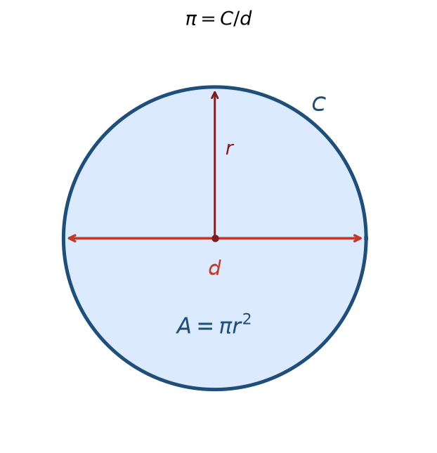
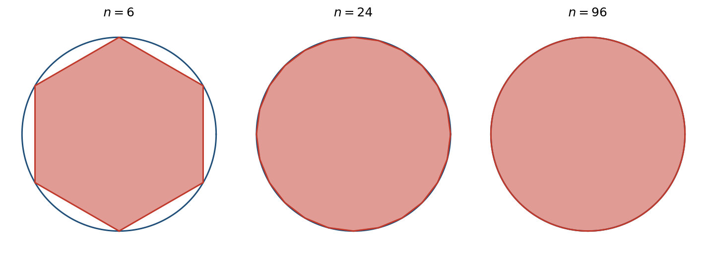
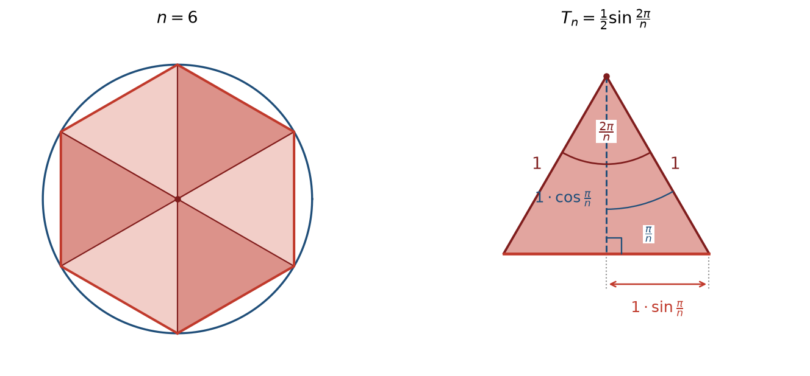
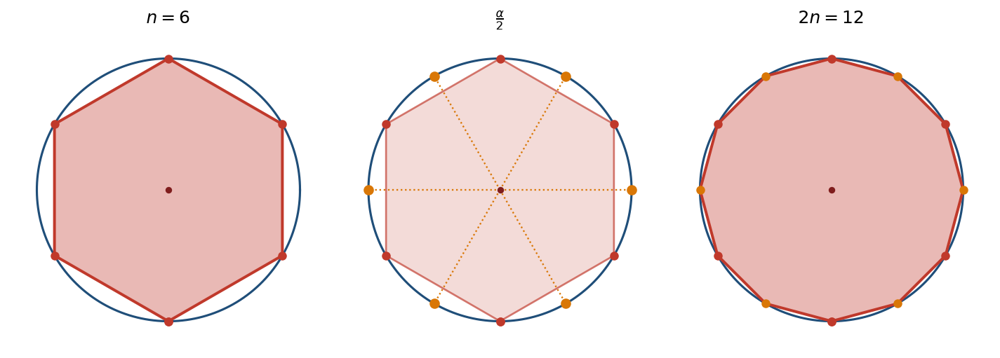
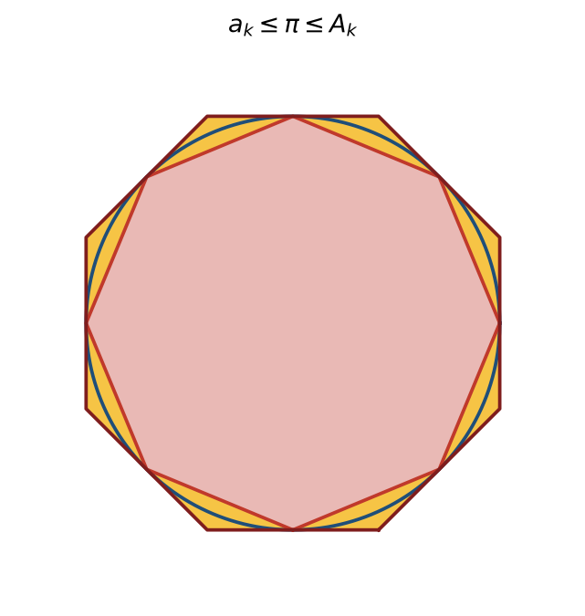
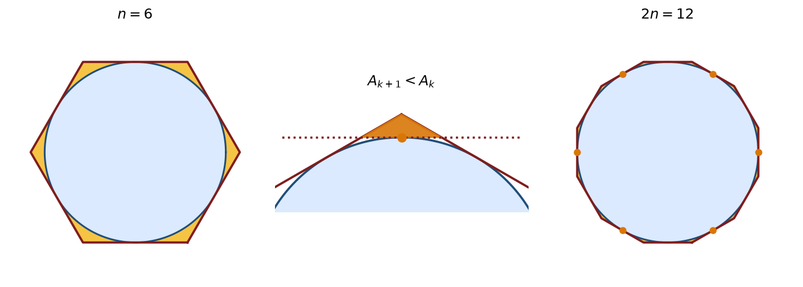
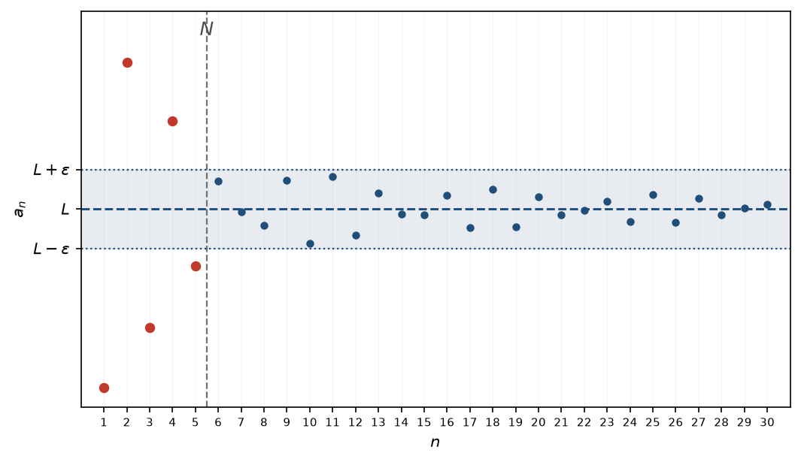
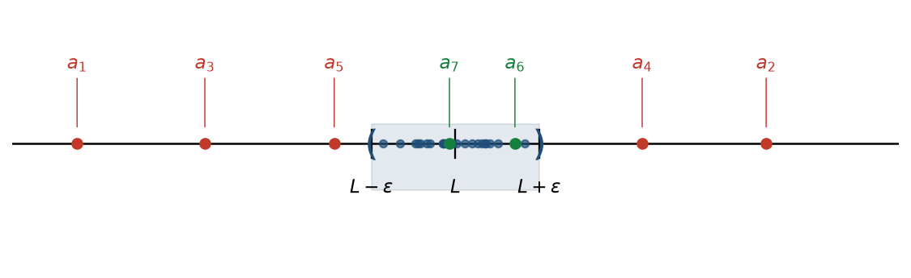
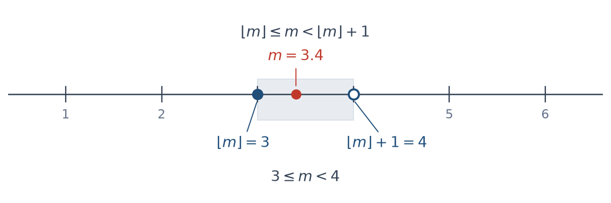
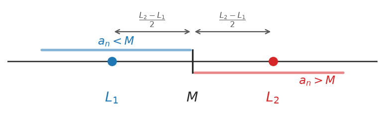

# גבול של סדרה {chapter="7"}

## הגדרה ודרכי תיאור

::: {#box-def-sequence .thmdef}
**סדרה (ממשית)** היא אוסף **אינסופי** של מספרים ממשיים, שבו יש **חשיבות לסדר** ו**חזרות מותרות** (ראו את הדיון על ההבדל בין סדרה לקבוצה [בפרק המבוא](06-sequences-intro.qmd)): $$a_1, a_2, a_3, \dots, a_n, \dots$$ $a_n$ הוא ה**איבר** שבמקום $n$, ו-$n$ הוא ה**אינדקס** הרץ על המספרים הטבעיים. את הסדרה כולה נסמן בקיצור $(a_n)_{n=1}^{\infty}$.
:::

::: {.thmrem title="ההגדרה הפורמלית: סדרה כפונקציה"}
פורמלית, סדרה ממשית $(a_n)_{n=1}^{\infty}$ היא **פונקציה** $a:\mathbb{N}\to\mathbb{R}$, כלומר לכל מספר טבעי $n$ מותאם ערך ממשי יחיד $a_n = a(n)$. הצגה זו הופכת את ״הסדר״ ואת ״האינסופיות״ למדויקים. האינדקס רץ על המספרים הטבעיים $\mathbb{N} = \{1, 2, 3, \dots\}$, ולכן סדרה מתחילה כברירת מחדל מ-$a_1$; רק כאשר יצוין במפורש נתחיל את האינדקס במקום אחר (למשל $a_0$).
:::

איך מתארים סדרה? עלינו לתאר במדויק איזה איבר נמצא במקום ה-$n$, לכל $n\in\mathbb{N}$. לכתוב את כל האיברים לפי הסדר — בלתי אפשרי, שכן יש אינסוף מהם. לכן נעזרים בכמה **דרכים לתיאור סדרה**; נציג שלוש דרכים נפוצות.

### הדרך ה״נאיבית״ {.unnumbered}

רושמים כמה מן האיברים הראשונים, מתוך הנחה ששאר האיברים ״ברורים מן ההקשר״. לדוגמה, $1, 3, 5, 7, \dots$ מתארת (כך אנו מקווים) את סדרת המספרים האי-זוגיים בסדר עולה. הדרך פשוטה ונוחה להמחשה, אך בעייתית משתי סיבות:

- **הסדרה אינה מוגדרת היטב.** ייתכנו כמה המשכים הגיוניים באותה מידה. כיצד, למשל, יש להמשיך את $2, 4, 8, \dots$? אולי $16$ (חזקות של $2$), ואולי $14$ (בהפרשים ההולכים וגדלים $2, 4, 6, \dots$). אין דרך להכריע בין השתיים מן הרשימה בלבד.
- **אין גישה ישירה לאיבר.** גם כשהכוונה ברורה, קשה לעיתים לומר מהו האיבר במקום מסוים בלי לכתוב את כל קודמיו — למשל, מהו האיבר ה-$100$?

### נוסחה סגורה {.unnumbered}

הדרך השנייה: ביטוי המחשב את $a_n$ **ישירות** מתוך $n$, בלי תלות באיברים הקודמים. יתרונה הגדול הוא הגישה הישירה — אפשר ״לקפוץ״ מיד לכל איבר שנרצה, גם ל-$a_{100}$, בלי לחשב את קודמיו. כך, את סדרת המספרים האי-זוגיים נתאר בפשטות על ידי $a_n = 2n - 1$.

::: {#box-exm-closed-form .thmexm title="סדרות בנוסחה סגורה"}
כמה סדרות המוגדרות בנוסחה סגורה:

- $a_n = n$ נותנת $1, 2, 3, 4, \dots$;
- $a_n = (-1)^n$ נותנת $-1, 1, -1, 1, \dots$, והיא סדרה **מתחלפת**;
- $a_n = 2^n$ נותנת $2, 4, 8, 16, \dots$, שהם **חזקות** של $2$;
- הסדרה הקבועה $a_n = 8$ נותנת $8, 8, 8, \dots$.
:::

### רקורסיה {.unnumbered}

לא לכל סדרה קל — ולעיתים אף לא ידוע — למצוא נוסחה סגורה. דרך טבעית אחרת היא **רקורסיה**: מגדירים במפורש כמה מן האיברים הראשונים, ונותנים **כלל** המחשב כל איבר חדש מתוך קודמיו. (בקורס נסתפק בכללים התלויים במספר **סופי** של איברים קודמים.) לרקורסיה יש חיסרון — כדי להגיע ל-$a_{100}$ יש לחשב תחילה את כל קודמיו — אך לעיתים היא הדרך הטבעית, ואף היחידה הפשוטה, לתאר סדרה. על מנת להתגבר על הבעיה של חישוב האיבר הכללי, מנסים להמיר את הנוסחה הרקורסיבית לנוסחה סגורה. באופן כללי, זו בעיה קשה ולא נתייחס למקרה הכללי בקורס. יחד עם זאת, לעיתים ניתן ל״נחש״ את הנוסחה ולהוכיח אותה בשיטות כמו אינדוקציה.

שתי הסדרות המוכרות ביותר מבית הספר — ה**חשבונית** וה**הנדסית** — מוגדרות באופן טבעי ברקורסיה.

::: {#box-exm-arithmetic .thmexm title="סדרה חשבונית"}
**סדרה חשבונית:** מתחילים באיבר $a_1$, ובכל צעד מוסיפים **הפרש** קבוע $d$, כלומר $a_{n+1} = a_n + d$. למשל, $a_1 = 3$ ו-$d = 2$ נותנות $3, 5, 7, 9, \dots$. (יש לה גם נוסחה סגורה: $a_n = a_1 + (n-1)\,d$.)
:::

::: {#box-exm-geometric .thmexm title="סדרה הנדסית"}
**סדרה הנדסית:** מתחילים באיבר $a_1$, ובכל צעד מכפילים ב**מנה** קבועה $q$, כלומר $a_{n+1} = q\,a_n$. למשל, $a_1 = 1$ ו-$q = 2$ נותנות $1, 2, 4, 8, \dots$. (וגם לה נוסחה סגורה: $a_n = a_1\,q^{\,n-1}$.)
:::

::: {#box-exm-factorial .thmexm title="העצרת"}
ה**עצרת** $n!$. אין ״פעולה חשבונית״ יחידה שמשמעותה ״מכפלת כל המספרים מ-$1$ עד $n$״; העצרת מוגדרת מלכתחילה ברקורסיה: $$,a_1 = 1 \qquad a_{n+1} = (n+1)\,a_n$$ ומתקבלת $1, 2, 6, 24, 120, \dots$, כלומר $a_n = n!$.
:::

::: {#box-exm-fibonacci .thmexm title="סדרת פיבונאצ׳י"}
כל איבר הוא סכום שני קודמיו: $$a_n = \begin{cases} 1 & n = 1, 2 \\ a_{n-1} + a_{n-2} & n \geq 3 \end{cases}$$ ומתקבלת הסדרה $1, 1, 2, 3, 5, 8, 13, 21, \dots$. זוהי אולי הסדרה הרקורסיבית המפורסמת ביותר, והיא צצה במקומות מפתיעים במתמטיקה ובטבע.
:::

::: {.extra title="העשרה: פיבונאצ׳י, ארנבים ויחס הזהב"}
סדרת פיבונאצ׳י הופיעה לראשונה בספרו של לאונרדו מפיזה (המכונה ״פיבונאצ׳י״) בשנת $1202$, כפתרון לחידה על **התרבות ארנבים**: מתחילים בזוג ארנבים אחד; כל זוג בוגר מוליד זוג חדש מדי חודש, וזוג טרי מבשיל תוך חודש. מספר זוגות הארנבים בחודש ה-$n$ הוא בדיוק $a_n$.

לסדרה יש גם **נוסחה סגורה** (״נוסחת בינה״), המערבת את **יחס הזהב** $\varphi = \frac{1+\sqrt{5}}{2}$. אלא שהנוסחה הזו אינה ״מסבירה״ את הסדרה: היא נשענת על מספרים אי-רציונליים, למרות שכל איברי הסדרה שלמים, ורחוקה מלהיות מובנת מאליה. דווקא ה**הגדרה הרקורסיבית** חושפת את התכונה שבזכותה הסדרה חשובה — שכל איבר הוא סכום קודמיו.

זו תופעה כללית: סדרות רבות שצצות בפועל — במדעי המחשב, ביולוגיה, פיסיקה, כלכלה ובתחומים רבים נוספים — מוגדרות באופן טבעי ברקורסיה, מפני שהן מתארות תהליכים שבהם המצב הבא תלוי במצב הנוכחי (או בכמה מצבים קודמים) ולאו דווקא במספר הצעד בתהליך. למשל, בחידת הארנבים מספר הזוגות בחודש הנוכחי הוא סכום הזוגות שכבר היו בחודש הקודם והזוגות החדשים שנולדו; ומספר הנולדים שווה למספר הזוגות הבוגרים — אלה שהיו כבר לפני חודשיים. כך כל איבר נקבע משני קודמיו, ללא תלות ישירה במספר החודש.
:::

::::: {.extra title="העשרה: רקורסיה מתקדמת"}
**מספרים בינאריים.** בבסיס עשר, הכתיב $4703$ פירושו

$$,4\cdot 1000 + 7\cdot 100 + 0\cdot 10 + 3\cdot 1$$

כלומר סכום של חזקות של $10$. הכתיב **הבינארי** בנוי בדיוק כך, אלא שבמקום חזקות של $10$ הוא משתמש ב**חזקות של** $2$, ולכן די בו בשתי ספרות, $0$ ו-$1$. כך הכתיב $10110$ פירושו

$$1\cdot 2^4 + 0\cdot 2^3 + 1\cdot 2^2 + 1\cdot 2^1 + 0\cdot 2^0 =$$

$$.16 + 0 + 4 + 2 + 0 = 22$$

::: {.content-visible when-format="html"}
```{=html}
<iframe class="widget-frame" src="widgets/ch07/binary-counter.html" loading="lazy" title="ממיר אינטראקטיבי: מספרים בינאריים"></iframe>
```
:::

::: {.content-visible when-format="pdf"}
*ממיר בינארי אינטראקטיבי, שבו אפשר לגרור את* $n$ ולהדליק ולכבות ספרות, זמין בגרסה המקוונת של הספר.
:::

שני דברים שיהיו שימושיים מיד. ראשית, $n$ זוגי בדיוק כאשר הספרה הבינארית האחרונה שלו היא $0$. שנית, המעבר מ-$n$ ל-$\left\lfloor n/2 \right\rfloor$ הוא בדיוק מחיקת אותה ספרה אחרונה.

**הסדרה.** הכלל הרקורסיבי גמיש: הוא יכול להישען על איברים רחוקים מן האחרון, ואף להשתנות לפי צורת האינדקס. נגדיר, למשל, סדרה שכל איבר בה נשען על האיבר שבמקום $\left\lfloor n/2 \right\rfloor$, בהתאם לזוגיות של $n$: $$a_n = \begin{cases} a_{n/2} & \text{יגוז}\ n \\ a_{(n-1)/2} + 1 & \text{יגוז-יא}\ n \end{cases}$$ (עם $a_1 = 1$). מתקבלת הסדרה $1, 1, 2, 1, 2, 2, 3, 1, \dots$, ומסתבר ש-$a_n$ הוא בדיוק מספר הספרות $1$ בייצוג הבינארי של $n$.
:::::

### תרגילים {.unnumbered}

בתרגילים המקוונים אפשר להקליד תשובה וללחוץ ״בדיקה״; בגרסה המודפסת הפתרונות מופיעים בהמשך. לשברים השתמשו ב-`/` (למשל `1/3`), לחזקות ב-`^` (למשל `2^5`), ולעצרת ב-`!` (למשל `n!`).

::: {.content-visible when-format="html"}
```{=html}
<p><strong>תרגיל 1.</strong> רשמו את חמשת האיברים הראשונים \(a_1,\dots,a_5\) של כל סדרה (מופרדים בפסיקים):</p>
<div class="seq-quiz" data-answer="1/2, 4/9, 9/28, 16/65, 25/126"><span class="seq-label">(א) \(a_n = \dfrac{n^2}{n^3+1}\)</span><input class="seq-input" type="text" placeholder="לדוגמה: 1, 2/3, -4, ..."><button class="seq-check">בדיקה</button><span class="seq-feedback"></span></div>
<div class="seq-quiz" data-answer="1/3, 8/9, 1, 64/81, 125/243"><span class="seq-label">(ב) \(a_n = \dfrac{n^3}{3^n}\)</span><input class="seq-input" type="text" placeholder="לדוגמה: 1, 2/3, -4, ..."><button class="seq-check">בדיקה</button><span class="seq-feedback"></span></div>
<div class="seq-quiz" data-answer="4, -7, 10, -13, 16"><span class="seq-label">(ג) \(a_n = (-1)^{n+1}\big(4+(n-1)\cdot 3\big)\)</span><input class="seq-input" type="text" placeholder="לדוגמה: 1, 2/3, -4, ..."><button class="seq-check">בדיקה</button><span class="seq-feedback"></span></div>
<p><strong>תרגיל 2.</strong> נתונים איבריה הראשונים של כל סדרה; מצאו נוסחה סגורה \(a_n\) כפונקציה של \(n\):</p>
<div class="formula-quiz" data-answer="1, 4, 9, 16, 25, 36"><span class="seq-label">(א) \(1,\ 4,\ 9,\ 16,\ \dots\)</span><input class="seq-input" type="text" placeholder="3*n^2+1 :למשל"><button class="seq-check">בדיקה</button><span class="seq-feedback"></span></div>
<div class="formula-quiz" data-answer="5, 9/2, 17/4, 33/8, 65/16, 129/32"><span class="seq-label">(ב) \(5,\ 9/2,\ 17/4,\ 33/8,\ 65/16,\ \dots\)</span><input class="seq-input" type="text" placeholder="3*n^2+1 :למשל"><button class="seq-check">בדיקה</button><span class="seq-feedback"></span></div>
<div class="formula-quiz" data-answer="1, -3, 5, -7, 9, -11"><span class="seq-label">(ג) \(1,\ -3,\ 5,\ -7,\ 9,\ \dots\)</span><input class="seq-input" type="text" placeholder="3*n^2+1 :למשל"><button class="seq-check">בדיקה</button><span class="seq-feedback"></span></div>
<p><strong>תרגיל 3.</strong> רשמו את חמשת האיברים הראשונים של כל אחת מהסדרות המוגדרות ברקורסיה:</p>
<div class="seq-quiz" data-answer="1, 7, 17, 31, 49"><span class="seq-label">(א) \(a_1 = 1,\ a_n = a_{n-1} + 4n - 2\)</span><input class="seq-input" type="text" placeholder="לדוגמה: 1, 2/3, -4, ..."><button class="seq-check">בדיקה</button><span class="seq-feedback"></span></div>
<div class="seq-quiz" data-answer="1, 2, 4, 8, 16"><span class="seq-label">(ב) \(a_1 = 1,\ a_2 = 2,\ a_n = 2a_{n-2} + a_{n-1}\)</span><input class="seq-input" type="text" placeholder="לדוגמה: 1, 2/3, -4, ..."><button class="seq-check">בדיקה</button><span class="seq-feedback"></span></div>
<div class="seq-quiz" data-answer="1, 3, 15, 105, 945"><span class="seq-label">(ג) \(a_1 = 1,\ a_n = (2n-1)\,a_{n-1}\)</span><input class="seq-input" type="text" placeholder="לדוגמה: 1, 2/3, -4, ..."><button class="seq-check">בדיקה</button><span class="seq-feedback"></span></div>
<p><strong>תרגיל 4.</strong> נתונה סדרה ברקורסיה; מצאו לה נוסחה סגורה \(a_n\):</p>
<div class="formula-quiz" data-answer="1, 3, 7, 15, 31, 63"><span class="seq-label">(א) \(a_1 = 1,\ a_{n+1} = a_n + 2^n\)</span><input class="seq-input" type="text" placeholder="3*n^2+1 :למשל"><button class="seq-check">בדיקה</button><span class="seq-feedback"></span></div>
<div class="formula-quiz" data-answer="0, 3, 8, 15, 24, 35"><span class="seq-label">(ב) \(a_1 = 0,\ a_{n+1} = a_n + 2n + 1\)</span><input class="seq-input" type="text" placeholder="3*n^2+1 :למשל"><button class="seq-check">בדיקה</button><span class="seq-feedback"></span></div>
<div class="formula-quiz" data-answer="2, 8, 48, 384, 3840, 46080"><span class="seq-label">(ג) \(a_1 = 2,\ a_n = 2n\,a_{n-1}\) — רמז: אפשר להיעזר בעצרת \(n!\)</span><input class="seq-input" type="text" placeholder="3*n^2+1 :למשל"><button class="seq-check">בדיקה</button><span class="seq-feedback"></span></div>
```
:::

:::: {.content-visible when-format="pdf"}
**תרגיל 1.** רשמו את חמשת האיברים הראשונים של כל סדרה: (א) $a_n = \dfrac{n^2}{n^3+1}$; (ב) $a_n = \dfrac{n^3}{3^n}$; (ג) $a_n = (-1)^{n+1}\big(4+(n-1)\cdot 3\big)$.

**תרגיל 2.** מצאו נוסחה סגורה $a_n$ לכל סדרה: (א) $1,\ 4,\ 9,\ 16,\ \dots$; (ב) $5,\ 9/2,\ 17/4,\ 33/8,\ 65/16,\ \dots$; (ג) $1,\ -3,\ 5,\ -7,\ 9,\ \dots$.

**תרגיל 3.** רשמו את חמשת האיברים הראשונים של כל אחת מהסדרות המוגדרות ברקורסיה: (א) $a_1 = 1,\ a_n = a_{n-1} + 4n - 2$; (ב) $a_1 = 1,\ a_2 = 2,\ a_n = 2a_{n-2} + a_{n-1}$; (ג) $a_1 = 1,\ a_n = (2n-1)\,a_{n-1}$.

**תרגיל 4.** מצאו נוסחה סגורה $a_n$ לכל אחת מהסדרות המוגדרות ברקורסיה: (א) $a_1 = 1,\ a_{n+1} = a_n + 2^n$; (ב) $a_1 = 0,\ a_{n+1} = a_n + 2n + 1$; (ג) $a_1 = 2,\ a_n = 2n\,a_{n-1}$ (רמז: אפשר להיעזר בעצרת $n!$).

::: {.callout-tip title="פתרונות"}
**תרגיל 1.** (א) $\dfrac{1}{2},\ \dfrac{4}{9},\ \dfrac{9}{28},\ \dfrac{16}{65},\ \dfrac{25}{126}$; (ב) $\dfrac{1}{3},\ \dfrac{8}{9},\ 1,\ \dfrac{64}{81},\ \dfrac{125}{243}$; (ג) $4,\ -7,\ 10,\ -13,\ 16$.

**תרגיל 2.** (א) $a_n = n^2$; (ב) $a_n = 4 + 2^{\,1-n}$; (ג) $a_n = (-1)^{n+1}(2n-1)$.

**תרגיל 3.** (א) $1,\ 7,\ 17,\ 31,\ 49$; (ב) $1,\ 2,\ 4,\ 8,\ 16$; (ג) $1,\ 3,\ 15,\ 105,\ 945$.

**תרגיל 4.** (א) $a_n = 2^n - 1$; (ב) $a_n = n^2 - 1$; (ג) $a_n = 2^n\,n!$.
:::
::::

## גבול של סדרה: מוטיבציה ואינטואיציה

בפועל, כשאנחנו עובדים עם מספרים, לעיתים קרובות איננו עובדים עם הערך המדויק אלא עם ערך ש״קרוב מספיק״ אליו. הדוגמה הפשוטה ביותר היא כתיבת $0.3333$ במקום $\frac{1}{3}$: אלה אינם אותו מספר, אבל לרוב הצרכים ההבדל ביניהם אינו משנה. כך גם כשכותבים $1.41$ במקום $\sqrt{2}$.

אבל מה פירוש ״קרוב״? כל עוד לא צירפנו לביטוי הזה מספר, אין בו טענה מתמטית. לכן קובעים **מראש** את השגיאה שאנחנו מוכנים לסבול, ומסמנים אותה $\varepsilon>0$ (״אפסילון״). נאמר ש-$x$ מקרב את $L$ **ברמת דיוק** $\varepsilon$ אם המרחק בין $x$ ל-$L$ קטן מ-$\varepsilon$.

והמרחק בין שני מספרים על הישר כבר מוכר לנו: הוא הערך המוחלט של ההפרש ביניהם. כלומר, התנאי הוא $$|x - L| < \varepsilon$$ ושימו לב שהמרחק **אינו תלוי בסדר**, שכן $|x - L| = |L - x|$. וזה הגיוני: לא מעניין אותנו אם $x$ גדול מ-$L$ או קטן ממנו, אלא רק כמה הוא רחוק ממנו. למשל, $0.3333$ קטן מ-$\frac{1}{3}$ ואילו $0.3334$ גדול ממנו — ושניהם מקרבים אותו ברמת דיוק $0.001$.

את אותו תנאי אפשר לרשום גם בלי ערך מוחלט, ואז מתקבלת תמונה גאומטרית: $$|x - L| < \varepsilon \iff -\varepsilon < x - L < \varepsilon \iff L - \varepsilon < x < L + \varepsilon$$ כלומר $x$ נמצא בקטע הפתוח $(L-\varepsilon,\ L+\varepsilon)$, קטע שמרכזו $L$ ורוחבו $2\varepsilon$. זוהי בדיוק **סביבת ה-**$\varepsilon$ של $L$ שראינו בפרק על הערך המוחלט. שתי הצורות שקולות לחלוטין, ונעבור ביניהן בחופשיות: הראשונה היא טענה על ה**שגיאה** — גודל אחד, המרחק, החסום על ידי מספר אחד; השנייה היא טענה על **מקומו** של $x$ על הישר.

```{python}
#| echo: false
#| output: false
import numpy as np
import matplotlib.pyplot as plt

fig, ax = plt.subplots(figsize=(6.4, 3.0))
L, eps, x = 0.0, 1.0, 0.55

ax.axhline(0, color="black", lw=1.2, zorder=1)
ax.plot([L - eps, L + eps], [0, 0], color="tab:blue", lw=3, alpha=0.5, zorder=2)
for xx, s in [(L - eps, "("), (L + eps, ")")]:
    ax.annotate(s, xy=(xx, 0), xytext=(xx, 0.02), ha="center", va="bottom",
                fontsize=20, color="tab:blue")
for xx, lab in [(L - eps, r"$L-\varepsilon$"), (L, r"$L$"), (L + eps, r"$L+\varepsilon$")]:
    ax.plot([xx, xx], [-0.04, 0.04], color="black", lw=1.2, zorder=3)
    ax.annotate(lab, xy=(xx, 0), xytext=(xx, -0.10), ha="center", va="top", fontsize=12)

# the single approximating number, and the distance from it to L
ax.plot([x], [0], "o", color="tab:green", ms=7, zorder=4)
ax.annotate(r"$x$", xy=(x, 0), xytext=(x, -0.10), ha="center", va="top",
            fontsize=12, color="tab:green")
for xx in (L, x):
    ax.plot([xx, xx], [0.05, 0.24], ls=":", color="0.6", lw=1.0, zorder=3)
ax.annotate("", xy=(L, 0.24), xytext=(x, 0.24),
            arrowprops=dict(arrowstyle="<->", color="tab:red", lw=1.4))
ax.text((L + x) / 2, 0.28, r"$|x-L|<\varepsilon$", ha="center", va="bottom",
        fontsize=12, color="tab:red")

ax.set_xlim(L - 2, L + 2)
ax.set_ylim(-0.35, 0.58)
ax.axis("off")
fig.savefig("figures/c07_fig01.png", dpi=150, bbox_inches="tight")
plt.close(fig)
```

```{=latex}
\par\medskip
\noindent\beginL\hbox to \linewidth{\hss\includegraphics[width=0.62\linewidth]{figures/c07_fig01.png}\hss}\endL\par
\medskip
```

:::: {.content-visible when-format="pdf"}
::: {style="text-align:center"}
תרשים: $x$ מקרב את $L$ ברמת דיוק $\varepsilon$; המרחק ביניהם קטן מ-$\varepsilon$, כלומר $x$ נמצא בקטע $(L-\varepsilon,\,L+\varepsilon)$.
:::
::::

::: {.content-visible when-format="html"}
{#fig-eps-approx width="62%" fig-align="center"}
:::

ועכשיו לנקודה שממנה מתחיל הפרק: רמת הדיוק אינה נתונה לנו מראש — היא נקבעת על ידי מי שדורש את הקירוב, ומספר בודד אינו יכול לעמוד ב**כל** דרישה. $0.3333$ אמנם מקרב את $\frac{1}{3}$ ברמת דיוק $0.0001$, אך ברמת דיוק $0.00001$ הוא כבר אינו מספיק ובמקומו נדרש $0.33333$; ברמת דיוק קטנה עוד יותר יידרש מספר אחר, וכך הלאה. שום שבר עשרוני סופי אינו עונה על כל הדרישות. היחיד שהיה עונה עליהן הוא $\frac{1}{3}$ עצמו — ואותו איננו יודעים לרשום כשבר עשרוני סופי, וזו כל הסיבה שאנחנו מקרבים מלכתחילה.

לכן, בהינתן מספר שאיננו יודעים לרשום או לחשב במדויק, מה שדרוש לנו אינו מספר בודד אלא **שיטה**: דרך אמינה לייצר קירוב לכל רמת דיוק שתידרש. אחת השיטות היא לבנות **סדרה** שאיבריה קלים לחישוב, המקיימת את התכונה הבאה: ל**כל** רמת דיוק $\varepsilon>0$, קטנה ככל שתהיה, קיים אינדקס שהחל ממנו ואילך **כל** איברי הסדרה מקרבים את המספר ברמת דיוק $\varepsilon$.

שימו לב לשני דברים. ראשית, אין כאן דרישה שהסדרה תתקרב בהתמדה: מותר לאיברים לעלות ולרדת ואף להתרחק לפרקים — הנדרש **הוא רק שבסופו של דבר** כולם ייכנסו לתחום ויישארו בו. שנית, זו הסיבה שאנחנו דורשים ש**כל** האיברים מן האינדקס והלאה יהיו קרובים ולא רק אחד מהם: איבר בודד שיצא קרוב במקרה אינו מועיל, שכן ייתכן שמיד אחריו הסדרה מתרחקת שוב. כשכל האיברים מן האינדקס והלאה קרובים מספיק, אפשר לעצור בכל אחד מהם ולקחת אותו כקירוב.

עד כאן הלכנו בכיוון אחד: המספר היה הנתון, והסדרה הייתה הכלי שבנינו כדי להגיע אליו.

אבל אפשר לקרוא את הקשר הזה גם בכיוון ההפוך, ואז מתקבלת שאלה חדשה: הסדרה היא הנתון, והשאלה היא מה היא מקרבת — אם בכלל. האם קיים מספר שהסדרה מתקרבת אליו במובן שתיארנו? האם היא **מתייצבת**?

המקרה הברור ביותר הוא זה שכבר עמדנו בו. רצינו לקרב מספר, הגדרנו סדרה שלכאורה עושה את העבודה — ומניין לנו שאכן כך? אין די בכך שהסדרה ״נראית מתקרבת״: כדי שהקירוב יהיה לגיטימי עלינו לדעת שהיא באמת מקיימת את שדרשנו, כלומר שלכל רמת דיוק אכן קיים אינדקס שהחל ממנו כל האיברים מקרבים את המספר ברמת הדיוק הזו. זו בדיוק העבודה שנעשה בהמשך הסעיף עבור $\pi$.

ולעיתים הסדרה אינה נבנית על ידינו כלל, אלא **יוצאת מתוך תהליך**: $a_n$ הוא התוצאה המתקבלת כאשר הפרמטר הוא $n$, ודווקא המספר הוא מה שאין לנו. למשל, נניח ש-$a_n$ הוא הזמן הדרוש לבניית בית על ידי $n$ פועלים. ככל שנוסיף פועלים הזמן יילך ויקטן — אך לא לאפס, שכן יש חלק מהעבודה שאי אפשר לחלק ביניהם. הזמן מתייצב על ערך מסוים: הזמן המהיר ביותר שבו אפשר לבנות את הבית בכלל. את הערך הזה איננו יודעים מראש, אבל עצם הידיעה שהוא קיים מעשית מאוד — מרגע שאנחנו ״מספיק קרובים״ אליו, כבר אין טעם להוסיף פועלים.

דוגמה עדכנית יותר היא אימון של מודל בלמידת מכונה. למודל יש פרמטרים, ויש להם ערך שבו הוא מתפקד בצורה הטובה ביותר; תהליך האימון מייצר סדרה של ערכים — אחד לכל שלב אימון. האם הסדרה הזו מתקרבת אל הערך האופטימלי? והאם היא בכלל מתייצבת על משהו? אלו שאלות אמיתיות, ולא כל אימון עונה עליהן בחיוב.

שכן לא כל תהליך מתייצב, וכדאי לראות זאת מיד. קחו סדרה שמתנהגת כך: $$1,\ 2,\ 3,\ 1,\ 2,\ 1,\ 2,\ 3,\ 1,\ 2,\ \dots$$ היא אינה בורחת לאינסוף — כל איבריה בין $1$ ל-$3$, וגם אינה מתקרבת לשום מספר. היא פשוט רודפת אחר זנבה: חוזרת שוב ושוב על אותם ערכים, ולעולם אינה מתיישבת על אחד מהם.

דוגמה יומיומית לאותו כשל: מרצה כותב על הלוח באותיות קטנות מדי. מבקשים ממנו לכתוב גדול יותר — והוא מצייר אותיות בגובה חצי לוח. מבקשים קטן יותר — ושוב זעיר. הגודל קופץ מקצה לקצה ואינו מתקרב לשום גודל, ולעולם לא נגיע לגודל הרצוי ולא נוכל לעצור. שימו לב מדוע: הבקשה ״גדול יותר״ אינה נושאת עמה שום **רמת דיוק**. כל עוד צורת הבקשה אינה משתנה, אין לנו כלל קריטריון שיאמר לנו מתי הגענו — וזו בדיוק הסיבה שקבענו מראש את $\varepsilon$.

::: {.thmrem title="אותו רעיון, בהקשרים רבים"}
השאלה שבכיוון השני — ״האם הסדרה מתייצבת?״ — היא למעשה השאלה שתעסיק אותנו בכל הפרק: האם הסדרה **מתכנסת**. המצבים שבהם היא עולה אינם ניתנים למניין, והם מופיעים כמעט בכל תחום שבו מופיעות סדרות של מספרים — בשאלות מעשיות ובשאלות תאורטיות כאחד.

מה שמשותף לכולם הוא הגרעין: האם קיים מספר שהסדרה מתקרבת אליו באופן שתיארנו? את השאלה הזו, ואת ההגדרה המדויקת שמאחוריה, ננסח בסעיף הבא.
:::

```{=html}
<!-- TODO: rewrite the pi example — it is currently too long and cumbersome. Split it in two.
     Part 1 (stays here, motivation only): define the inscribed-polygon sequence, explain why
     it works (no need to compute sines, no need to know the value of pi), show the first few
     terms, confirm empirically that they approach pi, and keep the interactive simulation.
     Part 2 (later in the chapter, after the limit is defined): the actual convergence proof —
     the circumscribed polygons, the error bound, and the choice of K. It belongs there because
     it illustrates a useful technique: bounding the error from above by something we do know
     how to compute. -->
```

### קירוב המספר $\pi$ {.unnumbered}

על מנת להמחיש ולהעמיק את הרעיון הקודם, ניתן דוגמה מפורטת יותר.

המספר $\pi$ הוא היחס בין היקף המעגל לקוטר שלו. כמו כן, ידועה לנו הנוסחה מהתיכון $A=\pi r^2$, כאשר $A$ הוא שטח העיגול ו-$r$ הוא רדיוס המעגל. מפני שהמעגל הוא אחת הצורות הגאומטריות הנפוצות, $\pi$ מופיע באופן טבעי בהרבה מקומות, והיינו רוצים לדעת את הערך שלו. אנחנו ננסה לפתח שיטה לחשב אותו.

הדוגמה שבחרנו בה אינה מלאכותית. המעגל הוא אחת הצורות הנפוצות ביותר, ולכן $\pi$ נדרש כמעט בכל חישוב הנדסי שבו מופיע עיגול, גליל או כדור — ובמשך רוב ההיסטוריה לא הייתה שום דרך פשוטה להשיג אותו. מי שנזקק לערכו היה תלוי בשיטת קירוב, בעצמו או דרך טבלאות שחיברו אחרים; השאלה ״כיצד מקרבים את $\pi$?״ הייתה שאלה מעשית, לא תרגיל.

היום המצב הפוך, ודווקא בזכות זה הדוגמה נוחה: כל מחשבון נותן את $\pi$ בדיוק של עשרות ספרות בשבריר שנייה. כלומר את התשובה אנחנו כבר יודעים — ולכן נוכל לבדוק בכל שלב אם השיטה שאנחנו בונים אכן עובדת.

```{python}
#| echo: false
#| output: false
import numpy as np
import matplotlib.pyplot as plt

fig, ax = plt.subplots(figsize=(4.8, 4.4))

# the circle, its diameter, its radius and its circumference
t = np.linspace(0, 2 * np.pi, 400)
ax.fill(np.cos(t), np.sin(t), color="#dbeafe", zorder=1)
ax.plot(np.cos(t), np.sin(t), color="#1f4e79", lw=2.4, zorder=3)
ax.annotate("", xy=(-1, 0), xytext=(1, 0),
            arrowprops=dict(arrowstyle="<->", color="#c0392b", lw=1.7))
ax.text(0, -0.14, r"$d$", ha="center", va="top", fontsize=14, color="#c0392b")
ax.annotate("", xy=(0, 1), xytext=(0, 0),
            arrowprops=dict(arrowstyle="->", color="#7f1d1d", lw=1.4))
ax.text(0.07, 0.55, r"$r$", ha="left", fontsize=13, color="#7f1d1d")
ax.plot([0], [0], marker="o", color="#7f1d1d", ms=4, zorder=5)
ax.text(1.03 * np.cos(0.9), 1.03 * np.sin(0.9), r"$C$",
        ha="left", va="bottom", fontsize=14, color="#1f4e79")
ax.text(0, -0.58, r"$A = \pi r^2$", ha="center", va="center", fontsize=15,
        color="#1f4e79", zorder=5)
ax.set_title(r"$\pi = C / d$", fontsize=13)
ax.set_xlim(-1.35, 1.4)
ax.set_ylim(-1.35, 1.35)
ax.set_aspect("equal")
ax.axis("off")

fig.tight_layout()
fig.savefig("figures/c07_fig02.png", dpi=150, bbox_inches="tight")
plt.close(fig)
```

```{=latex}
\par\medskip
\noindent\beginL\hbox to \linewidth{\hss\includegraphics[width=0.45\linewidth]{figures/c07_fig02.png}\hss}\endL\par
\medskip
```

:::: {.content-visible when-format="pdf"}
::: {style="text-align:center"}
תרשים: $\pi$ הוא היחס בין היקף המעגל $C$ לקוטרו $d$.
:::
::::

::: {.content-visible when-format="html"}
{#fig-pi-definition width="45%" fig-align="center"}
:::

שימו לב ש-$\pi$ הוא **יחס**, ולכן אינו תלוי בגודל המעגל: מעגל גדול ומעגל קטן נותנים בדיוק את אותו מספר. לכן מותר לנו לבחור לחישוב את המעגל הנוח ביותר, ונבחר את זה שרדיוסו $1$. הבחירה משתלמת במיוחד: לפי $A = \pi r^2$, שטח העיגול שרדיוסו $1$ הוא בדיוק $\pi$. כלומר, במקום למדוד את היחס בין ההיקף לקוטר, די לנו לחשב את ה**שטח** של עיגול היחידה.

אלא שמהגדרת המספר לא ברור כלל כיצד לחשב את ערכו: ההגדרה אומרת לנו מהו $\pi$, אך אינה נותנת שום דרך למצוא אותו. שימו לב שאין זו בעיה של **ייצוג** בלבד — גם אילו היה $\pi$ מספר רציונלי, עדיין לא היה ברור מן ההגדרה כיצד למצוא את השבר המתאים. (למעשה $\pi$ הוא אי-רציונלי, ולכן ממילא אי אפשר לכתוב אותו כשבר — אך עובדה זו לא תוכח כאן, ואיננו זקוקים לה.) לכן נתחיל מהמקום היחיד שאפשר להתחיל ממנו: ננסה לפתח שיטה שתאפשר לנו ל**קרב** אותו, בדיוק טוב כרצוננו.

#### הרעיון: מצולע עם הרבה צלעות דומה למעגל {.unnumbered}

איך נעשה את זה? נשים לב, שמצולע משוכלל עם מספיק צלעות הוא ״כמעט״ מעגל ומצד שני את השטח שלו יחסית קל לחשב.

התרשים הבא מראה עד כמה זה עובד. במשושה עוד רואים בבירור שש צלעות; במצולע בעל $24$ צלעות ההבדל מן המעגל כבר קשה לאיתור, ובבעל $96$ צלעות העין אינה מבחינה ביניהם כלל.

```{python}
#| echo: false
#| output: false
import numpy as np
import matplotlib.pyplot as plt
from matplotlib.path import Path
from matplotlib.patches import PathPatch


def polygon_panels(ns, highlight, path):
    """Regular n-gons inscribed in the unit circle, one panel per n.

    highlight=False — plain: only "the polygon looks like the circle".
    highlight=True  — fills the leftover region (disc minus polygon) and reports
                      pi - a_k, i.e. the quantity the error argument is about.
    Defined once and called twice so the two variants cannot drift apart.
    """
    t = np.linspace(0, 2 * np.pi, 400)
    fig, axes = plt.subplots(1, len(ns), figsize=(3.2 * len(ns), 3.4))
    for ax, n in zip(np.atleast_1d(axes), ns):
        a = -np.pi / 2 + 2 * np.pi * np.arange(n + 1) / n
        area = (n / 2) * np.sin(2 * np.pi / n)
        if highlight:
            # leftover region as a compound path: disc CCW, polygon CW -> hole
            outer = np.column_stack([np.cos(t), np.sin(t)])
            inner = np.column_stack([np.cos(a), np.sin(a)])[::-1]
            verts = np.vstack([outer, outer[:1], inner, inner[:1]])
            codes = ([Path.MOVETO] + [Path.LINETO] * (len(outer) - 1) + [Path.CLOSEPOLY]
                     + [Path.MOVETO] + [Path.LINETO] * (len(inner) - 1) + [Path.CLOSEPOLY])
            ax.add_patch(PathPatch(Path(verts, codes), facecolor="#f6c445",
                                   edgecolor="none", zorder=2))
            ax.set_title(r"$n = %d$,   $\pi-a_k=%.4f$" % (n, np.pi - area), fontsize=11)
        else:
            ax.set_title(r"$n = %d$" % n, fontsize=12)
        ax.plot(np.cos(t), np.sin(t), color="#1f4e79", lw=1.4, zorder=3)
        ax.fill(np.cos(a), np.sin(a), color="#c0392b", alpha=0.5, zorder=1)
        ax.plot(np.cos(a), np.sin(a), color="#c0392b", lw=1.4, zorder=4)
        ax.set_xlim(-1.15, 1.15)
        ax.set_ylim(-1.15, 1.15)
        ax.set_aspect("equal")
        ax.axis("off")
    fig.tight_layout()
    fig.savefig(path, dpi=150, bbox_inches="tight")
    plt.close(fig)


polygon_panels([6, 24, 96], highlight=False, path="figures/c07_fig03.png")
```

```{=latex}
\par\medskip
\noindent\beginL\hbox to \linewidth{\hss\includegraphics[width=0.95\linewidth]{figures/c07_fig03.png}\hss}\endL\par
\medskip
```

:::: {.content-visible when-format="pdf"}
::: {style="text-align:center"}
תרשים: ככל שמספר הצלעות גדל, המצולע נעשה דומה יותר ויותר למעגל.
:::
::::

::: {.content-visible when-format="html"}
{#fig-pi-lookalike width="95%" fig-align="center"}
:::

ומצד שני — וזה מה שהופך את הרעיון לשימושי — את שטח המצולע אנחנו יודעים לחשב במדויק בכל שלב, גם כאשר הוא כבר ״נראה כמו מעגל״, ובנוסחה פשוטה: שטחו $S_n$ של מצולע משוכלל בעל $n$ צלעות החסום במעגל שרדיוסו $1$ הוא $$.S_n = \frac{n}{2}\,\sin\frac{2\pi}{n}$$ ולכן הוא מועמד טוב לקירוב שטחו של העיגול, שהוא $\pi$.

:::::: {.foldable title="פירוט: חישוב שטח המצולע"}
נתבונן במצולע משוכלל בעל $n$ צלעות החסום במעגל שרדיוסו $1$, ונחשב את שטחו. לשם כך נחבר את מרכז המעגל לכל אחד מקודקודי המצולע: המצולע מתחלק ל-$n$ משולשים **חופפים**, ולכל אחד מהם שתי צלעות שאורכן $1$ (שני רדיוסים) — כלומר הם משולשים **שווי שוקיים** — וזווית הראש שלהם היא $\frac{2\pi}{n}$.

```{python}
#| echo: false
#| output: false
import numpy as np
import matplotlib.pyplot as plt
from matplotlib.patches import Arc

fig, axes = plt.subplots(1, 2, figsize=(9.6, 4.2))

# --- left: the polygon cut into n congruent triangles ---------------------
ax = axes[0]
n = 6
t = np.linspace(0, 2 * np.pi, 400)
ax.plot(np.cos(t), np.sin(t), color="#1f4e79", lw=1.6, zorder=3)
ang = -np.pi / 2 + 2 * np.pi * np.arange(n + 1) / n
xs, ys = np.cos(ang), np.sin(ang)
for k in range(n):
    ax.fill([0, xs[k], xs[k + 1]], [0, ys[k], ys[k + 1]],
            color=("#c0392b" if k % 2 == 0 else "#e9a79c"), alpha=0.55, zorder=2)
    ax.plot([0, xs[k]], [0, ys[k]], color="#7f1d1d", lw=1.0, zorder=4)
ax.plot(xs, ys, color="#c0392b", lw=1.9, zorder=5)
ax.plot([0], [0], marker="o", color="#7f1d1d", ms=4, zorder=6)
ax.set_title(r"$n = 6$", fontsize=13)
ax.set_xlim(-1.25, 1.25)
ax.set_ylim(-1.25, 1.25)
ax.set_aspect("equal")
ax.axis("off")

# --- right: one triangle, labelled for a general n ------------------------
ax = axes[1]
half = np.pi / n                      # half of the apex angle
P1 = (-np.sin(half), -np.cos(half))   # apex (the centre) at the top, base below
P2 = (np.sin(half), -np.cos(half))
M = (0.0, -np.cos(half))
ax.fill([0, P1[0], P2[0]], [0, P1[1], P2[1]], color="#c0392b", alpha=0.45, zorder=1)
ax.plot([0, P1[0]], [0, P1[1]], color="#7f1d1d", lw=1.8, zorder=3)
ax.plot([0, P2[0]], [0, P2[1]], color="#7f1d1d", lw=1.8, zorder=3)
ax.plot([P1[0], P2[0]], [P1[1], P2[1]], color="#c0392b", lw=2.2, zorder=3)
ax.plot([0, M[0]], [0, M[1]], ls="--", color="#1f4e79", lw=1.4, zorder=4)
ax.plot([0], [0], marker="o", color="#7f1d1d", ms=4, zorder=6)

ax.add_patch(Arc((0, 0), 0.86, 0.86, angle=0,
                 theta1=270 - np.degrees(half), theta2=270 + np.degrees(half),
                 color="#7f1d1d", lw=1.3, zorder=5))
ax.text(0, -0.27, r"$\frac{2\pi}{n}$", ha="center", va="center",
        fontsize=13, color="#7f1d1d", zorder=6,
        bbox=dict(facecolor="white", edgecolor="none", pad=1.5))
ax.text(P1[0] / 2 - 0.06, P1[1] / 2, r"$1$", ha="right", va="center",
        fontsize=13, color="#7f1d1d")
ax.text(P2[0] / 2 + 0.06, P2[1] / 2, r"$1$", ha="left", va="center",
        fontsize=13, color="#7f1d1d")
ax.text(-0.07, -0.60, r"$1\cdot\cos\frac{\pi}{n}$", ha="right", va="center",
        fontsize=12, color="#1f4e79")
# the half-angle: this is the right triangle the sin/cos come from
ax.add_patch(Arc((0, 0), 1.30, 1.30, angle=0, theta1=270,
                 theta2=270 + np.degrees(half), color="#1f4e79", lw=1.1, zorder=5))
ax.text(0.80 * np.cos(np.radians(270 + np.degrees(half) / 2)),
        0.80 * np.sin(np.radians(270 + np.degrees(half) / 2)),
        r"$\frac{\pi}{n}$", ha="center", va="center", fontsize=12,
        color="#1f4e79", zorder=6,
        bbox=dict(facecolor="white", edgecolor="none", pad=1.0))

yb = M[1] - 0.15                       # half-base, measured below the base
for x in (M[0], P2[0]):
    ax.plot([x, x], [M[1], yb - 0.03], ls=":", color="0.55", lw=1.0)
ax.annotate("", xy=(M[0], yb), xytext=(P2[0], yb),
            arrowprops=dict(arrowstyle="<->", color="#c0392b", lw=1.2))
ax.text((M[0] + P2[0]) / 2, yb - 0.08, r"$1\cdot\sin\frac{\pi}{n}$",
        ha="center", va="top", fontsize=12, color="#c0392b")

s = 0.075                              # right-angle marker at the foot
ax.plot([0, s, s], [M[1] + s, M[1] + s, M[1]], color="#1f4e79", lw=1.1, zorder=5)

ax.set_title(r"$T_n = \frac{1}{2}\sin\frac{2\pi}{n}$", fontsize=13)
ax.set_xlim(-0.95, 0.95)
ax.set_ylim(-1.42, 0.22)
ax.set_aspect("equal")
ax.axis("off")

fig.tight_layout()
fig.savefig("figures/c07_fig04.png", dpi=150, bbox_inches="tight")
plt.close(fig)
```

```{=latex}
\par\medskip
\noindent\beginL\hbox to \linewidth{\hss\includegraphics[width=0.9\linewidth]{figures/c07_fig04.png}\hss}\endL\par
\medskip
```

:::: {.content-visible when-format="pdf"}
::: {style="text-align:center"}
תרשים: חלוקת המצולע ל-$n$ משולשים שווי שוקיים חופפים, ומשולש בודד עם נתוניו.
:::
::::

::: {.content-visible when-format="html"}
{#fig-pi-triangulation width="90%" fig-align="center"}
:::

נחשב את שטחו של משולש כזה לפי בסיס כפול גובה חלקי שתיים. מן התרשים: הגובה מן המרכז אל הבסיס הוא $\cos\frac{\pi}{n}$, מחצית הבסיס היא $\sin\frac{\pi}{n}$, ולכן הבסיס כולו הוא $2\sin\frac{\pi}{n}$. נסמן ב-$T_n$ את שטחו של משולש כזה. מכאן $$T_n = \frac{1}{2}\cdot 2\sin\frac{\pi}{n}\cdot\cos\frac{\pi}{n} = \sin\frac{\pi}{n}\,\cos\frac{\pi}{n}$$ ולפי **נוסחת הזווית הכפולה**, $\sin 2\alpha = 2\sin\alpha\cos\alpha$, נציב $\alpha = \frac{\pi}{n}$ ונקבל $$.T_n = \frac{1}{2}\sin\frac{2\pi}{n}$$ יש $n$ משולשים חופפים כאלה, ולכן $$.S_n = n\,T_n = \frac{n}{2}\,\sin\frac{2\pi}{n}$$

נבדוק את הנוסחה על המקרה הפשוט ביותר, המשושה. כאשר $n = 6$ אורך הצלע שווה בדיוק לרדיוס, ולכן ששת המשולשים הם דווקא **שווי צלעות** בעלי צלע $1$; שטחו של משולש כזה הוא $\frac{\sqrt{3}}{4}$, ובסך הכול $6\cdot\frac{\sqrt{3}}{4} = \frac{3\sqrt{3}}{2}$. ואכן, הצבה בנוסחה נותנת $\frac{6}{2}\sin\frac{\pi}{3} = \frac{3\sqrt{3}}{2} \approx 2.598$, אותו ערך בדיוק.
::::::

#### התהליך: הכפלת מספר הצלעות {.unnumbered}

לכאורה לא הרווחנו הרבה: במקום לחשב את $\pi$ עלינו כעת לחשב את $\sin\frac{2\pi}{n}$, וגם זו אינה בעיה קלה יותר. אלא שכאן נכנס רעיון יפה. נניח שכבר חישבנו את המצולע בעל $n$ הצלעות, ונסמן את **אמצע כל קשת** שבין שני קודקודים סמוכים. הנקודות החדשות הללו, יחד עם הקודקודים הישנים, הן קודקודיו של מצולע משוכלל בעל $2n$ צלעות — שזווית הראש שלו היא בדיוק **מחצית** מזו של קודמו.

```{python}
#| echo: false
#| output: false
import numpy as np
import matplotlib.pyplot as plt

t = np.linspace(0, 2 * np.pi, 400)
fig, axes = plt.subplots(1, 3, figsize=(9.6, 3.5))

def circle(ax):
    ax.plot(np.cos(t), np.sin(t), color="#1f4e79", lw=1.5, zorder=3)
    ax.plot([0], [0], marker="o", color="#7f1d1d", ms=3.5, zorder=6)
    ax.set_xlim(-1.2, 1.2)
    ax.set_ylim(-1.2, 1.2)
    ax.set_aspect("equal")
    ax.axis("off")

old = -np.pi / 2 + 2 * np.pi * np.arange(7) / 6          # hexagon vertices
mid = old[:-1] + np.pi / 6                                # arc midpoints
new = -np.pi / 2 + 2 * np.pi * np.arange(13) / 12         # 12-gon vertices

# panel 1: the hexagon we already have
ax = axes[0]
circle(ax)
ax.fill(np.cos(old), np.sin(old), color="#c0392b", alpha=0.35, zorder=1)
ax.plot(np.cos(old), np.sin(old), color="#c0392b", lw=1.9, zorder=4)
ax.plot(np.cos(old), np.sin(old), ls="none", marker="o", color="#c0392b",
        ms=5, zorder=5)
ax.set_title(r"$n = 6$", fontsize=12)

# panel 2: mark the midpoint of every arc
ax = axes[1]
circle(ax)
ax.fill(np.cos(old), np.sin(old), color="#c0392b", alpha=0.18, zorder=1)
ax.plot(np.cos(old), np.sin(old), color="#c0392b", lw=1.3, alpha=0.6, zorder=4)
ax.plot(np.cos(old), np.sin(old), ls="none", marker="o", color="#c0392b",
        ms=5, zorder=5)
for m in mid:
    ax.plot([0, np.cos(m)], [0, np.sin(m)], ls=":", color="#d97706", lw=1.1,
            zorder=4)
ax.plot(np.cos(mid), np.sin(mid), ls="none", marker="o", color="#d97706",
        ms=6, zorder=6)
ax.set_title(r"$\frac{\alpha}{2}$", fontsize=12)

# panel 3: the resulting 12-gon
ax = axes[2]
circle(ax)
ax.fill(np.cos(new), np.sin(new), color="#c0392b", alpha=0.35, zorder=1)
ax.plot(np.cos(new), np.sin(new), color="#c0392b", lw=1.9, zorder=4)
ax.plot(np.cos(old), np.sin(old), ls="none", marker="o", color="#c0392b",
        ms=5, zorder=5)
ax.plot(np.cos(mid), np.sin(mid), ls="none", marker="o", color="#d97706",
        ms=5, zorder=5)
ax.set_title(r"$2n = 12$", fontsize=12)

fig.tight_layout()
fig.savefig("figures/c07_fig05.png", dpi=150, bbox_inches="tight")
plt.close(fig)
```

```{=latex}
\par\medskip
\noindent\beginL\hbox to \linewidth{\hss\includegraphics[width=0.92\linewidth]{figures/c07_fig05.png}\hss}\endL\par
\medskip
```

:::: {.content-visible when-format="pdf"}
::: {style="text-align:center"}
תרשים: הכפלת מספר הצלעות — מסמנים את אמצע כל קשת, ומתקבל מצולע בעל $2n$ צלעות.
:::
::::

::: {.content-visible when-format="html"}
{#fig-pi-doubling width="92%" fig-align="center"}
:::

וככל ש-$n$ גדל, השטח שנותר בין המצולע למעגל הולך וקטן, ושטח המצולע מתקרב לשטח העיגול — כלומר ל-$\pi$.

שימו לב שהמצולע החדש **מכיל** את קודמו: כל צלע של המצולע הישן מוחלפת בשתי צלעות שנפגשות בנקודה שעל המעגל, מחוץ לאותה צלע. במילים אחרות, כל הכפלה מוסיפה לשטח ואינה גורעת ממנו, ומה שנוסף הוא בדיוק חלק מן השטח שנותר בין המצולע הקודם למעגל. כך התהליך ״ממלא״ את העיגול צעד אחר צעד, ובפרט השטחים שנקבל יהיו סדרה **עולה**.

נתחיל מן המשושה ובכל צעד נכפיל את מספר הצלעות, כלומר $n_k = 3\cdot 2^{k}$ (וזה נותן $6, 12, 24, 48, \dots$). **זוהי הסדרה שלנו**: האיבר $a_k$ הוא שטח המצולע המשוכלל בעל $n_k$ הצלעות, כלומר $$.a_k = \frac{n_k}{2}\,\sin\frac{2\pi}{n_k}=3\cdot 2^{k-1}\,\sin\frac{\pi}{3\cdot2^{k-1}}$$ שימו לב שהאינדקס הרץ הוא $k$, מספר ההכפלות, ולא מספר הצלעות עצמו.

כעת אפשר לחזור לשאלת הסינוס, וכאן ההכפלה משתלמת שוב. אנחנו מתחילים מזווית שהסינוס שלה **ידוע**: במשושה $\alpha_1 = \frac{2\pi}{6} = \frac{\pi}{3}$, ו-$\sin\alpha_1 = \frac{\sqrt{3}}{2}$. בכל צעד מספר הצלעות מוכפל, ולכן הזווית פשוט **נחצית** — ולזווית נחצית יש נוסחה מוכרת, **נוסחת חצי הזווית**: $$.\sin\frac{\alpha}{2} = \sqrt{\frac{1-\cos\alpha}{2}}$$

::: {.thmrem title="חילוץ שורש ריבועי"}
בהמשך נשתמש בשורשים ריבועיים בלי לדון בהם. ההנחה הזו סבירה: קירוב של שורש ריבועי הוא בעיה קלה בהרבה מחישוב $\pi$; יש לה שיטות פשוטות ומהירות מאוד, וכבר בעת העתיקה ידעו לבצע אותה ידנית, **בקולמוס ופפירוס** (לא היה להם נייר ועפרונות אז...). לכן נרשה לעצמנו להתייחס אליה כאל פעולה זמינה, בדיוק כמו חיבור או כפל.
:::

מכאן מתקבלת נוסחה **רקורסיבית** לסינוס. נסמן $s_k = \sin\frac{\pi}{3\cdot 2^{k-1}}$, ואז $$s_{k+1} = \sqrt{\frac{1-\sqrt{1-s_k^{2}}}{2}}\ ,\qquad s_1 = \frac{\sqrt{3}}{2}$$

::: {.foldable title="פירוט: גזירת הרקורסיה"}
נסמן $\alpha_k = \frac{2\pi}{n_k}$, כך ש-$s_k = \sin\alpha_k$ ו-$\alpha_{k+1} = \frac{\alpha_k}{2}$.

בנוסחת חצי הזווית מופיע הקוסינוס, ואילו אנחנו עוקבים אחרי הסינוס בלבד — אבל אפשר לשחזר אותו: כל הזוויות שלנו חדות (הגדולה שבהן היא $\alpha_1 = \frac{\pi}{3}$), ולכן הקוסינוס חיובי ומתקיים $\cos\alpha_k = \sqrt{1-s_k^{2}}$.

נציב זאת בנוסחת חצי הזווית ונקבל $$s_{k+1} = \sqrt{\frac{1-\cos\alpha_k}{2}} = \sqrt{\frac{1-\sqrt{1-s_k^{2}}}{2}}$$ וזו בדיוק הרקורסיה שרשמנו למעלה.
:::

מכאן נקבל גם נוסחה לשטח: $$.a_k = 3\cdot 2^{\,k-1}\,s_k$$

זהו העיקר: כל איבר מתקבל מקודמו בעזרת ארבע פעולות החשבון ושורש ריבועי בלבד — בלי לדעת מהו $\pi$, ובלי טבלת סינוסים.

#### שתי שאלות {.unnumbered}

בנינו סדרה $(a_k)$ ואמרנו שהיא ״מתקרבת ל-$\pi$״. אמירה כזו דורשת הצדקה, ולמעשה מסתתרות בה **שתי** שאלות נפרדות:

1.  האם הסדרה בכלל מתקרבת לאיזשהו ערך, או שמא איבריה ״משוטטים״ בלי להתייצב?
2.  ואם היא אכן מתקרבת לערך — האם הערך הזה הוא באמת $\pi$, ולא מספר אחר הקרוב אליו?

אפשר לאחד את השתיים לשאלה אחת: **האם ערכי הסדרה מתקרבים ל-**$\pi$, וקרובים אליו ככל שנרצה?

::: {.thmrem title="מדוע אין כאן ערך מוחלט"}
לפי מה שראינו בתחילת הסעיף, ״$a_k$ קרוב ל-$\pi$ ברמת דיוק $\varepsilon$״ פירושו $|\pi - a_k| < \varepsilon$, עם ערך מוחלט, שכן בדרך כלל איננו יודעים מראש אם הקירוב גדול מן המספר או קטן ממנו.

אלא שכאן אנחנו **כן** יודעים: המצולע החסום נמצא כולו בתוך העיגול, ולכן שטחו קטן משטחו של העיגול, כלומר $a_k < \pi$. מכאן ש-$\pi - a_k$ חיובי ממילא, והערך המוחלט מיותר. לכן נכתוב מכאן ואילך את השגיאה כ-$\pi - a_k$ בלבד.

בהמשך נוסיף גם את המצולעים החוסמים, ואז נדע $a_k < \pi < A_k$, כלומר $\pi$ כלוא בין שתי הסדרות, ואת סימנם של שני ההפרשים אנחנו יודעים.
:::

#### האיברים הראשונים {.unnumbered}

מכאן והלאה נרשה לעצמנו ״לרמות״ שוב, בדיוק כפי שעשינו עם $\pi$ עצמו: גם את הסינוס יודעים היום לחשב בדיוק מפליג ובשבריר שנייה. לכן לא נריץ את הרקורסיה ביד, אלא פשוט נציב ערכי $\sin$ בנוסחה. זו נוחות בלבד — הרקורסיה שראינו היא ההוכחה שאפשר היה להסתדר גם בלעדיה.

כך, **בלי לדעת כלל מהו** $\pi$, אפשר לחשב כמה איברים שנרצה — כל אחד מקודמו, בעזרת ארבע פעולות חשבון ושורש ריבועי. הנה שבעת הראשונים, $a_1$ עד $a_7$, **מעוגלים לשש ספרות** אחרי הנקודה העשרונית: $$2.598076,\ \ 3.000000,\ \ 3.105829,\ \ 3.132629,\ \ 3.139350,\ \ 3.141032,\ \ 3.141452$$ אלה אינם הערכים המדויקים אלא קירובים שלהם — רובם אי-רציונליים. היוצא מן הכלל הוא $a_2$, שהוא בדיוק $3$: המצולע בעל $12$ הצלעות נותן $\frac{12}{2}\sin\frac{\pi}{6} = 6\cdot\frac{1}{2} = 3$.

נראה לעין שהתשובה חיובית, וזה מסתדר עם האינטואיציה הגאומטרית שלנו. שטח העיגול הוא בדיוק $\pi$, והמצולע כולו חסום בתוכו; לכן ההפרש $\pi - a_k$ הוא בדיוק **השטח שנותר** בין המצולע למעגל — אוסף ה״פלחים״ הקטנים שבין כל צלע לקשת שמעליה (השטח הצהוב בתרשים). ככל שמספר הצלעות גדל כל פלח נעשה דק יותר, והשטח שנותר הולך וקטן: במשושה הוא בולט לעין, במצולע בעל $24$ צלעות הוא כבר צר מאוד, ובבעל $96$ צלעות קשה כבר להבחין בו. במילים אחרות, $\pi - a_k$ הולך וקטן — ולכן $a_k$ הולך ומתקרב ל-$\pi$.

::: {.content-visible when-format="html"}
```{=html}
<div class="pi-demo" data-show-out="0">
<div class="pi-demo-row">
<label class="pi-demo-key">מספר הצלעות: <input class="pi-demo-slider" type="range" min="1" max="10" value="1" step="1"></label>
<span class="pi-demo-badge" dir="ltr">k = <span class="pi-demo-k">1</span>, n = <span class="pi-demo-n">6</span></span>
</div>
<svg class="pi-demo-svg" viewBox="-1.32 -1.32 2.64 2.64" role="img" aria-label="מצולע משוכלל חסום במעגל היחידה">
<circle class="pi-demo-circle" cx="0" cy="0" r="1"></circle>
<polygon class="pi-demo-poly" points=""></polygon>
</svg>
<div class="pi-demo-readout">
<div><span class="pi-demo-key">שטח המצולע:</span> <span class="pi-demo-val pi-demo-area" dir="ltr">—</span></div>
<div><span class="pi-demo-key">שטח העיגול:</span> <span class="pi-demo-val" dir="ltr">3.141593</span></div>
<div><span class="pi-demo-key">ההפרש:</span> <span class="pi-demo-val pi-demo-diff" dir="ltr">—</span></div>
</div>
</div>
```
:::

```{python}
#| echo: false
#| output: false
polygon_panels([6, 24, 96], highlight=True, path="figures/c07_fig06.png")
```

```{=latex}
\par\medskip
\noindent\beginL\hbox to \linewidth{\hss\includegraphics[width=0.95\linewidth]{figures/c07_fig06.png}\hss}\endL\par
\medskip
```

:::: {.content-visible when-format="pdf"}
::: {style="text-align:center"}
תרשים: מצולעים משוכללים חסומים במעגל היחידה — השטח הצהוב הוא ההפרש $\pi - a_k$, והוא הולך וקטן.
:::

גרסה **אינטראקטיבית**, שבה אפשר לשנות את מספר הצלעות ולעקוב אחר ההתכנסות, זמינה בגרסה המקוונת של הספר.

<!-- TODO: להוסיף כאן קישור ישיר לגרסה המקוונת (כתובת ה-GitHub Pages של הספר). -->
::::

#### מ״נראה נכון״ להוכחה: מצולעים חוסמים {.unnumbered}

הטיעון הגאומטרי משכנע, אבל כדאי לשים לב מה בדיוק הוא נותן לנו. הוא מראה שהמרחק $\pi - a_k$ **הולך וקטן** — ולא שהוא נעשה קטן **כרצוננו**. אלה שתי טענות שונות: המרחק בין איברי הסדרה לערך מסוים יכול להפוך לקטן יותר בכל צעד ובכל זאת להיתקע מעל מספר חיובי כלשהו ולעולם לא לרדת מתחתיו. ואילו מה שאנחנו רוצים לומר על הקירוב הוא דווקא הטענה השנייה.

והמכשול כאן מעשי לגמרי: כדי לדעת כמה גדולה השגיאה $\pi - a_k$ צריך לדעת מהו $\pi$, וזה בדיוק מה שאנחנו מנסים למצוא. את הגודל שמעניין אותנו איננו יכולים לחשב.

הרעיון הוא לעקוף את הגודל הזה. נבנה סדרה נוספת, $A_k$, שגם היא מקרבת את $\pi$, אבל מ**מעל**: כל $A_k$ יהיה גדול מ-$\pi$, בעוד שכל $a_k$ קטן ממנו. לכן לכל $k$ מתקיים $$\pi - a_k \le A_k - a_k$$ ואת אגף ימין אנחנו **כן** יודעים לחשב, שכן שתי הסדרות נתונות בנוסחאות מפורשות שאין בהן $\pi$ כלל.

מכאן התוכנית ברורה: אם נראה שההפרש $A_k - a_k$ נעשה קטן ככל שנרצה, נדע את אותו הדבר גם על השגיאה $\pi - a_k$, מבלי שנחשב אותה אי פעם.

ומאיפה נשיג סדרה כזו? מאותו רעיון עצמו, הפוך. עד כה השתמשנו במצולע ה**חסום** במעגל — הוא כולו בתוך העיגול, ולכן שטחו קטן מ-$\pi$. נתבונן עכשיו במצולע משוכלל **חוסם**: כזה שכל צלעותיו משיקות למעגל, כלומר המרחק מן המרכז אל כל צלע הוא בדיוק $1$. הפעם העיגול הוא שנמצא בתוך המצולע, ולכן שטחו של המצולע **גדול** מ-$\pi$.

```{python}
#| echo: false
#| output: false
import numpy as np
import matplotlib.pyplot as plt
from matplotlib.path import Path
from matplotlib.patches import PathPatch

t = np.linspace(0, 2 * np.pi, 400)
fig, ax = plt.subplots(figsize=(4.8, 4.6))

# the circle between the two polygons. The circumscribed polygon is tangent AT THE
# INSCRIBED POLYGON'S VERTICES, so its own corners sit half a step further round —
# same construction as the interactive demo.
n = 8
a = -np.pi / 2 + 2 * np.pi * np.arange(n + 1) / n
inn = np.column_stack([np.cos(a), np.sin(a)])                 # inscribed
u = a + np.pi / n                                             # tangency at inn's vertices
out = np.column_stack([np.cos(u), np.sin(u)]) / np.cos(np.pi / n)
verts = np.vstack([out, out[:1], inn[::-1], inn[:1]])
codes = ([Path.MOVETO] + [Path.LINETO] * (len(out) - 1) + [Path.CLOSEPOLY]
         + [Path.MOVETO] + [Path.LINETO] * (len(inn) - 1) + [Path.CLOSEPOLY])
ax.add_patch(PathPatch(Path(verts, codes), facecolor="#f6c445",
                       edgecolor="none", zorder=1))
ax.fill(inn[:, 0], inn[:, 1], color="#c0392b", alpha=0.35, zorder=2)
ax.plot(np.cos(t), np.sin(t), color="#1f4e79", lw=1.8, zorder=4)
ax.plot(inn[:, 0], inn[:, 1], color="#c0392b", lw=1.8, zorder=5)
ax.plot(out[:, 0], out[:, 1], color="#7f1d1d", lw=1.8, zorder=5)
ax.set_title(r"$a_k \leq \pi \leq A_k$", fontsize=13)
ax.set_xlim(-1.35, 1.35)
ax.set_ylim(-1.35, 1.35)
ax.set_aspect("equal")
ax.axis("off")

fig.tight_layout()
fig.savefig("figures/c07_fig07.png", dpi=150, bbox_inches="tight")
plt.close(fig)

# one triangle of the circumscribed polygon (goes with the folded derivation)
fig2, ax = plt.subplots(figsize=(4.6, 4.4))
half = np.pi / 6
h = 1.0
P1 = (-np.tan(half), -h)
P2 = (np.tan(half), -h)
M = (0.0, -h)
ax.fill([0, P1[0], P2[0]], [0, P1[1], P2[1]], color="#f6c445", alpha=0.75,
        zorder=1)
ax.plot([0, P1[0]], [0, P1[1]], color="#7f1d1d", lw=1.8, zorder=3)
ax.plot([0, P2[0]], [0, P2[1]], color="#7f1d1d", lw=1.8, zorder=3)
ax.plot([P1[0], P2[0]], [P1[1], P2[1]], color="#7f1d1d", lw=2.2, zorder=3)
ax.plot([0, M[0]], [0, M[1]], ls="--", color="#1f4e79", lw=1.4, zorder=4)
arc = np.linspace(-np.pi / 2 - half, -np.pi / 2 + half, 80)
ax.plot(np.cos(arc), np.sin(arc), color="#1f4e79", lw=1.8, zorder=5)
ax.plot([0], [0], marker="o", color="#7f1d1d", ms=4, zorder=6)
ax.text(-0.07, -0.55, r"$1$", ha="right", va="center", fontsize=13,
        color="#1f4e79")
from matplotlib.patches import Arc as _Arc
ax.add_patch(_Arc((0, 0), 1.20, 1.20, angle=0, theta1=270,
                  theta2=270 + np.degrees(half), color="#1f4e79", lw=1.1, zorder=5))
ax.text(0.74 * np.cos(np.radians(270 + np.degrees(half) / 2)),
        0.74 * np.sin(np.radians(270 + np.degrees(half) / 2)),
        r"$\frac{\pi}{n}$", ha="center", va="center", fontsize=12,
        color="#1f4e79", zorder=6,
        bbox=dict(facecolor="white", edgecolor="none", pad=1.0))
ax.text(0, -0.27, r"$\frac{2\pi}{n}$", ha="center", va="center", fontsize=13,
        color="#7f1d1d", zorder=7,
        bbox=dict(facecolor="white", edgecolor="none", pad=1.5))
yb = -h - 0.15
for x in (M[0], P2[0]):
    ax.plot([x, x], [-h, yb - 0.03], ls=":", color="0.55", lw=1.0)
ax.annotate("", xy=(M[0], yb), xytext=(P2[0], yb),
            arrowprops=dict(arrowstyle="<->", color="#7f1d1d", lw=1.2))
ax.text(P2[0] / 2, yb - 0.08, r"$1\cdot\tan\frac{\pi}{n}$", ha="center", va="top",
        fontsize=12, color="#7f1d1d")
s = 0.075
ax.plot([0, s, s], [-h + s, -h + s, -h], color="#1f4e79", lw=1.1, zorder=5)
ax.set_title(r"$T_n = \tan\frac{\pi}{n}$", fontsize=13)
ax.set_xlim(-0.95, 0.95)
ax.set_ylim(-1.55, 0.22)
ax.set_aspect("equal")
ax.axis("off")

fig2.tight_layout()
fig2.savefig("figures/c07_fig08.png", dpi=150, bbox_inches="tight")
plt.close(fig2)
```

```{=latex}
\par\medskip
\noindent\beginL\hbox to \linewidth{\hss\includegraphics[width=0.9\linewidth]{figures/c07_fig07.png}\hss}\endL\par
\medskip
```

:::: {.content-visible when-format="pdf"}
::: {style="text-align:center"}
תרשים: המעגל כלוא בין המצולע החסום לחוסם; מימין — משולש בודד של המצולע החוסם.
:::
::::

::: {.content-visible when-format="html"}
{#fig-pi-squeeze width="90%" fig-align="center"}
:::

שימו לב שאין כאן בנייה חדשה באמת: את המשיקים מעבירים דרך **קודקודי המצולע החסום**, ולכן אותה קבוצת נקודות על המעגל מולידה את שני המצולעים גם יחד — את החסום כמצולע שקודקודיו הן הנקודות, ואת החוסם כמצולע שצלעותיו הן המשיקים בהן.

את השטח מחשבים בדיוק כמו קודם, ומתקבל $$.A_k = 3\cdot 2^{k}\,\tan\frac{\pi}{3\cdot 2^{k}}$$

:::: {.foldable title="פירוט: חישוב שטח המצולע החוסם"}
נחשב תחילה את שטחו של מצולע משוכלל **חוסם** בעל $n$ צלעות כלשהו, בדיוק כפי שעשינו עם החסום, ורק בסוף נציב את מספר הצלעות שלנו.

מחברים את המרכז אל הקודקודים, והמצולע מתחלק ל-$n$ משולשים שווי שוקיים חופפים. זווית הראש של כל אחד מהם היא $\frac{2\pi}{n}$, וכאן — בשונה מן המצולע החסום — דווקא ה**גובה** מן המרכז אל הצלע הוא הידוע: הוא שווה $1$, שכן הצלע משיקה למעגל היחידה. זו בדיוק ההגדרה של מצולע חוסם.

הגובה חוצה את המשולש לשני משולשים ישרי-זווית, ובכל אחד מהם הזווית שליד המרכז היא $\frac{\pi}{n}$ (מחצית מזווית הראש), הניצב הסמוך לה הוא הגובה $1$, והניצב שמולה הוא מחצית הבסיס. לפי הגדרת הטנגנס, הניצב שמול הזווית שווה לניצב הסמוך כפול הטנגנס של הזווית; הניצב הסמוך כאן הוא $1$, ולכן מחצית הבסיס היא $1\cdot\tan\frac{\pi}{n}$, והבסיס כולו $2\tan\frac{\pi}{n}$.

נסמן ב-$T_n$ את שטחו של משולש כזה. לפי בסיס כפול גובה חלקי שתיים, $$.T_n = \frac{1}{2}\cdot 2\tan\frac{\pi}{n}\cdot 1 = \tan\frac{\pi}{n}$$

יש $n$ משולשים חופפים כאלה, ולכן שטחו של המצולע החוסם בעל $n$ הצלעות הוא $n\,T_n = n\tan\frac{\pi}{n}$.

נותר להציב את מספר הצלעות שלנו. בשלב ה-$k$ יש למצולע $n_k = 3\cdot 2^{k}$ צלעות, ולכן $$.A_k = 3\cdot 2^{k}\,\tan\frac{\pi}{3\cdot 2^{k}}$$

```{=latex}
\par\medskip
\noindent\beginL\hbox to \linewidth{\hss\includegraphics[width=0.42\linewidth]{figures/c07_fig08.png}\hss}\endL\par
\medskip
```

::: {.content-visible when-format="html"}
{#fig-pi-circum-triangle width="42%" fig-align="center"}
:::
::::

גם את ההכפלה עושים כאן באותו אופן, ואפשר לתאר אותה במדויק: בכל **פינה** של המצולע הנוכחי נתבונן בנקודה שבה הקרן מן המרכז דרך אותה פינה פוגשת את המעגל, ונעביר בה משיק. הנקודה הזו היא בדיוק אמצע הקשת שבין שתי נקודות ההשקה השכנות, והמשיק שמועבר בה **חותך את הפינה**.

נעשה זאת בכל הפינות ונקבל את המצולע החוסם בעל $n_{k+1}$ הצלעות. מכאן ברור גם מדוע הסדרה $A_k$ **יורדת**: כל צעד רק מקצץ פינות, ולכן כל מצולע מוכל בקודמו.

```{python}
#| echo: false
#| output: false
import numpy as np
import matplotlib.pyplot as plt
from matplotlib.path import Path
from matplotlib.patches import PathPatch

t = np.linspace(0, 2 * np.pi, 400)
START = -np.pi / 2

def circum(n):
    """vertices of the regular n-gon circumscribing the unit circle (apothem 1)"""
    R = 1 / np.cos(np.pi / n)
    ang = START + np.pi / n + 2 * np.pi * np.arange(n + 1) / n
    return R * np.cos(ang), R * np.sin(ang)

x6, y6 = circum(6)
x12, y12 = circum(12)
new_ang = START + np.pi / 6 + np.pi * np.arange(6) / 3   # the added tangent points

fig, axes = plt.subplots(1, 3, figsize=(9.6, 3.5))

def base(ax):
    ax.fill(np.cos(t), np.sin(t), color="#dbeafe", zorder=2)
    ax.plot(np.cos(t), np.sin(t), color="#1f4e79", lw=1.5, zorder=3)
    ax.set_xlim(-1.4, 1.4)
    ax.set_ylim(-1.4, 1.4)
    ax.set_aspect("equal")
    ax.axis("off")

# panel 1: the circumscribed hexagon we already have
ax = axes[0]
ax.fill(x6, y6, color="#f6c445", zorder=1)
base(ax)
ax.plot(x6, y6, color="#7f1d1d", lw=1.9, zorder=5)
ax.set_title(r"$n = 6$", fontsize=12)

# panel 2: close-up of ONE corner, and the tangent that slices it off
ax = axes[1]
R = 1 / np.cos(np.pi / 6)
V = np.array([0.0, R])                      # a corner of the hexagon
half = np.tan(np.pi / 12)                   # where the new tangent meets the edges
zt = np.linspace(np.pi / 6, 5 * np.pi / 6, 240)
ax.fill_between(np.cos(zt), np.sin(zt), 0.4, color="#dbeafe", zorder=1)
ax.plot(np.cos(zt), np.sin(zt), color="#1f4e79", lw=1.8, zorder=3)
for sgn in (-1, 1):
    ax.plot([V[0], sgn * R * np.cos(np.pi / 6)], [V[1], R * np.sin(np.pi / 6)],
            color="#7f1d1d", lw=1.9, zorder=4)
ax.fill([V[0], -half, half], [V[1], 1.0, 1.0], color="#d97706", alpha=0.9,
        zorder=5)
ax.plot([-0.8, 0.8], [1.0, 1.0], ls=":", color="#7f1d1d", lw=1.8, zorder=6)
ax.plot([0], [1.0], marker="o", color="#d97706", ms=7, zorder=7)
ax.set_xlim(-0.85, 0.85)
ax.set_ylim(0.50, 1.30)
ax.set_aspect("equal")
ax.axis("off")
ax.set_title(r"$A_{k+1} < A_k$", fontsize=12)

# panel 3: the resulting circumscribed 12-gon
ax = axes[2]
ax.fill(x12, y12, color="#f6c445", zorder=1)
base(ax)
ax.plot(x12, y12, color="#7f1d1d", lw=1.9, zorder=5)
ax.plot(np.cos(new_ang), np.sin(new_ang), ls="none", marker="o",
        color="#d97706", ms=5, zorder=7)
ax.set_title(r"$2n = 12$", fontsize=12)

fig.tight_layout()
fig.savefig("figures/c07_fig09.png", dpi=150, bbox_inches="tight")
plt.close(fig)
```

```{=latex}
\par\medskip
\noindent\beginL\hbox to \linewidth{\hss\includegraphics[width=0.92\linewidth]{figures/c07_fig09.png}\hss}\endL\par
\medskip
```

:::: {.content-visible when-format="pdf"}
::: {style="text-align:center"}
תרשים: הכפלת הצלעות במצולע החוסם — כל משיק חדש מקצץ פינה, והשטח הכתום הוא מה שיורד.
:::
::::

::: {.content-visible when-format="html"}
{#fig-pi-corner-cut width="92%" fig-align="center"}
:::

#### חסימת השגיאה {.unnumbered}

המעגל כלוא בין שני המצולעים, ולכן לכל $k$ מתקיים $$a_k \le \pi \le A_k$$ ומכאן נובע הדבר שחיפשנו: השגיאה שלנו אינה גדולה מן ה**הפרש בין שני המצולעים**, $$.0 \le \pi - a_k \le A_k - a_k$$ וההפרש הזה אינו מסתורי — לשני השטחים יש נוסחאות מפורשות, ולכן אנחנו יודעים לחשב אותו במדויק, בלי לדעת מהו $\pi$.

זו התמונה המשלימה לזו שראינו קודם: הכפלת הצלעות במצולע ה**חסום** מוסיפה לו פלחים ומגדילה את שטחו, ואילו במצולע ה**חוסם** היא מקצצת פינות ומקטינה אותו. שתי הסדרות נעות אפוא זו לקראת זו, ו-$\pi$ כלוא ביניהן: $$a_1 \le a_2 \le a_3 \le \dots \le \pi \le \dots \le A_3 \le A_2 \le A_1$$

כעת אפשר לחסום את ההפרש. השרשרת קצרה, וכל שלב בה עומד על נימוק אחד:

$$\pi - a_k \ \le\ A_k - a_k \ =\ A_k\left(\sin\frac{\pi}{3\cdot 2^{k}}\right)^{2} \ \le\ A_1\left(\sin\frac{\pi}{3\cdot 2^{k}}\right)^{2} \ <\ A_1\cdot\frac{\pi^2}{\left(3\cdot 2^{k}\right)^2}$$

הנימוקים, משמאל לימין: המעגל כלוא בין שני המצולעים; זהות שנוכיח מיד; הסדרה $A_k$ יורדת, ולכן $A_k \le A_1$; ולבסוף אי-השוויון $\sin x < x$ (עבור $x>0$), שיוכח במקום אחר בקורס.

::: {.foldable title="פירוט: מניין מגיע הביטוי להפרש"}
נסמן $r = \frac{\pi}{3\cdot 2^{k}}$, שהיא מחצית הזווית המרכזית. נכתוב את שני השטחים בלשונה. בנוסחת המצולע החוסם הזווית היא כבר $r$ עצמה: $$.A_k = 3\cdot 2^{k}\,\tan\frac{\pi}{3\cdot 2^{k}} = 3\cdot 2^{k}\,\tan r$$

בנוסחת המצולע החסום הזווית היא $\frac{\pi}{3\cdot 2^{k-1}}$, ומכיוון ש-$3\cdot 2^{k-1} = \frac{3\cdot 2^{k}}{2}$, זוהי בדיוק $\frac{2\pi}{3\cdot 2^{k}} = 2r$: $$.a_k = 3\cdot 2^{k-1}\,\sin\frac{\pi}{3\cdot 2^{k-1}} = 3\cdot 2^{k-1}\,\sin\frac{2\pi}{3\cdot 2^{k}} = 3\cdot 2^{k-1}\,\sin 2r$$

**שימו לב לזווית.** בנוסחת $A_k$ מופיעה $r$, ובנוסחת $a_k$ מופיעה $2r$, הזווית המרכזית המלאה. זו נקודה שקל להחליק עליה, ובלעדיה החישוב יוצא שגוי. כדי שבשתי הנוסחאות תופיע אותה זווית נשתמש בנוסחת הזווית הכפולה, $\sin 2r = 2\sin r\cos r$: $$.a_k = 3\cdot 2^{k-1}\cdot 2\sin r\cos r = 3\cdot 2^{k}\,\sin r\cos r$$

כעת נחסר, ונוציא $3\cdot 2^{k}\sin r$ כגורם משותף: $$A_k - a_k = 3\cdot 2^{k}\tan r - 3\cdot 2^{k}\sin r\cos r = 3\cdot 2^{k}\,\sin r\left(\frac{1}{\cos r} - \cos r\right)$$

נאחד את הסוגריים למכנה משותף: $\frac{1}{\cos r} - \cos r = \frac{1 - (\cos r)^2}{\cos r}$, ומכיוון ש-$1 - (\cos r)^2 = (\sin r)^2$ נקבל $$A_k - a_k = 3\cdot 2^{k}\,\sin r\cdot\frac{(\sin r)^2}{\cos r} = 3\cdot 2^{k}\,\frac{\sin r}{\cos r}\,(\sin r)^2 = 3\cdot 2^{k}\,\tan r\,(\sin r)^2$$

והגורם $3\cdot 2^{k}\tan r$ הוא בדיוק $A_k$, ולכן $$.A_k - a_k = A_k\,(\sin r)^2$$
:::

עכשיו נציב את המספרים. מתקיים $A_1 = 2\sqrt{3}$, וכן $\left(3\cdot 2^{k}\right)^2 = 9\cdot 4^{k}$. נקבל $$\pi - a_k \ <\ \frac{2\sqrt{3}\,\pi^2}{9}\cdot\frac{1}{4^{k}} \ <\ \frac{4}{4^{k}} \ =\ \frac{1}{4^{\,k-1}}$$ שכן $\frac{2\sqrt{3}\,\pi^2}{9} = 3.79\ldots < 4$.

זהו חסם פשוט במיוחד, והוא מספר לנו משהו חזק: בכל צעד השגיאה **מתחלקת בארבע לפחות**. לכן די במספר קטן מאוד של צעדים כדי להגיע לכל דיוק שנרצה. רוצים דיוק של $0.001$? צריך $\frac{1}{4^{\,k-1}} < 0.001$, כלומר $4^{\,k-1} > 1000$, ומספיק $k = 6$, כלומר חמש הכפלות בלבד מן המשושה.

ומה אם תידרש רמת דיוק אחרת? נראה שאפשר לענות על **כל** דרישה, ואף להצביע על המקום המתאים מראש. תהי $\varepsilon>0$ רמת הדיוק הנדרשת. נוח להחליף תחילה את החסם בחסם גס יותר: לכל $k\ge 1$ מתקיים $4^{\,k-1}\ge k$ (באינדוקציה — עבור $k=1$ זהו $1\ge 1$; ואם $4^{\,k-1}\ge k$ אז $4^{\,k} = 4\cdot 4^{\,k-1}\ge 4k\ge k+1$), ולכן $$.\pi - a_k \ <\ \frac{1}{4^{\,k-1}} \ \le\ \frac{1}{k}$$

עכשיו נבחר $K = \left\lfloor \frac{1}{\varepsilon}\right\rfloor + 1$. לכל $x$ מתקיים $\lfloor x\rfloor + 1 > x$, ולכן $K > \frac{1}{\varepsilon}$; מכאן שלכל $k > K$ מתקיים גם $k > \frac{1}{\varepsilon}$, כלומר $\frac{1}{k} < \varepsilon$. נצרף את שני החסמים ונקבל שלכל $k > K$ $$.\pi - a_k \ <\ \frac{1}{k} \ <\ \varepsilon$$

שימו לב ש-$K$ זה בזבזני מאוד: עבור $\varepsilon = 0.001$ הוא נותן $K = 1001$, בעוד שראינו זה עתה שדי ב-$k=6$. אין בכך פגם — כל שנדרש הוא ש**קיים** מקום כזה ושנדע להצביע עליו, ולא שנמצא את המוקדם ביותר. החסם $\frac{1}{k}$ גס בהרבה מן החסם $\frac{1}{4^{\,k-1}}$, אבל הוא נוח לחישוב וזה כל מה שהיה דרוש לנו כאן.

כך זה נראה במספרים. השגיאה $\pi - a_k$ היא מה שמעניין אותנו, והחסם $\frac{1}{4^{\,k-1}}$ רודף אחריה:

- $k = 1$ (משושה, $n_1 = 6$): השגיאה $0.5435$, והחסם $1$;
- $k = 3$ ($n_3 = 24$): השגיאה $0.0358$, והחסם $0.0625$;
- $k = 5$ ($n_5 = 96$): השגיאה $0.0022$, והחסם $0.0039$;
- $k = 7$ ($n_7 = 384$): השגיאה $0.00014$, והחסם $0.00024$.

השגיאה קטנה מן החסם בכל שורה, ושתיהן מצטמצמות באותו קצב — פי ארבעה בכל צעד. אחרי חמש הכפלות בלבד השגיאה כבר קטנה מ-$0.001$, ואם נמשיך להכפיל היא תרד מתחת לכל מספר חיובי שנבחר.

::: {.content-visible when-format="html"}
```{=html}
<div class="pi-demo" data-show-out="1">
<div class="pi-demo-row">
<label class="pi-demo-key">מספר הצלעות: <input class="pi-demo-slider" type="range" min="1" max="10" value="1" step="1"></label>
<span class="pi-demo-badge" dir="ltr">k = <span class="pi-demo-k">1</span>, n = <span class="pi-demo-n">6</span></span>
</div>
<svg class="pi-demo-svg" viewBox="-1.32 -1.32 2.64 2.64" role="img" aria-label="מצולעים משוכללים חסום וחוסם ביחס למעגל היחידה">
<polygon class="pi-demo-poly-out" points=""></polygon>
<circle class="pi-demo-circle" cx="0" cy="0" r="1"></circle>
<polygon class="pi-demo-poly" points=""></polygon>
</svg>
<div class="pi-demo-readout">
<div><span class="pi-demo-key">שטח המצולע החסום:</span> <span class="pi-demo-val pi-demo-area" dir="ltr">—</span></div>
<div><span class="pi-demo-key">שטח העיגול:</span> <span class="pi-demo-val" dir="ltr">3.141593</span></div>
<div class="pi-demo-out-row"><span class="pi-demo-key">שטח המצולע החוסם:</span> <span class="pi-demo-val pi-demo-area-out" dir="ltr">—</span></div>
<div><span class="pi-demo-key">ההפרש \(\pi - a_k\):</span> <span class="pi-demo-val pi-demo-diff" dir="ltr">—</span></div>
<div class="pi-demo-band-row"><span class="pi-demo-key">הפרש המצולעים \(A_k - a_k\):</span> <span class="pi-demo-val pi-demo-band" dir="ltr">—</span></div>
</div>
</div>
```
:::

:::: {.content-visible when-format="pdf"}
::: {style="text-align:center"}
גרסה **אינטראקטיבית** עם שני המצולעים יחד זמינה בגרסה המקוונת של הספר.
:::
::::

זוהי הנקודה החשובה, והיא זו שנהפוך מיד להגדרה: לא רק ש״ההפרש קטן״, אלא שאפשר להקטין אותו מתחת ל**כל** דיוק שיידרש מאיתנו מראש, ובלבד שנתקדם מספיק רחוק בסדרה. ״הולך וקטן״ ו״קשה להבחין בו״ אינם ביטויים מתמטיים; המשפט האחרון כבר כן — ועליו נשענת ההגדרה שנראה כעת.

### מה למדנו {.unnumbered}

נסכם מה עשינו, כי חלק מהדברים יחזור שוב ושוב.

היה לנו מספר $\pi$ נתון מראש, ובנינו $(a_k)$ סדרה (את זה דווקא לא נעשה הרבה, רוב הסדרות שתופיענה תהיינה נתונות הרבה) וניסינו לבדוק האם איבריה מתקרבים ל מספר $\pi$.

זאת שאלה שתחזור על עצמה המון פעמים בקורס.

על מנת לענות לשאלה הזאת, הראנו שההפרש $|a_k-\pi|$ חסום על ידי $\frac{1}{4^{k-1}}$ מלמעלה ומכאן נבע שלמעשה לכל $\varepsilon>0$ קיים אינדקס $K$ שתלוי ב-$\varepsilon$ כך שלכל $k>K$ המרחק $|a_k-\pi|<\varepsilon$. ה-$K$ שאפשר לבחור הוא $$.K = \left\lfloor \frac{1}{\varepsilon}\right\rfloor + 1$$ בדיוק כפי שחישבנו בסוף הדוגמה.

שני אלה יחד עונים על שתי השאלות שהצגנו. הסדרה אינה משוטטת אלא מתקרבת לערך אחד, והערך הזה הוא $\pi$ ולא מספר אחר — שכן כל מספר אחר היה נשאר, מאיזה שלב והלאה, רחוק מן הסדרה יותר מן החסם שמצאנו.

אבל הדבר החשוב כאן אינו התוצאה, אלא **צורת** התשובה. לא אמרנו ״הסדרה מתקרבת ל-$\pi$״ ועצרנו; אמרנו משהו חזק בהרבה: **נקבע מראש** כל רמת דיוק שנרצה — $0.01$, $0.001$, או כל מספר חיובי אחר — ואז אפשר להצביע על מקום בסדרה שממנו והלאה **כל** האיברים קרובים ל-$\pi$ יותר מרמת הדיוק הזו. בדוגמה שלנו אפילו ידענו להצביע עליו: די ש-$\frac{1}{4^{\,k-1}}$ יהיה קטן מן הדיוק הנדרש.

זהו בדיוק הניסוח שהופיע בתחילת הסעיף, ואליו הגענו הפעם דרך גאומטריה. הוא גם הניסוח שאפשר להפוך להגדרה מדויקת — כזו שאינה נשענת על תרשימים, ושתעבוד לכל סדרה ולא רק למצולעים. נעשה זאת בסעיף הבא.

מהו הערך שסדרה **מתקרבת** אליו? הרעיון: איברי הסדרה נעשים קרובים לערך $L$ כרצוננו — קרובים ככל שנדרוש — החל ממקום מסוים והלאה.

## גבול של סדרה: הגדרה פורמלית ודוגמאות

בסעיף הקודם ראינו סדרות שערכיהן מתקרבים לערך מסוים. בסעיף הזה נגדיר באופן פורמלי את המושגים שדיברנו עליהם באופן אינטואיטיבי.

אינטואיציה הרבה פעמים עוזרת להבין ולהרגיש את הדברים, אך חשוב לזכור — הסבר אינטואיטיבי אינו קביל בכתיבה מתמטית פורמלית. בשפה המתמטית המקצועית יש להסברים כאלה אפילו שם — **נפנופי ידיים**. שימו לב — אין הכוונה לומר שאינטואיציה אינה חשובה, אלא שהיא אינה מתקבלת כטיעון מתמטי **פורמלי**. זאת מפני שהאינטואיציה ברוב המקרים אינה ״מדויקת״, ולעיתים אף אינה מוגדרת כלל, ואילו במתמטיקה אנחנו שואפים לדיוק מרבי; וגם מפני שלעיתים האינטואיציה שלנו פשוט אינה נכונה. במובן מסוים אפשר לומר שההגדרות באות לתת מסגרת לאינטואיציה, וההוכחות באות לבדוק שהתחושה האינטואיטיבית אכן נכונה. לכן, על מנת שנוכל לנסח ולהוכיח דברים בצורה מסודרת, עלינו לפרמל את המושגים.

לתופעה של התקרבות לאיזשהו ערך יש שם מתמטי פורמלי — **התכנסות**. סדרה שמתקרבת לערך מסוים נקראת סדרה **מתכנסת**.

כזכור, מה שדרשנו הוא זה:

1.  **קיים מספר** $L\in\mathbb{R}$ שאיברי הסדרה מתקרבים אליו.
2.  **״קרוב״ נמדד בערך מוחלט.** האמירה ש-$a_n$ קרוב ל-$L$ יותר מ-$\varepsilon$ נרשמת $|a_n - L| < \varepsilon$.
3.  **הדרישה היא לכל** $\varepsilon>0$, ולא עבור $\varepsilon$ אחד מסוים.
4.  **״בסופו של דבר״:** קיים אינדקס $N\in\mathbb{N}$ כך ש**כל איברי הסדרה שהאינדקס שלהם גדול מ-**$N$ **קרובים ל-**$L$ **יותר מ-**$\varepsilon$**.**
5.  **לכל** $\varepsilon>0$ קיים $N$ משלו. ככל שאנו רוצים דיוק גדול יותר, כלומר $\varepsilon$ קטן יותר, כך צריך להתקדם רחוק יותר בסדרה — כלומר $N$ הולך וגדל.

את הדרישות הללו אפשר לסכם בהגדרה הבאה.

::: {#box-def-convergence .thmdef}
תהי $(a_n)_{n=1}^{\infty}$ סדרה. נאמר שהסדרה **מתכנסת**, או שיש לה **גבול**, אם קיים $L\in\mathbb{R}$ כך שלכל $\varepsilon>0$ קיים $N\in\mathbb{N}$ כך שלכל $n \geq N$ מתקיים $$.|a_n - L| < \varepsilon$$ במקרה זה נאמר שהסדרה **שואפת** (או **מתכנסת**) ל-$L$, ונסמן $$\lim_{n\to\infty}a_n=L$$ או $$.a_n \to L$$ אם אין לסדרה גבול, נאמר שהיא **מתבדרת**.
:::

לעיתים מופיעה ההגדרה עם אי-שוויון חד, כלומר $n > N$ במקום $n \geq N$. מתקבלת הגדרה שקולה.

::: {#box-def-convergence-strict .thmdef}
תהי $(a_n)_{n=1}^{\infty}$ סדרה. נאמר שהסדרה **מתכנסת**, או שיש לה **גבול**, אם קיים $L\in\mathbb{R}$ כך שלכל $\varepsilon>0$ קיים $N\in\mathbb{N}$ כך שלכל $n > N$ מתקיים $$.|a_n - L| < \varepsilon$$ במקרה זה נאמר שהסדרה **שואפת** (או **מתכנסת**) ל-$L$, ונסמן $$\lim_{n\to\infty}a_n=L$$ או $$.a_n \to L$$ אם אין לסדרה גבול, נאמר שהיא **מתבדרת**.
:::

::: {#box-rem-strict-vs-weak .thmrem}
המעבר בין שתי ההגדרות הוא הזזה של $1$ באינדקס. אם מתקיימת ההגדרה הראשונה עם $N$ מסוים, אז כל $n > N$ מקיים בפרט $n \geq N$, ולכן אותו $N$ עצמו מתאים גם לשנייה. ובכיוון ההפוך, אם מתקיימת ההגדרה השנייה עם $N$ מסוים, נבחר $N' = N+1$: כל $n \geq N'$ מקיים $n \geq N+1 > N$, כלומר $n > N$, ולכן $N'$ מתאים לראשונה.

אין כאן הפסד, מפני שההגדרה דורשת רק ש**קיים** אינדקס שממנו והלאה כל האיברים קרובים ל-$L$, והזזה של האינדקס הזה ב-$1$ אינה משנה זאת.
:::

שימו לב לכמה נקודות נוספות, שאינן כתובות בהגדרה במפורש אך נובעות ממנה מיד:

1.  הגבול $L$ אינו חייב להיות איבר של הסדרה, ובדרך כלל אינו כזה. אך גם אין בכך איסור: הסדרה הקבועה $a_n = 5$ מתכנסת ל-$5$, שהוא כל אחד מאיבריה.
2.  לכל $\varepsilon>0$, מספר האיברים המקיימים $|a_n - L| \geq \varepsilon$ הוא **סופי**.
3.  ההתכנסות אינה תלויה באיברים הראשונים של הסדרה — ״חשוב מה שקורה בסוף״.

```{python}
#| echo: false
#| output: false
import numpy as np
import matplotlib.pyplot as plt

L_lim = 2.0
EPS = 0.35
M = 30
idx = np.arange(1, M + 1)
seq = L_lim + 3.2 * np.cos(3.57 * idx + 4.8) / idx
out = np.abs(seq - L_lim) >= EPS
N_idx = int(idx[out].max()) + 1        # first index with n >= N inside the band

RED, BLUE = "#c0392b", "#1f4e79"

fig, ax = plt.subplots(figsize=(7.2, 4.2))
ax.axhspan(L_lim - EPS, L_lim + EPS, color=BLUE, alpha=0.10, zorder=0)
ax.axhline(L_lim, linestyle="--", color=BLUE, linewidth=1.4, zorder=2)
ax.axhline(L_lim + EPS, linestyle=":", color=BLUE, linewidth=1.1, zorder=2)
ax.axhline(L_lim - EPS, linestyle=":", color=BLUE, linewidth=1.1, zorder=2)
ax.axvline(N_idx - 0.5, linestyle="--", color="0.45", linewidth=1.1, zorder=1)
ax.scatter(idx[~out], seq[~out], s=16, color=BLUE, zorder=3)
ax.scatter(idx[out], seq[out], s=30, color=RED, zorder=4)
hi = L_lim + 1.75
ax.set_xlim(0, M + 1)
ax.set_ylim(L_lim - 1.75, hi)
ax.set_xlabel(r"$n$")
ax.set_ylabel(r"$a_n$")
ax.set_yticks([L_lim - EPS, L_lim, L_lim + EPS])
ax.set_yticklabels([r"$L-\varepsilon$", r"$L$", r"$L+\varepsilon$"])
ax.set_xticks(idx)                     # every n gets its own label
ax.tick_params(axis="x", labelsize=7)
ax.annotate(r"$N$", xy=(N_idx - 0.5, hi), xytext=(N_idx - 0.5, hi - 0.09), ha="center",
            va="top", fontsize=12, color="0.30")
ax.grid(True, axis="x", alpha=0.12, linewidth=0.5)
fig.tight_layout()
fig.savefig("figures/c07_fig10.png", dpi=150, bbox_inches="tight")
plt.close(fig)
```

```{=latex}
\par\medskip
\noindent\beginL\hbox to \linewidth{\hss\includegraphics[width=0.85\linewidth]{figures/c07_fig10.png}\hss}\endL\par
\medskip
```

:::: {.content-visible when-format="pdf"}
::: {style="text-align:center"}
תרשים: סדרה המתכנסת ל-$L$, והאזור המוצלל הוא סביבת ה-$\varepsilon$ של $L$, כלומר הקטע $(L-\varepsilon,\,L+\varepsilon)$; כל האיברים שהאינדקס שלהם גדול או שווה ל-$N$ נמצאים בתוכה, ומחוצה לה נשארו רק האיברים המסומנים באדום.
:::
::::

::: {.content-visible when-format="html"}
{#fig-seq-eps-band width="80%" fig-align="center"}
:::

```{python}
#| echo: false
#| output: false
fig, ax = plt.subplots(figsize=(7.6, 2.4))
ax.axvspan(L_lim - EPS, L_lim + EPS, ymin=0.30, ymax=0.56, color=BLUE,
           alpha=0.12, zorder=0)
ax.axhline(0, color="black", lw=1.2, zorder=1)
for x, s in [(L_lim - EPS, "("), (L_lim + EPS, ")")]:
    ax.annotate(s, xy=(x, 0), xytext=(x, -0.005), ha="center", va="center",
                fontsize=21, color=BLUE, zorder=6)
for x, lab in [(L_lim - EPS, r"$L-\varepsilon$"), (L_lim, r"$L$"),
               (L_lim + EPS, r"$L+\varepsilon$")]:
    ax.plot([x, x], [-0.030, 0.030], color="black", lw=1.1, zorder=3)
    ax.annotate(lab, xy=(x, 0), xytext=(x, -0.075), ha="center", va="top",
                fontsize=11)
ax.plot(seq[~out], np.zeros((~out).sum()), "o", color=BLUE, ms=4.5,
        alpha=0.7, zorder=4)
ax.plot(seq[out], np.zeros(out.sum()), "o", color=RED, ms=6, zorder=5)
for i in np.where(out)[0]:
    ax.annotate(rf"$a_{{{i+1}}}$", xy=(seq[i], 0.032), xytext=(seq[i], 0.15),
                ha="center", va="bottom", fontsize=11, color=RED,
                arrowprops=dict(arrowstyle="-", color=RED, lw=0.7,
                                shrinkA=1, shrinkB=1))
# the first two terms that already lie inside the band, in green so they stand out
# from the crowd of other in-band points
GREEN = "#15803d"
inside_first2 = np.where(~out)[0][:2]
ax.plot(seq[inside_first2], np.zeros(len(inside_first2)), "o", color=GREEN, ms=6,
        zorder=6)
for i in inside_first2:
    ax.annotate(rf"$a_{{{i+1}}}$", xy=(seq[i], 0.032), xytext=(seq[i], 0.15),
                ha="center", va="bottom", fontsize=11, color=GREEN,
                arrowprops=dict(arrowstyle="-", color=GREEN, lw=0.7,
                                shrinkA=1, shrinkB=1))
ax.set_xlim(L_lim - 1.85, L_lim + 1.85)
ax.set_ylim(-0.26, 0.28)
ax.axis("off")
fig.tight_layout()
fig.savefig("figures/c07_fig11.png", dpi=150, bbox_inches="tight")
plt.close(fig)
```

```{=latex}
\par\medskip
\noindent\beginL\hbox to \linewidth{\hss\includegraphics[width=0.9\linewidth]{figures/c07_fig11.png}\hss}\endL\par
\medskip
```

:::: {.content-visible when-format="pdf"}
::: {style="text-align:center"}
תרשים: אותה סדרה, כשאיבריה מסומנים כנקודות על ציר המספרים — הנקודות מצטופפות סביב $L$, ורק מספר סופי מהן נמצא מחוץ לקטע $(L-\varepsilon,\,L+\varepsilon)$.
:::
::::

::: {.content-visible when-format="html"}
{#fig-seq-number-line width="85%" fig-align="center"}
:::

שימו לב שההגדרה תואמת במדויק את האינטואיציה שדיברנו עליה. מכאן ואילך, עם זאת, עלינו להוכיח מתוך **ההגדרה, או ממשפטים אחרים שנלמד** — ולא באופן אינטואיטיבי. אין בכך אמירה שהאינטואיציה אינה חשובה: היא זו שתעזור לנו לנחש מהו הגבול ולמצוא את כיוון הפתרון — **אך אינה מהווה תחליף ללוגיקה או לחישוב.**

### דוגמאות ושאלות פתורות {.unnumbered}

נפתור מספר שאלות על מנת לחדד את ההגדרה, ונציג כמה דרכים להוכיח שסדרה מתכנסת לגבול מסוים או שאינה מתכנסת.

נשים לב מה בדיוק יש בידינו בשלב הזה: **ההגדרה הפורמלית בלבד**. ההגדרה היא כלי **בדיקה** ולא כלי **חיפוש** — היא מקבלת מספר $L$ שהוצע, ומאשרת או פוסלת אותו, אך אינה מייצרת אותו. לכן היא מאפשרת לענות על שני סוגים של שאלות: האם הסדרה מתכנסת לגבול נתון $L$, והאם היא **אינה** מתכנסת אליו. יש מקרים שבהם ההגדרה לבדה מספיקה גם כדי להראות ששום $L$ אינו יכול להיות גבול של הסדרה — כלומר שהסדרה מתבדרת.

מה שההגדרה אינה נותנת הוא את $L$ עצמו. אם ישאלו אותנו ״הוכיחו שהסדרה מתכנסת״ בלי לציין לאיזה גבול, או ״מהו הגבול של הסדרה?״, אין לנו בשלב הזה דרך לענות — פרט לניחוש הגבול ולהוכחת ההתכנסות אליו. בהמשך נכיר שיטות שיאפשרו להוכיח קיום של גבול, וגם לחשב אותו במקרים מסוימים.

::: {.content-visible when-format="pdf"}
בהמשך הפרק משולבות **סימולציות** אינטראקטיביות: בוחרים בהן $\varepsilon$, מוצאים את ה-$N$ המינימלי, ורואים את סביבת ה-$\varepsilon$ ואת האיברים החורגים ממנה. הסימולציות עצמן פועלות רק בגרסה המקוונת של הספר, בכתובת /07-sequences-limit.html — אך הן ממוספרות גם כאן, כך שהמספור זהה בשתי הגרסאות.
:::

::: {#box-q-constant-seq .thmqst title="סדרה קבועה"}
תהי $(a_n)_{n=1}^{\infty}$ הסדרה הקבועה $a_n = 1$ (כלומר $1, 1, 1, \dots$). הראו כי $\lim\limits_{n\to\infty} a_n = 1$.
:::

::: thmsol
למרות שזאת שאלה מאוד פשוטה, נעשה אותה בפירוט, מפני שיש בה לא מעט מרכיבים שחוזרים על עצמם.

נפתח את ההגדרה. היא אומרת שלכל $\varepsilon>0$ קיים $N\in\mathbb{N}$ כך שלכל $n\geq N$ מתקיים $\left|a_n-L\right|<\varepsilon$. במקרה שלנו $L$ הוא $1$, והביטוי הופך להיות $\left|a_n-1\right|<\varepsilon$. למען האמת, בשלב זה יכולנו לסיים את ההוכחה — אם נפתח את הביטוי עוד קצת נקבל $a_n=1$, ומכאן $\left|1-1\right|=0<\varepsilon$ לכל $\varepsilon>0$ ולכל $n\geq1$, ולמעשה סיימנו.

אך נבחר בדרך ארוכה יותר בכוונה — על מנת להבחין בתבנית שתחזור על עצמה די הרבה.

כאשר אנחנו מנסים להוכיח טענה מסוימת *לכל איברי* קבוצה מסוימת, הדרך היא לקחת איבר *שרירותי* בקבוצה, להסתמך על תכונות שנכונות לכל איברי הקבוצה, ולגזור מהן את הטענה המבוקשת עבור *אותו* איבר. מכיוון שאותו טיעון עצמו תקף לכל איבר בקבוצה, הטענה הופכת להיות נכונה לכל איבריה.

כאן הקבוצה שלנו היא קבוצת כל ה-$\varepsilon$-ים החיוביים, והטענה היא שקיים מספר טבעי $N$ כך שלכל $n\geq N$ מתקיים $|a_n - 1| < \varepsilon$.

הדרך הפורמלית הסטנדרטית לכתוב את זה היא זו. שימו לב: מכאן ואילך **מודגשים** רק המשפטים שנכנסים להוכחה עצמה. כל מה שאינו מודגש — ההסברים, המוטיבציה, והדרך שבה הגענו לכל שלב — נועד רק להסביר את הניסוח ואת מהלך המחשבה, ואינו נחוץ בהוכחה עצמה; בהוכחה שתכתבו אין צורך בו כלל.

**יהי** $\varepsilon>0$ *(בתרגום חופשי: ניקח* $\varepsilon>0$ כלשהו). **נראה שקיים** $N\in\mathbb{N}$ **כך שלכל** $n\geq N$ **מתקיים** $\left|a_n-1\right|<\varepsilon$**.** *(זאת הטענה שאנחנו מבקשים להוכיח, אחרי שהצבנו* $1$ במקום $L$).

עכשיו עלינו למצוא $N\in\mathbb{N}$ כך שלכל איבר $a_n$ שהאינדקס שלו גדול או שווה ל-$N$ יתקיים $|a_n - 1|<\varepsilon$.

הדרך ההגיונית היחידה בשלב הזה היא לפתוח את הביטוי $|a_n - 1|$, ״לשחק איתו״, ולמצוא איזשהו אינדקס $N$, התלוי ב-$\varepsilon$, שמקיים את הטענה. וזה מה שנעשה.

**נפתח את הביטוי** $\left|a_n - 1\right|$ **ונקבל**

$$.\left|a_n-1\right|=\left|1-1\right|=0<\varepsilon$$

**זה נכון לכל** $n\in\mathbb{N}$**, ובפרט לכל** $n\geq 14$**. נבחר** $N=14$ **וסיימנו.** כלומר, הראינו שלכל $\varepsilon>0$ קיים $N$ *(במקרה שלנו* $14$) כך שלכל $n\geq N$ מתקיים $|a_n - 1| < \varepsilon$, כמו שרצינו להוכיח.

נשים לב לכמה דברים. *ראשית*, אתם בטח שואלים למה $14$ ולא $1$? בגדול, אין סיבה טובה — חוץ מזה שרצינו להראות שמספיק למצוא מספר $N$ כלשהו, ולא דווקא את ה-$N$ המינימלי שמקיים את הדרישה. למעשה, כל מספר שגדול או שווה ל-$N$ יכול לשמש באותו תפקיד.

*שנית*, וזה מצב שלא יקרה הרבה: ה-$N$ שבחרנו אינו תלוי ב-$\varepsilon$ כלל. ברוב המקרים בהמשך תהיה תלות כזו, והמצב שלנו הוא *חריג*.

כך נראית ההוכחה הסופית — רק החלקים המודגשים:

**יהי** $\varepsilon>0$**. נראה שקיים** $N\in\mathbb{N}$ **כך שלכל** $n\geq N$ **מתקיים** $\left|a_n-1\right|<\varepsilon$**.**

**נפתח את הביטוי** $\left|a_n-1\right|$ **ונקבל**

$$.\left|a_n-1\right|=\left|1-1\right|=0<\varepsilon$$

**זה נכון לכל** $n\in\mathbb{N}$**, ובפרט לכל** $n\geq 14$**. נבחר** $N=14$ **וסיימנו.** $\blacksquare$
:::

::::: {#box-sim-const .thmsim title="הסדרה $a_n = 1$"}
::: {.content-visible when-format="html"}
```{=html}
<iframe class="widget-frame" src="widgets/ch07/seq-const.html" loading="lazy" title="סימולציה: הסדרה הקבועה a_n = 1"></iframe>
```
:::

גררו את $\varepsilon$ עד הקצה — ה-$N$ המינימלי נשאר קבוע. זה המקרה החריג שבו אותו שער מתאים לכל $\varepsilon$.

::: {.content-visible when-format="pdf"}
*הסימולציה עצמה זמינה בגרסה המקוונת של הספר.*
:::
:::::

::: {#box-q-one-over-n .thmqst title="הסדרה $a_n=\\frac{1}{n}$"}
תהי $(a_n)_{n=1}^{\infty}$ הסדרה המוגדרת על ידי $a_n=\dfrac{1}{n}$. הראו כי $\lim\limits_{n\to\infty}a_n=0$.
:::

:::::: thmsol
כמו בשאלה הקודמת — נשתמש בתבנית דומה. ניקח $\varepsilon>0$, ונראה שעבור אותו $\varepsilon$ קיים אינדקס $N$ כך שלכל $n\geq N$ מתקיים $\left|a_n-0\right|<\varepsilon$.

כמו שהסברנו בשאלה הקודמת, ההוכחה נפתחת כך:

**יהי** $\varepsilon > 0$**. נראה שקיים** $N\in\mathbb{N}$ **כך שלכל** $n\geq N$ **מתקיים** $\left|a_n - 0\right|<\varepsilon$**.**

כמו בשאלה הקודמת — הדרך הישירה כאן היא לפתוח את הביטוי שבערך המוחלט ולהתחיל ״לשחק איתו״; גם כך קשה לחשוב על משהו אחר. וזה מה שנעשה.

**נפתח את הביטוי** $\left|a_n-0\right|$ **ונקבל**

$$,\left|a_n-0\right|=\left|\frac{1}{n}-0\right|=\left|\frac{1}{n}\right|=\frac{1}{n}$$

**כי** $\frac{1}{n}>0$ **לכל** $n\in\mathbb{N}$**.**

**זאת אומרת, די להראות שקיים** $N\in\mathbb{N}$ **כך שלכל** $n\geq N$ **מתקיים** $\frac{1}{n}<\varepsilon$**.**

ובכן, אינטואיטיבית זה מאוד ברור — הביטוי $\frac{1}{n}$ הוא ההופכי של $n$, וכיוון ש-$n$ אינו חסום מלמעלה, $\frac{1}{n}$ הולך ומתקרב ל-$0$. ננסה לתרגם את האינטואיציה שלנו לטענה פורמלית. מכיוון ש-$n>0$ וגם $\varepsilon>0$, מותר לכפול ולחלק בהם מבלי לשנות את כיוון האי-שוויון. נעשה זאת בשני שלבים: תחילה נכפול ב-$n$, ואחר כך נחלק ב-$\varepsilon$. שני הצעדים יחד הם בדיוק כפל ב-$\dfrac{n}{\varepsilon}$.

**נכפול את שני האגפים של** $\frac{1}{n} < \varepsilon$ **ב-**$n$ **ונקבל**

$$,1 < \varepsilon n$$

**ונחלק את שני האגפים ב-**$\varepsilon$ **ונקבל**

$$.\frac{1}{\varepsilon} < n$$

**כלומר** $\frac{1}{n} < \varepsilon$ **אם ורק אם** $\frac{1}{\varepsilon} < n$**, ולכן די למצוא** $N\in\mathbb{N}$ **כך שלכל** $n\geq N$ **יתקיים** $\frac{1}{\varepsilon}<n$**.**

איך נמצא אותו? לכל מספר ממשי $m$ מוגדר *ערך השלם* של $m$, המסומן $\lfloor m \rfloor$, כמספר השלם הגדול ביותר שקטן או שווה ל-$m$. בפרט מתקיים אי-השוויון

$$.\lfloor m \rfloor \leq m < \lfloor m \rfloor + 1$$

```{python}
#| echo: false
#| output: false
import numpy as np
import matplotlib.pyplot as plt

BLUE, RED = "#1f4e79", "#c0392b"
m_val, lo_i, hi_i = 3.4, 3, 4

fig, ax = plt.subplots(figsize=(7.6, 2.6))
ax.axvspan(lo_i, hi_i, ymin=0.40, ymax=0.62, color=BLUE, alpha=0.10, zorder=0)
ax.axhline(0, color="#334155", lw=1.2, zorder=1)
for k in range(1, 7):
    ax.plot([k, k], [-0.10, 0.10], color="#334155", lw=1.1, zorder=2)
    if k not in (lo_i, hi_i):          # these two carry their own labels below
        ax.annotate(str(k), xy=(k, 0), xytext=(k, -0.20), ha="center", va="top",
                    fontsize=11, color="#64748b")
# closed at floor(m), open at floor(m)+1
ax.plot([lo_i], [0], "o", color=BLUE, ms=9, zorder=4)
ax.plot([hi_i], [0], "o", color="white", ms=9, zorder=4,
        markeredgecolor=BLUE, markeredgewidth=1.8)
ax.plot([m_val], [0], "o", color=RED, ms=8, zorder=5)
ax.annotate(r"$m = 3.4$", xy=(m_val, 0.08), xytext=(m_val, 0.40), ha="center",
            va="bottom", fontsize=13, color=RED, family="serif", style="italic",
            arrowprops=dict(arrowstyle="-", color=RED, lw=0.9))
ax.annotate(r"$\lfloor m \rfloor = 3$", xy=(lo_i, -0.08),
            xytext=(lo_i - 0.15, -0.56), ha="center", va="top", fontsize=13,
            color=BLUE, family="serif", style="italic",
            arrowprops=dict(arrowstyle="-", color=BLUE, lw=0.9))
ax.annotate(r"$\lfloor m \rfloor + 1 = 4$", xy=(hi_i, -0.08),
            xytext=(hi_i + 0.35, -0.56), ha="center", va="top", fontsize=13,
            color=BLUE, family="serif", style="italic",
            arrowprops=dict(arrowstyle="-", color=BLUE, lw=0.9))
# the general fact on top, the instance it illustrates underneath
ax.annotate(r"$\lfloor m \rfloor \leq m < \lfloor m \rfloor + 1$",
            xy=((lo_i + hi_i) / 2, 0.72), ha="center", va="bottom",
            fontsize=13, color="#334155", family="serif", style="italic")
ax.annotate(r"$3 \leq m < 4$", xy=((lo_i + hi_i) / 2, -1.02), ha="center",
            va="top", fontsize=13, color="#334155", family="serif", style="italic")
ax.set_xlim(0.4, 6.6)
ax.set_ylim(-1.35, 1.15)
ax.axis("off")
fig.tight_layout()
fig.savefig("figures/c07_fig12.png", dpi=150, bbox_inches="tight")
plt.close(fig)
```

```{=latex}
\par\medskip
\noindent\beginL\hbox to \linewidth{\hss\includegraphics[width=0.9\linewidth]{figures/c07_fig12.png}\hss}\endL\par
\medskip
```

:::: {.content-visible when-format="pdf"}
::: {style="text-align:center"}
תרשים: ערך השלם. עבור $m = 3.4$ מתקיים $\lfloor m \rfloor = 3$, ולכן $3 \leq m < 4$, מקרה פרטי של $\lfloor m \rfloor \leq m < \lfloor m \rfloor + 1$.
:::
::::

::: {.content-visible when-format="html"}
{#fig-floor width="85%" fig-align="center"}
:::

מכיוון ש-$\varepsilon>0$ מתקיים $\frac{1}{\varepsilon}>0$, ולכן $\left\lfloor \frac{1}{\varepsilon} \right\rfloor \geq 0$, כלומר $\left\lfloor \frac{1}{\varepsilon} \right\rfloor + 1$ הוא מספר שלם וחיובי. לכן

**נבחר** $N=\left\lfloor \frac{1}{\varepsilon} \right\rfloor + 1 \in \mathbb{N}$**.**

לפי אי-השוויון שלמעלה, עם $m=\frac{1}{\varepsilon}$, מתקיים $\frac{1}{\varepsilon} < \left\lfloor \frac{1}{\varepsilon} \right\rfloor + 1 = N$. לכן

**לכל** $n \geq N$ **מתקיים**

$$,\frac{1}{\varepsilon} < \left\lfloor \frac{1}{\varepsilon} \right\rfloor + 1 = N \leq n$$

**ומכאן** $\frac{1}{n} < \varepsilon$**, כלומר** $\left|a_n-0\right| < \varepsilon$**, כנדרש.**

שלושה דברים ראויים לתשומת לב לפני שנכתוב את ההוכחה במלואה.

*ראשית*, בניגוד לשאלה הקודמת, ה-$N$ שבחרנו כאן *כן* תלוי ב-$\varepsilon$: ככל ש-$\varepsilon$ קטן יותר, $\left\lfloor \frac{1}{\varepsilon} \right\rfloor + 1$ גדול יותר. זה המצב הרגיל, והמקרה של הסדרה הקבועה הוא החריג.

*שנית*, ולמרות התלות הזו — כדי למצוא את $N$ השתמשנו רק בתכונות שיש *לכל* $\varepsilon$: שהוא חיובי, ושקיים מספר טבעי הגדול מ-$\frac{1}{\varepsilon}$. לא הנחנו על $\varepsilon$ דבר מעבר לכך, ולא בדקנו אף ערך מסוים שלו. זו בדיוק התבנית מהשאלה הקודמת: לקחנו $\varepsilon$ שרירותי, ולכן מה שהראינו עבורו נכון עבור כולם.

*שלישית*, התלות אינה חד-חד-ערכית: $\varepsilon$-ים שונים יכולים להוביל לאותו $N$. למשל, כל $\varepsilon$ בתחום $\left(\frac{1}{3},\,\frac{1}{2}\right]$ נותן $\left\lfloor \frac{1}{\varepsilon}\right\rfloor+1 = 3$. אין בכך שום פגם: ההגדרה דורשת שלכל $\varepsilon$ *יימצא* $N$ מתאים, ולא ש-$N$ יהיה שונה עבור כל $\varepsilon$. בשאלה הקודמת ראינו את הקצה הקיצוני של אותו דבר עצמו — שם כל ה-$\varepsilon$-ים הסתפקו באותו $N$.

כך נראית ההוכחה הסופית — רק החלקים המודגשים:

**יהי** $\varepsilon > 0$**. נראה שקיים** $N\in\mathbb{N}$ **כך שלכל** $n\geq N$ **מתקיים** $\left|a_n - 0\right|<\varepsilon$**.**

**נפתח את הביטוי** $\left|a_n-0\right|$ **ונקבל**

$$,\left|a_n-0\right|=\left|\frac{1}{n}-0\right|=\left|\frac{1}{n}\right|=\frac{1}{n}$$

**כי** $\frac{1}{n}>0$ **לכל** $n\in\mathbb{N}$**.**

**זאת אומרת, די להראות שקיים** $N\in\mathbb{N}$ **כך שלכל** $n\geq N$ **מתקיים** $\frac{1}{n}<\varepsilon$**.**

**נכפול את שני האגפים של** $\frac{1}{n} < \varepsilon$ **ב-**$n$ **ונקבל**

$$,1 < \varepsilon n$$

**ונחלק את שני האגפים ב-**$\varepsilon$ **ונקבל**

$$.\frac{1}{\varepsilon} < n$$

**כלומר** $\frac{1}{n} < \varepsilon$ **אם ורק אם** $\frac{1}{\varepsilon} < n$**, ולכן די למצוא** $N\in\mathbb{N}$ **כך שלכל** $n\geq N$ **יתקיים** $\frac{1}{\varepsilon}<n$**.**

**נבחר** $N=\left\lfloor \frac{1}{\varepsilon} \right\rfloor + 1 \in \mathbb{N}$**.**

**לכל** $n \geq N$ **מתקיים**

$$,\frac{1}{\varepsilon} < \left\lfloor \frac{1}{\varepsilon} \right\rfloor + 1 = N \leq n$$

**ומכאן** $\frac{1}{n} < \varepsilon$**, כלומר** $\left|a_n-0\right| < \varepsilon$**, כנדרש.** $\blacksquare$
::::::

::::: {#box-sim-one-over-n .thmsim title="הסדרה $a_n = \\frac{1}{n}$"}
::: {.content-visible when-format="html"}
```{=html}
<iframe class="widget-frame" src="widgets/ch07/seq-inv-n.html" loading="lazy" title="סימולציה: הסדרה a_n = 1/n"></iframe>
```
:::

הקטינו את $\varepsilon$ פי $10$ וראו את ה-$N$ המינימלי גדל פי $10$, בדיוק החסם $N = \left\lfloor \frac{1}{\varepsilon}\right\rfloor + 1$ שהוכח בדוגמה.

::: {.content-visible when-format="pdf"}
*הסימולציה עצמה זמינה בגרסה המקוונת של הספר.*
:::
:::::

נתעכב מעט על הדוגמה האחרונה. ראינו כאן סדרה ששואפת לאפס — מקרה נפוץ מאוד, ולעיתים קרובות גם קל יותר להוכחה: יש לא מעט טכניקות לחסימת סדרות, ובאחדות מהן נעסוק בהמשך הקורס. יתר על כן, את שאלת ההתכנסות עצמה אפשר לעיתים לתרגם לשאלה על שאיפה לאפס, כפי שמנוסח בטענת העזר הבאה.

::: {#box-lem-abs-to-zero .thmlem}
תהי $(a_n)_{n=1}^{\infty}$ סדרה ויהי $L\in\mathbb{R}$. אז הסדרה $(a_n)$ מתכנסת ל-$L$ אם ורק אם הסדרה $\bigl(\left|a_n-L\right|\bigr)_{n=1}^{\infty}$ מתכנסת ל-$0$.
:::

::: {.thmproof .foldable}
**הרעיון בקצרה.** בהגדרת השאיפה של $(a_n)$ ל-$L$ מופיע הביטוי $\left|a_n-L\right|$, ואילו בהגדרת השאיפה של $\bigl(\left|a_n-L\right|\bigr)_{n=1}^{\infty}$ ל-$0$ מופיע הביטוי $\Bigl|\left|a_n-L\right|-0\Bigr|$. מכיוון ש-$\left|a_n-L\right|$ אינו שלילי, הערך המוחלט החיצוני אינו משנה דבר:

$$.\Bigl|\left|a_n-L\right|-0\Bigr| = \left|a_n-L\right|$$

זהו אפוא אותו ביטוי בדיוק, ולכן שני התנאים שעלינו להשוות הם אותו אי-שוויון עצמו. מכאן שלכל $\varepsilon>0$ ולכל $N\in\mathbb{N}$, התנאי מתקיים לכל $n \geq N$ בטענה הראשונה אם ורק אם הוא מתקיים לכל $n \geq N$ בטענה השנייה; בפרט $N$ המתאים לטענה אחת מתאים גם לשנייה, ולכן שתי הטענות שקולות.

ההוכחה המלאה, הכתובה בשני הכיוונים כמקובל, מובאת להלן.\
הטענה היא ״אם ורק אם״, ולכן עלינו להוכיח ששתי הטענות גוררות זו את זו: שאם הראשונה מתקיימת אז גם השנייה, ולהפך. נוכיח כל גרירה בנפרד.

**כיוון ראשון.** נניח ש-$a_n$ שואפת ל-$L$. נראה ש-$\left|a_n-L\right|$ שואפת ל-$0$.

יהי $\varepsilon>0$. נראה שקיים $N\in\mathbb{N}$ כך שלכל $n\geq N$ מתקיים $\Bigl|\left|a_n-L\right|-0\Bigr|<\varepsilon$.

נשים לב שהביטוי $\left|a_n-L\right|$ אינו שלילי, ולכן הערך המוחלט החיצוני אינו משנה דבר: $$.\Bigl|\left|a_n-L\right|-0\Bigr| = \left|a_n-L\right|$$

לפי ההנחה ש-$a_n$ שואפת ל-$L$, כלומר לפי ההגדרה: לכל $\varepsilon>0$ קיים $N\in\mathbb{N}$ כך שלכל $n\geq N$ מתקיים $\left|a_n-L\right|<\varepsilon$. בפרט הדבר נכון עבור ה-$\varepsilon$ שלקחנו, ולכן קיים $N$ כזה; נקבע אותו.

אז לכל $n\geq N$ מתקיים $\Bigl|\left|a_n-L\right|-0\Bigr| = \left|a_n-L\right| < \varepsilon$. מצאנו $N$ כנדרש, ולכן $\left|a_n-L\right|$ שואפת ל-$0$.

**כיוון שני.** נניח ש-$\left|a_n-L\right|$ שואפת ל-$0$. נראה ש-$a_n$ שואפת ל-$L$.

יהי $\varepsilon>0$. נראה שקיים $N\in\mathbb{N}$ כך שלכל $n\geq N$ מתקיים $\left|a_n-L\right|<\varepsilon$.

לפי ההנחה ש-$\left|a_n-L\right|$ שואפת ל-$0$, כלומר לפי ההגדרה: לכל $\varepsilon>0$ קיים $N\in\mathbb{N}$ כך שלכל $n\geq N$ מתקיים $\Bigl|\left|a_n-L\right|-0\Bigr|<\varepsilon$. בפרט הדבר נכון עבור ה-$\varepsilon$ שלקחנו, ולכן קיים $N$ כזה; נקבע אותו.

ושוב, מכיוון שהביטוי $\left|a_n-L\right|$ אינו שלילי, מתקיים $\Bigl|\left|a_n-L\right|-0\Bigr| = \left|a_n-L\right|$, ולכן לכל $n\geq N$ מתקיים $\left|a_n-L\right|<\varepsilon$. מצאנו $N$ כנדרש, ולכן $a_n$ שואפת ל-$L$. $\blacksquare$
:::

הטענה הזו שימושית מפני שהיא מחליפה שאלה על התכנסות לגבול כלשהו בשאלה על שאיפה לאפס — ולשם כך די לחסום את $\left|a_n-L\right|$ מלמעלה בביטוי ששואף לאפס, בלי לעקוב אחרי הסדרה עצמה.

::: {#box-q-pm-one .thmqst title="סדרה מתחלפת"}
תהי $(a_n)_{n=1}^{\infty}$ הסדרה המוגדרת על ידי $a_n = (-1)^{n-1}$ (כלומר $1, -1, 1, -1, \dots$). הוכיחו או הפריכו: הסדרה מתכנסת.
:::

::: thmsol
תחילה ננסה להוכיח את הטענה. נראה כמה דרכים שגויות, על מנת להראות טעויות נפוצות שמופיעות בהוכחת גבולות.

*ניסיון ראשון (שגוי).* **הוכחה:** ניקח $L=0$ ו-$\varepsilon=2$. לכל $n\geq 1$ מתקיים

$$,\left|a_n-0\right| = \left|(-1)^{n-1}\right| = 1 < 2 = \varepsilon$$

ולכן $N=1$ מתאים, ומכאן ש-$\lim\limits_{n\to\infty} a_n = 0$.

*היכן הטעות?* ההגדרה דורשת שהתנאי יתקיים לכל $\varepsilon>0$, ולא עבור $\varepsilon$ אחד שנוח לנו. כל מה שהראינו נכון — אבל הוא מראה רק ש-$\varepsilon=2$ ״עובד״, וזו טענה חלשה בהרבה מן הנדרש.

וכדי לראות שאין זו קפדנות ריקה, נבדוק את אותו $L=0$ מול $\varepsilon$ קטן יותר. ניקח $\varepsilon=\frac{1}{2}$. לכל $n\geq 1$ מתקיים

$$,\left|a_n-0\right| = 1 \geq \frac{1}{2}$$

כלומר אף איבר של הסדרה אינו מקיים $\left|a_n-0\right| < \frac{1}{2}$. לכן לא קיים $N$ המתאים ל-$\varepsilon=\frac{1}{2}$, ומכאן ש-$0$ בוודאי אינו הגבול.

*ניסיון שני (שגוי).* אולי פשוט בחרנו מועמד לא נכון? **הוכחה:** ננסה $L=1$. לכל $n$ אי-זוגי מתקיים $a_n=1$, ולכן $\left|a_n-1\right| = 0$. מכאן שלכל $\varepsilon>0$ ולכל $N\in\mathbb{N}$ קיימים אינסוף אינדקסים $n\geq N$ שעבורם

$$,\left|a_n-1\right| = 0 < \varepsilon$$

ולכן $\lim\limits_{n\to\infty} a_n = 1$.

*היכן הטעות?* ההגדרה דורשת שקיים $N$ כך שכל האיברים מן האינדקס הזה והלאה קרובים ל-$L$, ולא שיש אינסוף איברים כאלה. אלו שתי דרישות שונות לגמרי. כאן, לצד אינסוף האינדקסים ה״טובים״ (האי-זוגיים), יש גם אינסוף אינדקסים ״רעים״: לכל $n$ זוגי מתקיים $a_n=-1$, ולכן $\left|a_n-1\right| = 2$. שום $N$ לא ישאיר מאחוריו את כל האינדקסים הזוגיים.

אותו ניסיון ייכשל באותו אופן בדיוק גם עבור $L=-1$: שם האינדקסים הזוגיים נותנים $\left|a_n-(-1)\right| = 0$, אך לכל $n$ אי-זוגי מתקיים $\left|a_n-(-1)\right| = 2$, ולכן לכל $\varepsilon\leq 2$ קיימים אינסוף אינדקסים $n$ שעבורם $\left|a_n-(-1)\right| \geq \varepsilon$.

בשלב הזה אפשר היה להמשיך ולפסול מועמד אחרי מועמד — אבל יש אינסוף מועמדים, ולא נוכל לעבור על כולם אחד-אחד. במקום זאת נוכיח טענה אחת שפוסלת את כולם בבת אחת.

**הפרכה: נניח בשלילה שהסדרה מתכנסת, כלומר שקיים** $L\in\mathbb{R}$ **כך ש-**$\lim\limits_{n\to\infty} a_n = L$**.**

**ניקח** $\varepsilon=1$**. לפי ההגדרה קיים** $N\in\mathbb{N}$ **כך שלכל** $n\geq N$ **מתקיים** $\left|a_n-L\right| < 1$**.**

**גם מעבר ל-**$N$ **יש אינדקסים אי-זוגיים וגם זוגיים, ולכן נוכל לבחור** $n_1\geq N$ **אי-זוגי ו-**$n_2\geq N$ **זוגי. עבורם** $a_{n_1}=1$ **ו-**$a_{n_2}=-1$**, ולכן** $\left|1-L\right| < 1$ **וגם** $\left|-1-L\right| < 1$**.**

**לפי אי-שוויון המשולש,**

$$,2 = \left|1-(-1)\right| = \left|(1-L)+(L+1)\right| \leq \left|1-L\right| + \left|L+1\right| < 1+1 = 2$$

**כלומר** $2<2$ **— סתירה. לכן ההנחה שגויה, והסדרה אינה מתכנסת.**

נסיים בתובנה כללית. מה שהפעיל את ההפרכה אינו משהו מיוחד לסדרה $(-1)^{n-1}$, אלא עובדה אחת בלבד: מצאנו מספר **חיובי** — נסמן אותו $d$, כך שלכל $N\in\mathbb{N}$ קיימים $n,m\geq N$ שעבורם

$$.\left|a_n-a_m\right| \geq d$$

במקרה שלנו $d=2$: לכל $N$ נבחר $n\geq N$ אי-זוגי ו-$m\geq N$ זוגי, ואז $\left|a_n-a_m\right| = \left|1-(-1)\right| = 2$. בפרט יש **אינסוף** זוגות כאלה — והחשוב מכך, הם אינם מתרכזים בתחילת הסדרה אלא מופיעים מעבר לכל אינדקס.

כאשר זה קורה, **שום** $L$ ממשי אינו יכול להיות הגבול, וההוכחה היא בדיוק זו שראינו — עם $\varepsilon = \frac{d}{2}$. אכן, אילו התכנסה הסדרה ל-$L$, היה קיים $N$ כך שלכל $n\geq N$ מתקיים $\left|a_n-L\right| < \frac{d}{2}$; אך אז, עבור $n,m\geq N$ כמו למעלה,

$$,d \leq \left|a_n-a_m\right| = \left|(a_n-L)+(L-a_m)\right| \leq \left|a_n-L\right| + \left|a_m-L\right| < \frac{d}{2}+\frac{d}{2} = d$$

כלומר $d<d$, סתירה. שימו לב שה-$\varepsilon$ שבחרנו בהוכחה למעלה, $\varepsilon=1$, הוא בדיוק $\frac{d}{2}$ עבור $d=2$.

כך נראית ההפרכה הסופית — רק החלקים המודגשים:

**הפרכה: נניח בשלילה שהסדרה מתכנסת, כלומר שקיים** $L\in\mathbb{R}$ **כך ש-**$\lim\limits_{n\to\infty} a_n = L$**.**

**ניקח** $\varepsilon=1$**. לפי ההגדרה קיים** $N\in\mathbb{N}$ **כך שלכל** $n\geq N$ **מתקיים** $\left|a_n-L\right| < 1$**.**

**גם מעבר ל-**$N$ **יש אינדקסים אי-זוגיים וגם זוגיים, ולכן נוכל לבחור** $n_1\geq N$ **אי-זוגי ו-**$n_2\geq N$ **זוגי. עבורם** $a_{n_1}=1$ **ו-**$a_{n_2}=-1$**, ולכן** $\left|1-L\right| < 1$ **וגם** $\left|-1-L\right| < 1$**.**

**לפי אי-שוויון המשולש,**

$$,2 = \left|1-(-1)\right| = \left|(1-L)+(L+1)\right| \leq \left|1-L\right| + \left|L+1\right| < 1+1 = 2$$

**כלומר** $2<2$ **— סתירה. לכן ההנחה שגויה, והסדרה אינה מתכנסת.** $\blacksquare$
:::

::::: {#box-sim-pm-one .thmsim title="הסדרה $a_n = (-1)^{n-1}$"}
::: {.content-visible when-format="html"}
```{=html}
<iframe class="widget-frame" src="widgets/ch07/seq-alt-pm1.html" loading="lazy" title="סימולציה: הסדרה a_n = (-1)^(n-1)"></iframe>
```
:::

בחרו מועמד לגבול וצמצמו את $\varepsilon$: לכל מועמד נשארים אינסוף איברים מחוץ לסביבת ה-$\varepsilon$. שימו לב שציר הערכים קבוע — הסביבה היא שגדלה, ולא הסדרה שמתקרבת.

::: {.content-visible when-format="pdf"}
*הסימולציה עצמה זמינה בגרסה המקוונת של הספר.*
:::
:::::

```{python}
#| echo: false
#| output: false
import numpy as np
import matplotlib.pyplot as plt

N = 20
n = np.arange(1, N + 1)
a_n = (-1.0) ** (n - 1)

fig, ax = plt.subplots(figsize=(7.2, 3.6))
ax.axhline(1, linestyle="--", color="0.65", linewidth=1)
ax.axhline(-1, linestyle="--", color="0.65", linewidth=1)
ax.scatter(n, a_n, s=18, color="#c0392b", zorder=3, label=r"$a_n = (-1)^{n-1}$")
ax.set_xlabel(r"$n$")
ax.set_ylabel(r"$a_n$")
ax.set_title(r"$a_n = (-1)^{n-1}$")
ax.set_xticks(n[::2])
ax.set_ylim(-1.4, 1.4)
ax.grid(True, alpha=0.3)
ax.legend(loc="upper right")
fig.tight_layout()
fig.savefig("figures/c07_fig13.png", dpi=150, bbox_inches="tight")
plt.close(fig)
```

```{=latex}
\par\medskip
\noindent\beginL\hbox to \linewidth{\hss\includegraphics[width=0.85\linewidth]{figures/c07_fig13.png}\hss}\endL\par
\medskip
```

:::: {.content-visible when-format="pdf"}
::: {style="text-align:center"}
תרשים: הסדרה $a_n = (-1)^{n-1}$; איבריה קופצים בין שני קווים, ולכן אינם מתקרבים לקו אחד.
:::
::::

```{=html}
<!-- סדרות קושי הוסתרו לפי בקשה: ההערה המקדימה, ההגדרה, מבחן קושי, ההוכחה,
     ההערה על שני סימונים שונים, והפסקה על הכיוון ההפוך.
     להחזרה, מחקו את שורת הפתיחה הזו ואת שורת הסיום שמתחת לפסקה האחרונה.
     שימו לב: אין לעטוף כאן הערת HTML נוספת, שכן הערות אינן מקננות.

::: {#box-rem-cauchy .thmrem}
התנאי שהופיע בתובנה שבסוף השאלה האחרונה חשוב דיו כדי לקבל שם משלו. שימו לב שהוא אינו מזכיר גבול כלל — הוא מדבר רק על המרחקים בין איברי הסדרה **לבין עצמם**. אפשר לבדוק אותו בלי לדעת מהו $L$, ואפילו בלי לדעת אם קיים כזה.
:::

::: {#box-def-cauchy .thmdef}
תהי $(a_n)_{n=1}^{\infty}$ סדרה ממשית. נאמר שהיא **סדרת קושי** אם לכל $\varepsilon>0$ קיים $N\in\mathbb{N}$ כך שלכל $n,m\geq N$ מתקיים $\left|a_n-a_m\right|<\varepsilon$.
:::

::: {#box-lem-cauchy-test .thmlem title="מבחן קושי להתכנסות"}
כל סדרה מתכנסת היא סדרת קושי.
:::

::: thmproof
זהו בדיוק הטיעון שראינו בתובנה שבסוף השאלה הקודמת; נחזור עליו כאן לשם שלמות.

נניח בשלילה שהסדרה $(a_n)$ מתכנסת אך **אינה** סדרת קושי, ונסמן $L=\lim\limits_{n\to\infty}a_n$.

נשלול את התנאי שבהגדרה: קיים $\varepsilon>0$ כך שלכל $N\in\mathbb{N}$ קיימים $n,m\geq N$ שעבורם $$.\left|a_n-a_m\right| \geq \varepsilon$$

כעת נשתמש בהנחה שהסדרה מתכנסת. לפי הגדרת הגבול, לכל $d>0$ קיים $N\in\mathbb{N}$ כך שלכל $n\geq N$ מתקיים $$.\left|a_n-L\right| < d$$

*מדוע* $d$, ולא $\varepsilon$ כפי שכתבנו עד כה? מפני שהאות $\varepsilon$ כבר תפוסה: היא מסמנת את המספר שקיבלנו מן השלילה, והוא מודד מרחק **בין שני איברי הסדרה**. המספר שבהגדרת הגבול הוא מספר אחר, שאותו אנחנו בוחרים, והוא מודד מרחק **מן הגבול**. אלו שני דברים שונים, ולכן הם זקוקים לשני סימונים שונים.

נבחר עכשיו $d=\frac{\varepsilon}{2}$. מכיוון ש-$\varepsilon>0$ גם $d>0$, ולכן קיים $N\in\mathbb{N}$ כך שלכל $n\geq N$ מתקיים $\left|a_n-L\right| < \frac{\varepsilon}{2}$.

עבור אותו $N$ קיימים, לפי השלילה, אינדקסים $n,m\geq N$ שעבורם $\left|a_n-a_m\right|\geq\varepsilon$. אך $$,\varepsilon \leq \left|a_n-a_m\right| = \left|(a_n-L)+(L-a_m)\right| \leq \left|a_n-L\right|+\left|a_m-L\right| < \frac{\varepsilon}{2}+\frac{\varepsilon}{2} = \varepsilon$$ כלומר $\varepsilon<\varepsilon$, סתירה. לכן כל סדרה מתכנסת היא אכן סדרת קושי. $\blacksquare$
:::

::: {#box-rem-two-symbols .thmrem}
כפי שראינו בהוכחה, כאשר יש צורך לסמן **שני** דברים שונים — שני מספרים, שני אינדקסים, שתי סדרות — חובה להשתמש **בשני סימונים שונים**. שימוש באותה אות לשני תפקידים אינו קיצור נוח אלא שגיאה חמורה: הוא מזהה בין שני עצמים שונים, ומוביל להוכחות שנראות תקינות אך אינן. זו אחת הטעויות הנפוצות ביותר, וכדאי להקפיד על כך כבר עכשיו.
:::

הכיוון ההפוך נכון גם הוא: **כל סדרת קושי מתכנסת**. יחד, שני הכיוונים נותנים את האפיון המלא — סדרה מתכנסת **אם ורק אם** היא סדרת קושי. הוכחת הכיוון ההפוך קשה יותר ודורשת כלים שטרם פיתחנו, ולכן נדחה אותה להמשך.
-->
```

```{=html}
<!-- Route for the converse (Cauchy => convergent), for when this gets written:
     take b_n = sup of the tail from n, a_n = inf of the tail from n; then a_n <= x_n <= b_n,
     b_n is non-increasing and a_n non-decreasing, both bounded because a Cauchy sequence is
     bounded, so both converge; Cauchy gives b_n - a_n -> 0, so the two limits coincide, and
     the sandwich theorem carries x_n to that common limit. Needs: bounded+monotone converges,
     and the sandwich theorem — neither is stated yet, so this cannot be placed before both
     exist. (This is also the only place where completeness of R is actually doing work; the
     text does not develop that notion, so it is deliberately not named above.) -->
```

```{=html}
<!--
::: todo
הוכחת הכיוון ההפוך — כל סדרת קושי מתכנסת — להשלמה בהמשך.
:::
-->
```

::: {#box-q-one-frac-n .thmqst title="סדרה מתכנסת שאינה מונוטונית"}
הסדרה $a_n = 1 + \dfrac{\sin(n)}{n}$ (עבור $n \ge 1$) מתכנסת, וגבולה $1$. יהי $\varepsilon>0$. קיים $N$ כך ש-$N \ge \dfrac{1}{\varepsilon}$, ולכן לכל $n>N$ מתקיים $\dfrac{1}{n} < \dfrac{1}{N} \le \varepsilon$. לכן $$|a_n - 1| = \left|\frac{\sin(n)}{n}\right| \le \frac{1}{n} < \varepsilon,$$ כנדרש.
:::

```{python}
#| echo: false
#| output: false
import numpy as np
import matplotlib.pyplot as plt

N = 30
n = np.arange(1, N + 1)
a_n = 1 + np.sin(n) / n

x = np.linspace(1, N, 600)
upper = 1 + 1 / x
lower = 1 - 1 / x

fig, ax = plt.subplots(figsize=(7.2, 4.3))
ax.plot(x, upper, linestyle=":", color="0.65", linewidth=1)
ax.plot(x, lower, linestyle=":", color="0.65", linewidth=1)
ax.axhline(1, linestyle="--", color="#1f4e79", linewidth=1.4,
           label=r"$\lim_{n\to\infty} a_n = 1$")
ax.scatter(n, a_n, s=10, color="#c0392b", zorder=3,
           label=r"$a_n = 1 + \frac{\sin(n)}{n}$")
ax.set_xlabel(r"$n$")
ax.set_ylabel(r"$a_n$")
ax.set_title(r"$a_n = 1 + \frac{\sin(n)}{n}$")
ax.set_xticks(np.arange(5, N + 1, 5))
ax.grid(True, alpha=0.3)
ax.legend()
fig.tight_layout()
fig.savefig("figures/c07_fig14.png", dpi=150, bbox_inches="tight")
plt.close(fig)
```

```{=latex}
\par\medskip
\noindent\beginL\hbox to \linewidth{\hss\includegraphics[width=0.85\linewidth]{figures/c07_fig14.png}\hss}\endL\par
\medskip
```

:::: {.content-visible when-format="pdf"}
::: {style="text-align:center"}
תרשים: התכנסות הסדרה $a_n = 1 + \frac{\sin(n)}{n}$ אל $1$; הנקודות נעשות צפופות סביב קו הגבול.
:::
::::

::::: {#box-sim-sin-n .thmsim title="הסדרה $a_n = 1 + \\frac{\\sin(n)}{n}$"}
::: {.content-visible when-format="html"}
```{=html}
<iframe class="widget-frame" src="widgets/ch07/seq-sin-n.html" loading="lazy" title="סימולציה: הסדרה a_n = 1 + sin(n)/n"></iframe>
```
:::

ההתקרבות אינה מונוטונית: הסדרה חוצה את הגבול שוב ושוב, וה-$N$ המינימלי קופץ בצורה לא צפויה כשמקטינים את $\varepsilon$.

::: {.content-visible when-format="pdf"}
*הסימולציה עצמה זמינה בגרסה המקוונת של הספר.*
:::
:::::

::: {#box-q-seq-3n-4 .thmqst title="מנה של ביטויים לינאריים"}
עבור $a_n = \dfrac{3n-4}{n+2}$ מתקיים $\lim\limits_{n\to\infty} a_n = 3$. נפשט: $$\left|\frac{3n-4}{n+2} - 3\right| = \left|\frac{3n-4-3(n+2)}{n+2}\right| = \frac{10}{n+2} < \frac{10}{n}.$$ יהי $\varepsilon>0$; נבחר $N = \left\lfloor \dfrac{10}{\varepsilon}\right\rfloor + 1$. אז לכל $n>N$ מתקיים $\dfrac{10}{n} < \varepsilon$, ולכן $\left|a_n - 3\right| < \varepsilon$.
:::

::::: {#box-sim-3n-4 .thmsim title="הסדרה $a_n = \\frac{3n-4}{n+2}$"}
::: {.content-visible when-format="html"}
```{=html}
<iframe class="widget-frame" src="widgets/ch07/seq-rational.html" loading="lazy" title="סימולציה: הסדרה a_n = (3n-4)/(n+2)"></iframe>
```
:::

כאן הגבול אינו $0$ והסדרה מתקרבת אליו מלמטה בלבד, ולכן כל האיברים החורגים נמצאים בצד אחד של הסביבה.

::: {.content-visible when-format="pdf"}
*הסימולציה עצמה זמינה בגרסה המקוונת של הספר.*
:::
:::::

נשים לב: הגדרת ההתכנסות בודקת רק את **קיום** הגבול, לא את **מהירות** ההתקרבות אליו. שתי סדרות יכולות להתכנס לאותו גבול בקצבים שונים מאוד.

### תרגילים {.unnumbered}

התרגילים הבאים לקוחים מדפי התרגילים של הקורס, ואפשר לפתור את כולם בעזרת ההגדרה הפורמלית בלבד. בגרסה המקוונת, לחיצה על ״נכון״ או על ״לא נכון״ פותחת מיד את הפתרון; בכל שאר התרגילים אפשר לפתוח את הפתרון בלחיצה.

```{=html}
<!-- הפתרונות המתקפלים כאן חייבים להישאר בלי מזהה (#id): צירוף של מזהה עם
     .thmsol .foldable מפיל את הפילטר של Quarto עצמו. הקישור בין שאלת האמת/שקר
     לפתרון נעשה לפי סדר המסמך, דרך התכונה data-reveal — ראו _styles.html. -->
```

**נכון או לא נכון.** בארבעת התרגילים הבאים $(a_n)_{n=1}^{\infty}$ ו-$(b_n)_{n=1}^{\infty}$ הן סדרות ממשיות כלשהן.

**תרגיל 1.** אם $(a_n)$ אינה מתכנסת וגם $(b_n)$ אינה מתכנסת, אז $(a_n+b_n)$ אינה מתכנסת.

::: {.content-visible when-format="html"}
```{=html}
<div class="tf-quiz" data-correct="false" data-reveal>
<button class="tf-opt" data-val="true">נכון</button>
<button class="tf-opt" data-val="false">לא נכון</button>
<div class="tf-feedback"></div>
</div>
```
:::

::: {.thmsol .foldable}
**לא נכון.** ניקח $a_n = \left(-1\right)^{n}$ ו-$b_n = -\left(-1\right)^{n}$. אף אחת מהן אינה מתכנסת, בדיוק לפי הטיעון שראינו למעלה עבור הסדרה המתחלפת. אבל לכל $n$ מתקיים $a_n + b_n = 0$, ולכן הסכום הוא הסדרה הקבועה $0$, שמתכנסת ל-$0$.
:::

**תרגיל 2.** אם $(a_n)$ מתכנסת ו-$(b_n)$ אינה מתכנסת, אז $(a_n+b_n)$ אינה מתכנסת.

::: {.content-visible when-format="html"}
```{=html}
<div class="tf-quiz" data-correct="true" data-reveal>
<button class="tf-opt" data-val="true">נכון</button>
<button class="tf-opt" data-val="false">לא נכון</button>
<div class="tf-feedback"></div>
</div>
```
:::

::: {.thmsol .foldable}
**נכון.** נניח בשלילה שגם $(a_n+b_n)$ מתכנסת, ונסמן $a_n \to A$ וכן $a_n+b_n \to S$. נראה שאז $b_n \to S-A$, בסתירה להנחה ש-$(b_n)$ אינה מתכנסת.

יהי $\varepsilon>0$. לפי ההגדרה קיים $N_1\in\mathbb{N}$ כך שלכל $n \geq N_1$ מתקיים $\left|a_n-A\right| < \frac{\varepsilon}{2}$, וקיים $N_2\in\mathbb{N}$ כך שלכל $n \geq N_2$ מתקיים $\left|\left(a_n+b_n\right)-S\right| < \frac{\varepsilon}{2}$. נבחר $N = \max\left\{N_1,N_2\right\}$.

לכל $n \geq N$ נכתוב

$$,b_n - \left(S-A\right) = \left(a_n+b_n-S\right) - \left(a_n-A\right)$$

ולפי אי-שוויון המשולש

$$.\left|b_n-\left(S-A\right)\right| \leq \left|a_n+b_n-S\right| + \left|a_n-A\right| < \frac{\varepsilon}{2}+\frac{\varepsilon}{2} = \varepsilon$$

מצאנו $N$ כנדרש, ולכן $b_n \to S-A$, בסתירה להנחה.
:::

**תרגיל 3.** אם $(a_n+b_n)$ מתכנסת, אז לפחות אחת מן הסדרות $(a_n)$ , $(b_n)$ מתכנסת.

::: {.content-visible when-format="html"}
```{=html}
<div class="tf-quiz" data-correct="false" data-reveal>
<button class="tf-opt" data-val="true">נכון</button>
<button class="tf-opt" data-val="false">לא נכון</button>
<div class="tf-feedback"></div>
</div>
```
:::

::: {.thmsol .foldable}
**לא נכון.** אותה דוגמה נגדית שבתרגיל הראשון: עבור $a_n = \left(-1\right)^{n}$ ו-$b_n = -\left(-1\right)^{n}$ הסכום הוא הסדרה הקבועה $0$, שמתכנסת, ואילו אף אחת משתי הסדרות עצמן אינה מתכנסת.
:::

**תרגיל 4.** אם $(a_n+b_n)$ אינה מתכנסת, אז לפחות אחת מן הסדרות $(a_n)$ , $(b_n)$ אינה מתכנסת.

::: {.content-visible when-format="html"}
```{=html}
<div class="tf-quiz" data-correct="true" data-reveal>
<button class="tf-opt" data-val="true">נכון</button>
<button class="tf-opt" data-val="false">לא נכון</button>
<div class="tf-feedback"></div>
</div>
```
:::

::: {.thmsol .foldable}
**נכון.** נוכיח את הטענה השקולה: אם שתי הסדרות מתכנסות, אז גם הסכום מתכנס.

נניח $a_n \to A$ וכן $b_n \to B$, ויהי $\varepsilon>0$. קיים $N_1\in\mathbb{N}$ כך שלכל $n \geq N_1$ מתקיים $\left|a_n-A\right| < \frac{\varepsilon}{2}$, וקיים $N_2\in\mathbb{N}$ כך שלכל $n \geq N_2$ מתקיים $\left|b_n-B\right| < \frac{\varepsilon}{2}$. נבחר $N = \max\left\{N_1,N_2\right\}$, ואז לכל $n \geq N$, לפי אי-שוויון המשולש,

$$.\left|\left(a_n+b_n\right)-\left(A+B\right)\right| \leq \left|a_n-A\right| + \left|b_n-B\right| < \frac{\varepsilon}{2}+\frac{\varepsilon}{2} = \varepsilon$$

לכן $a_n+b_n \to A+B$. מכאן שאם הסכום אינו מתכנס, לא ייתכן ששתי הסדרות מתכנסות.
:::

**הוכחות.** בתרגילים הבאים הוכיחו ישירות מתוך ההגדרה.

**תרגיל 5.** הוכיחו כי $\lim\limits_{n\to\infty} \dfrac{2n+1}{n-2} = 2$.

::: {.thmsol .foldable}
יהי $\varepsilon>0$. לכל $n \geq 3$ מתקיים $n-2>0$, ולכן

$$.\left|\frac{2n+1}{n-2}-2\right| = \left|\frac{2n+1-2\left(n-2\right)}{n-2}\right| = \left|\frac{5}{n-2}\right| = \frac{5}{n-2}$$

די אפוא להראות שמתקיים $\frac{5}{n-2} < \varepsilon$ החל ממקום מסוים. נכפול את שני האגפים ב-$n-2>0$ ונחלק אותם ב-$\varepsilon>0$; אי-השוויון שקול ל-$\frac{5}{\varepsilon} < n-2$, כלומר ל-$n > \frac{5}{\varepsilon}+2$.

נבחר $N = \left\lfloor \frac{5}{\varepsilon}\right\rfloor + 3$. זהו מספר טבעי הגדול או שווה ל-$3$, ומתקיים

$$,N = \left(\left\lfloor \frac{5}{\varepsilon}\right\rfloor + 1\right) + 2 > \frac{5}{\varepsilon}+2$$

ולכן לכל $n \geq N$ מתקיים $n > \frac{5}{\varepsilon}+2$, ומכאן $\left|\frac{2n+1}{n-2}-2\right| < \varepsilon$, כנדרש.
:::

**תרגיל 6.** הוכיחו כי $\lim\limits_{n\to\infty} \dfrac{n+\sin\left(n\right)}{n^2+3n} = 0$.

::: {.thmsol .foldable}
יהי $\varepsilon>0$. נחסום את המרחק מלמעלה בביטוי פשוט יותר. לכל $n \geq 1$ מתקיים $-1 \leq \sin\left(n\right) \leq 1$, ולכן

$$,0 < n + \sin\left(n\right) \leq n+1 \leq 2n$$

וכן $n^2+3n > n^2 > 0$. מכאן

$$.\left|\frac{n+\sin\left(n\right)}{n^2+3n}-0\right| = \frac{n+\sin\left(n\right)}{n^2+3n} \leq \frac{2n}{n^2} = \frac{2}{n}$$

די אפוא שיתקיים $\frac{2}{n} < \varepsilon$, כלומר $n > \frac{2}{\varepsilon}$. נבחר $N = \left\lfloor \frac{2}{\varepsilon}\right\rfloor + 1 > \frac{2}{\varepsilon}$, ואז לכל $n \geq N$ מתקיים $\frac{2}{n} < \varepsilon$, ולכן גם המרחק קטן מ-$\varepsilon$, כנדרש.
:::

**תרגיל 7.** הוכיחו כי $\lim\limits_{n\to\infty} \dfrac{5n-12}{2n+3} \neq \dfrac{3}{2}$.

::: {.thmsol .foldable}
עלינו להראות שקיים $\varepsilon>0$ שעבורו **אין** $N$ מתאים. ניקח $\varepsilon = \frac{1}{2}$.

תחילה נחשב את המרחק. לכל $n \geq 1$ מתקיים $2n+3>0$, ולכן

$$.\left|\frac{5n-12}{2n+3}-\frac{3}{2}\right| = \left|\frac{2\left(5n-12\right)-3\left(2n+3\right)}{2\left(2n+3\right)}\right| = \left|\frac{10n-24-6n-9}{2\left(2n+3\right)}\right| = \frac{\left|4n-33\right|}{2\left(2n+3\right)}$$

לכל $n \geq 18$ מתקיים $4n-33>0$, ואי-השוויון $\frac{4n-33}{2\left(2n+3\right)} \geq \frac{1}{2}$ שקול ל-$4n-33 \geq 2n+3$, כלומר ל-$n \geq 18$. לכן לכל $n \geq 18$ המרחק הוא לפחות $\frac{1}{2}$.

עכשיו יהי $N\in\mathbb{N}$ כלשהו, ונבחר $n = \max\left\{N,18\right\}$. אז $n \geq N$, ובכל זאת

$$,\left|\frac{5n-12}{2n+3}-\frac{3}{2}\right| \geq \frac{1}{2} = \varepsilon$$

כלומר אין $N$ המתאים ל-$\varepsilon = \frac{1}{2}$. מכאן שהגבול אינו $\frac{3}{2}$.
:::

**תרגיל 8.** ידוע כי $2^{n} \geq n$ לכל $n\in\mathbb{N}$ (טענה שמוכיחים באינדוקציה — ראו [את השאלה בפרק האינדוקציה](05-induction.qmd#box-qst-induction-2n-geq-n)). הוכיחו כי $\lim\limits_{n\to\infty} \dfrac{1}{2^{n}} = 0$.

::: {.thmsol .foldable}
יהי $\varepsilon>0$. לכל $n\in\mathbb{N}$ מתקיים $2^{n} \geq n > 0$, ולכן $\frac{1}{2^{n}} \leq \frac{1}{n}$, ומכאן

$$.\left|\frac{1}{2^{n}}-0\right| = \frac{1}{2^{n}} \leq \frac{1}{n}$$

נבחר $N = \left\lfloor \frac{1}{\varepsilon}\right\rfloor + 1$, בדיוק כפי שעשינו בשאלה על הסדרה $\frac{1}{n}$. אז לכל $n \geq N$ מתקיים $\frac{1}{n} < \varepsilon$, ולכן גם $\left|\frac{1}{2^{n}}-0\right| < \varepsilon$, כנדרש.
:::

**תרגיל 9.** תהי $(a_n)_{n=1}^{\infty}$ סדרה ויהי $L\in\mathbb{R}$. הוכיחו כי אם $a_n \to L$ אז $\left|a_n\right| \to \left|L\right|$. (היעזרו באי-שוויון המשולש ההפוך, $\bigl|\left|x\right|-\left|y\right|\bigr| \leq \left|x-y\right|$.)

::: {.thmsol .foldable}
יהי $\varepsilon>0$. מכיוון ש-$a_n \to L$, קיים $N\in\mathbb{N}$ כך שלכל $n \geq N$ מתקיים $\left|a_n-L\right| < \varepsilon$.

נציב $x=a_n$ ו-$y=L$ באי-שוויון המשולש ההפוך ונקבל

$$,\Bigl|\left|a_n\right|-\left|L\right|\Bigr| \leq \left|a_n-L\right|$$

ולכן לכל $n \geq N$ מתקיים $\Bigl|\left|a_n\right|-\left|L\right|\Bigr| < \varepsilon$. זהו בדיוק התנאי שבהגדרה עבור הסדרה $\left(\left|a_n\right|\right)$ והגבול $\left|L\right|$, ולכן $\left|a_n\right| \to \left|L\right|$.
:::

**תרגיל 10.** הראו שהכיוון ההפוך של התרגיל הקודם אינו נכון: מצאו סדרה $(a_n)$ ומספר $L$ שעבורם $\left|a_n\right| \to \left|L\right|$ ואילו $(a_n)$ אינה שואפת ל-$L$.

::: {.thmsol .foldable}
ניקח $a_n = \left(-1\right)^{n}$ ו-$L=1$.

לכל $n$ מתקיים $\left|a_n\right| = 1$, ולכן $\left(\left|a_n\right|\right)$ היא הסדרה הקבועה $1$, שמתכנסת ל-$1$, שהוא בדיוק $\left|L\right|$.

מצד שני, $(a_n)$ כלל אינה מתכנסת, לפי הטיעון שראינו למעלה עבור הסדרה המתחלפת, ובפרט היא אינה שואפת ל-$L=1$.
:::

## מסקנות מיידיות מהגדרת הגבול

### טווח ערכי הסדרה החל ממקום מסוים

נניח ש-$(a_n)_{n=1}^{\infty}$ מתכנסת ל-$.8$ אם ניקח $,\varepsilon = 1$ אז לפי הגדרת הגבול קיים מספר טבעי $N$ כך שלכל $n \geq N$ מתקיים $.\left|a_n - 8\right| < 1$ ננתח לפרטים מה בדיוק אומרת ההגדרה הזאת.

קודם כל, הביטוי ״קיים $N$ כך שלכל $n \geq N$ מתקיים $\left|a_n - 8\right| < 1$״ פירושו בעצם שהחל ממקום מסוים מתקיים $.\left|a_n - 8\right| < 1$ דרך אחרת לומר זאת: עבור $n$ גדול מספיק מתקיים $.\left|a_n - 8\right| < 1$

התבנית ״קיים $N$ כך שלכל $n \geq N$ מתקיים $P(n)$״, כאשר $P(n)$ היא טענה כלשהי על $,n$ תחזור על עצמה שוב ושוב מכאן ואילך, ולכן במקום לכתוב אותה במלואה נכתוב לעיתים ״החל ממקום מסוים״ או ״עבור $n$ גדול מספיק״.

::: {#box-key-eventually .thmkey title="מוסכמה: החל ממקום מסוים"}
מכאן ואילך נאמר לעיתים קרובות שתכונה כלשהי מתקיימת ״החל ממקום מסוים״, או שהיא מתקיימת ״עבור $n$ גדול מספיק״, במקום לכתוב במפורש ״קיים $N \in \mathbb{N}$ כך שהתכונה מתקיימת לכל $n \geq N$״. שלוש הצורות אומרות בדיוק את אותו הדבר.

כשנשתמש בצורה המקוצרת, הכוונה בדרך כלל היא שהערך המסוים של $N$ אינו מעניין אותנו: כל שחשוב הוא שהתכונה מתקיימת החל ממקום כלשהו ואינה מפסיקה להתקיים לאחר מכן.
:::

נפתח עכשיו את הערך המוחלט. אי-השוויון $\left|a_n - 8\right| < 1$ שקול לאי-השוויון הכפול

$$,-1 < a_n - 8 < 1$$

ואם נוסיף $8$ לשלושת האגפים נקבל

$$.7 < a_n < 9$$

כלומר, בידינו הטענה הבאה: החל ממקום מסוים מתקיים $.7 < a_n < 9$

אי-שוויון כפול הוא שני אי-שוויונות המתקיימים בו-זמנית, ולכן מותר לפצל את הטענה הזאת לשתי טענות:

(1) החל ממקום מסוים מתקיים $;a_n > 7$

(2) החל ממקום מסוים מתקיים $.a_n < 9$

שום דבר בחישוב הזה לא היה תלוי בכך שבחרנו $.\varepsilon = 1$ עבור $\varepsilon > 0$ כלשהו אותו חישוב עצמו נותן שהחל ממקום מסוים מתקיים

$$,8 - \varepsilon < a_n < 8 + \varepsilon$$

ואותו פיצול עצמו נותן הפעם:

(1) החל ממקום מסוים מתקיים $;a_n > 8 - \varepsilon$

(2) החל ממקום מסוים מתקיים $.a_n < 8 + \varepsilon$

נשים לב עכשיו ש-$8 - \varepsilon$ אינו אלא מספר כלשהו הקטן מ-$:8$ כאשר $\varepsilon$ עובר על כל המספרים החיוביים, $8 - \varepsilon$ עובר על כל המספרים הקטנים מ-$.8$ באותו אופן, $8 + \varepsilon$ הוא מספר כלשהו הגדול מ-$.8$ נסמן אפוא $m = 8 - \varepsilon$ ו-$,M = 8 + \varepsilon$ ושתי הטענות שלנו אומרות:

(1) לכל $m < 8$ מתקיים, החל ממקום מסוים, $;a_n > m$

(2) לכל $M > 8$ מתקיים, החל ממקום מסוים, $.a_n < M$

לבסוף, גם המספר $8$ עצמו לא מילא כל תפקיד בטיעון; הוא נכנס אליו רק בתור הגבול של הסדרה. אם נחליף אותו בגבול $L$ כלשהו נקבל את המשפט הבא.

::: {#box-thm-limit-window .thmthm}
תהי $(a_n)_{n=1}^{\infty}$ סדרה המקיימת $.\lim\limits_{n\to\infty} a_n = L$ אז:

(א) לכל $m < L$ מתקיים, החל ממקום מסוים, $.a_n > m$

(ב) לכל $M > L$ מתקיים, החל ממקום מסוים, $.a_n < M$

במפורש: סעיף (א) אומר שלכל $m < L$ קיים $N \in \mathbb{N}$ כך שלכל $n \geq N$ מתקיים $;a_n > m$ וסעיף (ב) אומר שלכל $M > L$ קיים $N \in \mathbb{N}$ כך שלכל $n \geq N$ מתקיים $.a_n < M$
:::

::: {.thmproof title="סעיף (א)"}
יהי $.m < L$ המרחק בין $m$ ל-$L$ חיובי, ולכן מותר להפעיל את הגדרת הגבול עם $:\varepsilon = L - m > 0$ קיים $N \in \mathbb{N}$ כך שלכל $n \geq N$ מתקיים $,\left|a_n - L\right| < \varepsilon$ ובפרט

$$.a_n > L - \varepsilon = L - \left(L - m\right) = m$$
:::

::: {.thmproof title="סעיף (ב)"}
יהי $.M > L$ הפעם ניקח $,\varepsilon = M - L > 0$ ונקבל $N \in \mathbb{N}$ כך שלכל $n \geq N$ מתקיים $,\left|a_n - L\right| < \varepsilon$ ובפרט

$$.a_n < L + \varepsilon = L + \left(M - L\right) = M$$
:::

::: {#box-rem-m-M-as-epsilon .thmrem title="$m$ ו-$M$ הם $L-\\varepsilon$ ו-$L+\\varepsilon$ בלבוש אחר"}
שתי ההוכחות עשו את אותו הדבר: בהינתן $m < L$ הן לקחו $,\varepsilon = L - m$ ובהינתן $M > L$ הן לקחו $.\varepsilon = M - L$ ההתאמה הזאת פועלת בשני הכיוונים: לתת מספר $m < L$ זה בדיוק לתת $\varepsilon > 0$ ולהגדיר $,m = L - \varepsilon$ ובאותו אופן כל $M > L$ הוא $M = L + \varepsilon$ עבור $\varepsilon > 0$ יחיד.

לכן $m$ ו-$M$ אינם אלא $\varepsilon$ בלבוש אחר, והם מתנהגים בדיוק כמותו: לכל $m$ יש מקום $N$ משלו שהחל ממנו מתקיים $,a_n > m$ ואם נזיז את $m$ יזוז המקום יחד איתו. בפרט, אין לצפות ל-$N$ אחד שישרת את כל ערכי $m$ בבת אחת.
:::

נשכח לרגע כיצד הגענו לשני סעיפי המשפט, וננסה ללכת בכיוון ההפוך: בידינו שתי טענות נפרדות, ואנחנו רוצים לאחד אותן לטענה אחת. נקבע $m < L$ ו-$.M > L$ סעיף (א) אומר שהחל ממקום מסוים מתקיים $,a_n > m$ וסעיף (ב) אומר שהחל ממקום מסוים מתקיים $.a_n < M$ האם מותר להסיק שהחל ממקום מסוים מתקיימים **שני** האי-שוויונות, כלומר ש-$?m < a_n < M$

כאן הקיצור דורש מעט זהירות, משום שכל אחת משתי הטענות מסתירה מקום משלה: סעיף (א) נותן $N_1$ כך שלכל $n \geq N_1$ מתקיים $,a_n > m$ וסעיף (ב) נותן $N_2$ כך שלכל $n \geq N_2$ מתקיים $,a_n < M$ ואין שום סיבה ששני המקומות יהיו שווים. אבל אין בכך מכשול: ניקח $.N = \max\left\{N_1,\ N_2\right\}$ כל $n \geq N$ מקיים גם $n \geq N_1$ וגם $,n \geq N_2$ ולכן שני האי-שוויונות מתקיימים עבורו, והחל מהמקום $N$ מתקיים

$$.m < a_n < M$$

::: {#box-key-finitely-many .thmkey title="מספר סופי של תכונות בבת אחת"}
מה שעשינו זה עתה ראוי לניסוח כללי. תהיינה $P_1(n),\ P_2(n),\ \dots,\ P_k(n)$ טענות על $,n$ **במספר סופי**, שכל אחת מהן מתקיימת החל ממקום מסוים. אז החל ממקום מסוים כולן מתקיימות יחד.

ואכן, כל טענה $P_i$ מתקיימת החל ממקום $N_i$ כלשהו. ניקח $,N = \max\left\{N_1,\ \dots,\ N_k\right\}$ שהוא הגדול מבין מספר סופי של מספרים. כל $n \geq N$ מקיים $n \geq N_i$ לכל $,i$ ולכן כל הטענות $P_1(n),\ \dots,\ P_k(n)$ מתקיימות עבורו בבת אחת. נשתמש בכך שוב ושוב, בדרך כלל בלי לומר זאת במפורש.
:::

::: {#box-warn-finiteness-essential .thmwarn title="הסופיות חיונית"}
הדרישה שמספר הטענות יהיה **סופי** אינה דקדקנות טכנית. בהינתן אינסוף טענות $,P_1(n),\ P_2(n),\ P_3(n),\ \dots$ שכל אחת מהן מתקיימת החל ממקום מסוים, ייתכן בהחלט שאין שום מקום שהחל ממנו כולן מתקיימות יחד: המקומות $N_1,\ N_2,\ N_3,\ \dots$ הם בעצמם אינסוף מספרים, ולאוסף אינסופי של מספרים לא חייב להיות איבר גדול ביותר.

לדוגמה, תהי $P_k(n)$ הטענה $.n > k$ כל טענה כזאת אכן מתקיימת החל ממקום מסוים, כלומר החל מ-$,n = k+1$ ובכל זאת אין אף $n$ יחיד המקיים את כולן בבת אחת.
:::

::: {#box-cor-limit-open-interval .thmrem title="ניסוח באמצעות קטעים פתוחים"}
ראינו זה עתה שלכל $m$ ו-$M$ המקיימים $,m < L < M$ מתקיים $m < a_n < M$ החל ממקום מסוים.

נשים לב עכשיו שהקבוצה $\left\{x \mid m < x < M\right\}$ אינה אלא הקטע הפתוח $,\left(m,\ M\right)$ והוא מכיל את $.L$ מצד שני, גם סביבת $\varepsilon$ של $,L$ כלומר $,\left(L-\varepsilon,\ L+\varepsilon\right)$ היא קטע פתוח המכיל את $.L$ מכאן מתקבל הניסוח הבא: מתקיים $\lim\limits_{n\to\infty} a_n = L$ **אם ורק אם** לכל קטע פתוח $\left(t,\ s\right)$ המקיים $L \in \left(t,\ s\right)$ מתקיים $a_n \in \left(t,\ s\right)$ החל ממקום מסוים.
:::

```{python}
#| echo: false
#| output: false
import numpy as np
import matplotlib.pyplot as plt

# Static stand-in for the widget, in the print edition. Same sequence, same window,
# and the same thing to notice: the terms that fall outside sit at the START.
n = np.arange(1, 41)
a = 1 + np.sin(n) / n
m, M = 0.85, 1.15
outside = (a <= m) | (a >= M)
N = int(n[outside].max()) + 1

fig, ax = plt.subplots(figsize=(6.4, 3.2))
ax.axhspan(m, M, color="tab:green", alpha=0.10)
# all three levels dashed: the interval is OPEN, so m and M are not attained and a
# solid rule would suggest the terms may sit on them
ax.axhline(1.0, color="0.35", lw=1.0, ls="--")
ax.axhline(m, color="tab:blue", lw=1.3, ls="--")
ax.axhline(M, color="tab:red", lw=1.3, ls="--")
ax.axvline(N, color="0.2", lw=1.1, ls=":")

ax.plot(n[~outside], a[~outside], "o", ms=4.5, color="tab:green")
ax.plot(n[outside], a[outside], "o", ms=4.5, color="tab:red")

ax.annotate("$L$", xy=(41.2, 1.0), va="center", fontsize=12, color="0.25")
ax.annotate("$m$", xy=(41.2, m), va="center", fontsize=12, color="tab:blue")
ax.annotate("$M$", xy=(41.2, M), va="center", fontsize=12, color="tab:red")
ax.annotate("$N = %d$" % N, xy=(N, 1.92), ha="center", fontsize=11, color="0.2")
ax.annotate(r"$a_n = 1 + \frac{\sin n}{n}$", xy=(21, 1.75), fontsize=12, color="0.2")

# only the three levels that matter get a number
ax.set_yticks([m, 1.0, M])
ax.set_yticklabels(["%.2f" % m, "1", "%.2f" % M])
ax.set_xlim(0, 43)
ax.set_ylim(0.62, 1.98)
ax.set_xlabel("$n$")
ax.spines[["top", "right"]].set_visible(False)
fig.savefig("figures/c07_fig15.png", dpi=150, bbox_inches="tight")
plt.close(fig)
```

:::::: {#box-sim-window .thmsim title="הקטע הפתוח $(m,\\ M)$"}
::: {.content-visible when-format="html"}
```{=html}
<iframe class="widget-frame" src="widgets/ch07/window-m-M.html" loading="lazy" title="איברי הסדרה, הקטע הפתוח שבין m ל-M סביב הגבול, והאינדקס N שממנו והלאה כל האיברים בתוך הקטע"></iframe>
```
:::

הזיזו את $m$ ואת $,M$ וראו כיצד $N$ משתנה. שימו לב לשני דברים: $N$ מגיב לשני המחוונים ולא רק לצר שביניהם, והקטע אינו חייב להיות סימטרי סביב $:L$ אפשר להצמיד את $m$ קרוב מאוד ל-$L$ ולהשאיר את $M$ רחוק, ועדיין יימצא $N$ מתאים.

:::: {.content-visible when-format="pdf"}
```{=latex}
\par\medskip
\noindent\beginL\hbox to \linewidth{\hss\includegraphics[width=0.62\linewidth]{figures/c07_fig15.png}\hss}\endL\par
\medskip
```

::: {style="text-align:center"}
תרשים: איברי הסדרה $a_n = 1 + \frac{\sin n}{n}$ והקטע הפתוח שבין $m$ ל-$.M$ האיברים האדומים חורגים ממנו, וכולם נמצאים בהתחלה; החל מ-$N$ כל האיברים בפנים.
:::
::::
::::::

::: {#box-qst-window-equivalent .thmqst}
השלימו את פרטי ההוכחה של הטענה שב[הערה על קטעים פתוחים](#box-cor-limit-open-interval): הוכיחו כי $\lim\limits_{n\to\infty} a_n = L$ אם ורק אם לכל קטע פתוח $\left(t,\ s\right)$ המקיים $L \in \left(t,\ s\right)$ קיים $N \in \mathbb{N}$ כך שלכל $n \geq N$ מתקיים $.a_n \in \left(t,\ s\right)$
:::

::: {.thmsol .foldable}
**הכיוון הראשון.** נניח $,\lim\limits_{n\to\infty} a_n = L$ ויהי $\left(t,\ s\right)$ קטע פתוח המקיים $.L \in \left(t,\ s\right)$

מהגדרת הקטע הפתוח נובע $,t < L < s$ ולכן אפשר להפעיל את המשפט הקודם עם $m = t$ ועם $.M = s$

סעיף (א) נותן $N_1 \in \mathbb{N}$ כך שלכל $n \geq N_1$ מתקיים $.a_n > t$

סעיף (ב) נותן $N_2 \in \mathbb{N}$ כך שלכל $n \geq N_2$ מתקיים $.a_n < s$

נבחר $.N = \max\left\{N_1,\ N_2\right\}$ אז לכל $n \geq N$ שני האי-שוויונות מתקיימים, כלומר $.a_n \in \left(t,\ s\right)$

**הכיוון השני.** נניח שהתנאי מתקיים לכל קטע פתוח המכיל את $,L$ ויהי $.\varepsilon > 0$

הקטע $\left(L-\varepsilon,\ L+\varepsilon\right)$ הוא קטע פתוח המכיל את $,L$ ולכן ההנחה חלה עליו: קיים $N \in \mathbb{N}$ כך שלכל $n \geq N$ מתקיים $,a_n \in \left(L-\varepsilon,\ L+\varepsilon\right)$ כלומר

$$,L - \varepsilon < a_n < L + \varepsilon$$

ובאופן שקול $.\left|a_n - L\right| < \varepsilon$

זוהי בדיוק הגדרת הגבול, ולכן $.\lim\limits_{n\to\infty} a_n = L$
:::

### אי-שוויונות עוברים לגבול

המסקנה הבאה נובעת מיד מן המשפט הקודם: אם כל איברי הסדרה נמצאים מעל מספר מסוים, גם הגבול נמצא מעליו.

::: {#box-thm-limit-preserves-order .thmthm}
תהי $(a_n)_{n=1}^{\infty}$ סדרה מתכנסת, ונסמן $.\lim\limits_{n\to\infty} a_n = L$ אז:

(א) אם $a_n \geq m$ לכל $,n$ אז $.L \geq m$

(ב) אם $a_n \leq M$ לכל $,n$ אז $.L \leq M$
:::

::: {.thmproof title="סעיף (א)"}
נניח בשלילה ש-$.L < m$ אז $m$ הוא מספר הגדול מן הגבול, ולכן לפי סעיף (ב) של [המשפט על טווח ערכי הסדרה](#box-thm-limit-window) קיים $N \in \mathbb{N}$ כך שלכל $n \geq N$ מתקיים $.a_n < m$ בפרט $,a_N < m$ בסתירה להנחה ש-$a_n \geq m$ לכל $.n$ לכן $.L \geq m$
:::

::: {.thmproof title="סעיף (ב)"}
באותו אופן. אילו היה $,L > M$ היה $M$ מספר הקטן מן הגבול, ולפי סעיף (א) של אותו משפט היה קיים $N \in \mathbb{N}$ כך שלכל $n \geq N$ מתקיים $,a_n > M$ בסתירה להנחה. לכן $.L \leq M$
:::

::: {#box-warn-strict-becomes-weak .thmwarn title="אי-שוויון חד אינו נשמר בגבול"}
גם אם **כל** איברי הסדרה מקיימים אי-שוויון **חד**, כלומר $,a_n > m$ עם הסימן $>$ שבו שני האגפים אינם שווים לעולם, על הגבול מובטח רק אי-שוויון **חלש**, כלומר $,L \geq m$ שבו מותר גם שוויון.

הדוגמה הפשוטה ביותר היא $:a_n = \dfrac{1}{n}$ לכל $n$ מתקיים $,a_n > 0$ ובכל זאת ראינו ב[שאלה על הסדרה $\frac{1}{n}$](#box-q-one-over-n) שהגבול הוא $,0$ ולא מספר חיובי כלשהו.

לכן מ-$a_n > m$ לכל $n$ אפשר להסיק רק $,L \geq m$ ולעולם לא $.L > m$
:::

### יחידות הגבול

אם הגדרת ההתכנסות היא הפורמליזציה של הרעיון ״הסדרה מקרבת מספר״, עלינו לוודא שהיא מאפשרת לקרב מספר אחד בלבד. המשפט הבא אומר שאכן כך.

::: {#box-thm-limit-uniqueness .thmthm}
תהי $(a_n)_{n=1}^{\infty}$ סדרה. אם מתקיים $\lim_{n\to\infty}a_n = L_1$ וגם $\lim_{n \to \infty} a_n = L_2$ אז $.L_1 = L_2$

כלומר, אם סדרה מתכנסת אז הגבול שלה הוא יחיד.
:::

```{python}
#| echo: false
#| output: false
import matplotlib.pyplot as plt

L1, L2 = -1.0, 1.0
Mid = (L1 + L2) / 2

fig, ax = plt.subplots(figsize=(6.4, 1.9))
ax.axhline(0, color="0.2", lw=1.3)

for x, col, lab in [(L1, "tab:blue", "$L_1$"), (L2, "tab:red", "$L_2$")]:
    ax.plot([x], [0], "o", ms=8, color=col, zorder=4)
    ax.annotate(lab, xy=(x, -0.46), ha="center", fontsize=13, color=col)

ax.plot([Mid, Mid], [-0.13, 0.13], color="0.15", lw=1.6, zorder=5)
ax.annotate("$M$", xy=(Mid, -0.46), ha="center", fontsize=13, color="0.15")

# the two halves, marked equal: M is the midpoint, and that is all the proof needs
for x0, x1, y in [(L1, Mid, 0.34), (Mid, L2, 0.34)]:
    ax.annotate("", xy=(x0, y), xytext=(x1, y),
                arrowprops=dict(arrowstyle="<->", color="0.35", lw=1.1))
ax.annotate("$\\frac{L_2-L_1}{2}$", xy=((L1 + Mid) / 2, 0.44), ha="center", fontsize=11,
            color="0.35")
ax.annotate("$\\frac{L_2-L_1}{2}$", xy=((Mid + L2) / 2, 0.44), ha="center", fontsize=11,
            color="0.35")

ax.annotate("", xy=(L1 - 0.9, 0.13), xytext=(Mid, 0.13),
            arrowprops=dict(arrowstyle="-", color="tab:blue", lw=2.4, alpha=0.55))
ax.annotate("$a_n < M$", xy=((L1 - 0.9 + Mid) / 2, 0.19), ha="center", fontsize=11,
            color="tab:blue")
ax.annotate("", xy=(Mid, -0.13), xytext=(L2 + 0.9, -0.13),
            arrowprops=dict(arrowstyle="-", color="tab:red", lw=2.4, alpha=0.55))
# to the right of L2, not above it: centred on the segment it would sit on the L2 label
ax.annotate("$a_n > M$", xy=(L2 + 0.55, -0.26), ha="center", fontsize=11,
            color="tab:red")

ax.set_xlim(-2.3, 2.3)
ax.set_ylim(-0.62, 0.62)
ax.axis("off")
fig.savefig("figures/c07_fig16.png", dpi=150, bbox_inches="tight")
plt.close(fig)
```

:::::: thmproof
נניח בשלילה ש-$.L_1 \neq L_2$

**בלי הגבלת הכלליות נניח ש-**$.L_1 < L_2$

::: {.thmexpl title="בלי הגבלת הכלליות"}
הביטוי הזה חוזר בהוכחות רבות וכדאי לעמוד על משמעותו: הטענה סימטרית ב-$L_1$ וב-$,L_2$ ולכן אם השניים שונים אחד מהם קטן מן האחר, ואין שום הפסד בכך שנקרא לקטן שבהם $.L_1$ המקרה השני הוא בדיוק אותה הוכחה עם החלפת התפקידים, ולכן אין צורך לכתוב אותו.
:::

ניקח את נקודת האמצע שבין שני הגבולות:

$$.M = \frac{L_1 + L_2}{2}$$

מתקיים $,L_1 < M < L_2$ ולכן אפשר להפעיל את [המשפט על טווח ערכי הסדרה](#box-thm-limit-window) פעמיים, פעם על כל גבול:

הסדרה מתכנסת ל-$L_1$ ומתקיים $,M > L_1$ ולכן לפי סעיף (ב) קיים $N_1$ כך שלכל $n \geq N_1$ מתקיים $.a_n < M$

הסדרה מתכנסת ל-$L_2$ ומתקיים $,M < L_2$ ולכן לפי סעיף (א) קיים $N_2$ כך שלכל $n \geq N_2$ מתקיים $.a_n > M$

נבחר $.N = \max\left\{N_1,\ N_2\right\}$ שני התנאים מתקיימים עבור $,n = N$ כלומר $a_N < M$ וגם $,a_N > M$ וזו סתירה.

לכן ההנחה $L_1 \neq L_2$ אינה יכולה להתקיים, ומכאן $.L_1 = L_2$

```{=latex}
\par\medskip
\noindent\beginL\hbox to \linewidth{\hss\includegraphics[width=0.62\linewidth]{figures/c07_fig16.png}\hss}\endL\par
\medskip
```

::: {.content-visible when-format="pdf" style="text-align:center"}
תרשים: $M$ היא נקודת האמצע בין $L_1$ ל-$.L_2$ מצד אחד, עבור $n$ גדול מספיק $a_n$ נמצא משמאל ל-$,M$ כי $a_n$ מתכנס ל-$L_1$ ומתקיים $;L_1 < M$ ומצד שני מימינו, כי $a_n$ מתכנס ל-$L_2$ ומתקיים $.M < L_2$
:::

::: {.content-visible when-format="html"}
{#fig-uniqueness-midpoint width="62%" fig-align="center"}
:::
::::::

:::::::::::: extra
## פיתוח עשרוני כסדרה (העשרה)

בפרק המבוא ראינו את סדרת הקירובים העשרוניים של $\sqrt{2}$. כעת, משהוגדרה ההתכנסות, נטפל בפיתוח העשרוני במדויק. כדוגמה, נענה על השאלה: האם $0.999\dots = 1$? אחרי שראינו הגדרה של המושג גבול, התשובה היא ״כן״ — שני הסימונים מתארים את אותו מספר. הסיבה: $0.999\dots$ הוא קיצור לסדרת הקירובים $0.9,\ 0.99,\ 0.999,\ \dots$, המתכנסת ל-$1$.

::: {#box-def-decimal-expansion .thmdef}
יהי $a>0$ ממשי. נגדיר [**ברקורסיה**](05-induction.qmd#sec-recursive-definition) סדרת ספרות $(a_n)_{n=1}^\infty$ (עם $a_n \in \{0,1,\dots,9\}$, ו-$a_0$ שלם כלשהו): $a_0$ הוא **המספר השלם הגדול ביותר הקטן ממש מ-**$a$, ובהינתן $a_0,\dots,a_n$, $$a_{n+1} = \max\left\{k \in \{0,\dots,9\} \;\middle|\; a_0.a_1\dots a_n + \frac{k}{10^{n+1}} < a\right\}.$$ הביטוי $a_0.a_1a_2\dots$ נקרא ה**פיתוח העשרוני** של $a$ (עבור $a<0$ לוקחים את הפיתוח של $-a$ עם סימן מינוס, ועבור $a=0$ את הסדרה הקבועה $0$). נסמן, לכל $n\ge 1$, $t_n = a_0.a_1\dots a_n$, ונקרא ל-$(t_n)_{n=1}^{\infty}$ **סדרת הקירובים העשרוניים** של $a$.
:::

::: {#box-prp-decimal-convergence .thmprp}
יהי $a\in\mathbb{R}$, ותהי $(t_n)$ סדרת הקירובים העשרוניים שלו. אז $\lim\limits_{n\to\infty} t_n = a$; במילים אחרות, $a = a_0.a_1a_2\dots$.
:::

::: thmproof
נניח $a>0$ (המקרים $a<0$ ו-$a=0$ דומים). לפי בניית הספרות, לכל $n$ מתקיים $t_n < a \le t_n + \frac{1}{10^n}$, ולכן $|t_n - a| \le \frac{1}{10^n}$. יהי $\varepsilon>0$. לפי [**תכונת ארכימדס**](03-number-systems.qmd#box-thm-archimedes) (לכל ממשי חיובי קיים מספר טבעי הגדול ממנו) קיים $N$ כך ש-$10^N > \frac{1}{\varepsilon}$, כלומר $\frac{1}{10^N} < \varepsilon$. לכן לכל $n>N$ מתקיים $|t_n - a| \le \frac{1}{10^n} \le \frac{1}{10^N} < \varepsilon$, כנדרש.
:::

::: {#box-exm-expansion-25 .thmexm title="הפיתוח העשרוני של 2.5"}
הפיתוח העשרוני של $2.5$ הוא $2.4999\dots$, וסדרת הקירובים שלו היא $2.4,\ 2.49,\ 2.499,\ \dots$, והיא מתכנסת ל-$2.5$.
:::

```{python}
#| echo: false
#| output: false
import numpy as np
import matplotlib.pyplot as plt

N = 5
n = np.arange(1, N + 1)
a = 2.5
t_n = a - 10.0 ** (-n.astype(float))

fig, ax = plt.subplots(figsize=(8.6, 3.6))
ax.axhline(a, linestyle="-", color="#1f4e79", linewidth=1.4,
           label=r"$\lim_{n\to\infty} t_n = 2.5$")
ax.scatter(n, t_n, s=40, color="#c0392b", zorder=3, label=r"$t_n$")
ax.set_xlabel(r"$n$")
ax.set_ylabel(r"$t_n$")
ax.set_title(r"Decimal approximations of $2.5$")
ax.set_xticks(n)
ax.set_ylim(2.35, 2.55)
ax.grid(True, alpha=0.3)
ax.legend()
fig.tight_layout()
fig.savefig("figures/c07_fig17.png", dpi=150, bbox_inches="tight")
plt.close(fig)
```

```{=latex}
\par\medskip
\noindent\beginL\hbox to \linewidth{\hss\includegraphics[width=0.85\linewidth]{figures/c07_fig17.png}\hss}\endL\par
\medskip
```

:::: {.content-visible when-format="pdf"}
::: {style="text-align:center"}
תרשים: התכנסות הקירובים העשרוניים הסופיים של $2.5$.
:::
::::

::::: {#box-sim-decimal .thmsim title="הקירובים העשרוניים של $2.5$"}
::: {.content-visible when-format="html"}
```{=html}
<iframe class="widget-frame" src="widgets/ch07/seq-decimal.html" loading="lazy" title="סימולציה: הקירובים העשרוניים של 2.5"></iframe>
```
:::

כל צעד מוסיף ספרה אחת, ולכן כל הקטנה של $\varepsilon$ פי $10$ מגדילה את $N$ ב-$1$ בלבד — התכנסות מהירה בהרבה מזו של $\frac{1}{n}$.

::: {.content-visible when-format="pdf"}
*הסימולציה עצמה זמינה בגרסה המקוונת של הספר.*
:::
:::::

כעת נשוב לשאלה שפתחנו בה. לפי הגדרת הפיתוח, הפיתוח של $1$ הוא $0.999\dots$: המספר השלם הגדול ביותר הקטן ממש מ-$1$ הוא $a_0 = 0$, ובכל שלב הספרה הגדולה ביותר ששומרת על הקירוב קטן ממש מ-$1$ היא $9$. סדרת הקירובים $0.9,\ 0.99,\ 0.999,\ \dots$ מתכנסת ל-$1$, ולכן $$0.999\dots = \lim_{n\to\infty} t_n = 1.$$ שני הסימונים $0.999\dots$ ו-$1.000\dots$ מתארים אפוא את אותו מספר ממשי.
::::::::::::