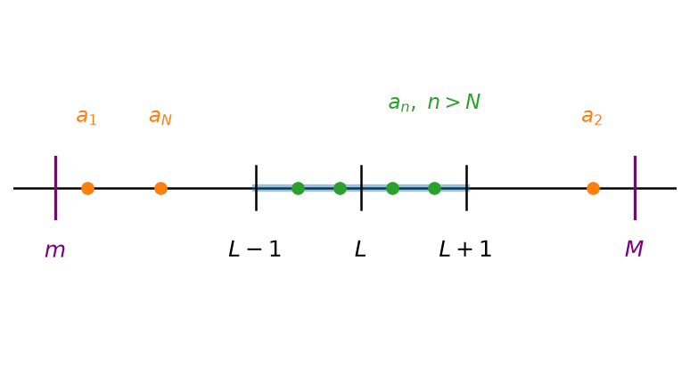
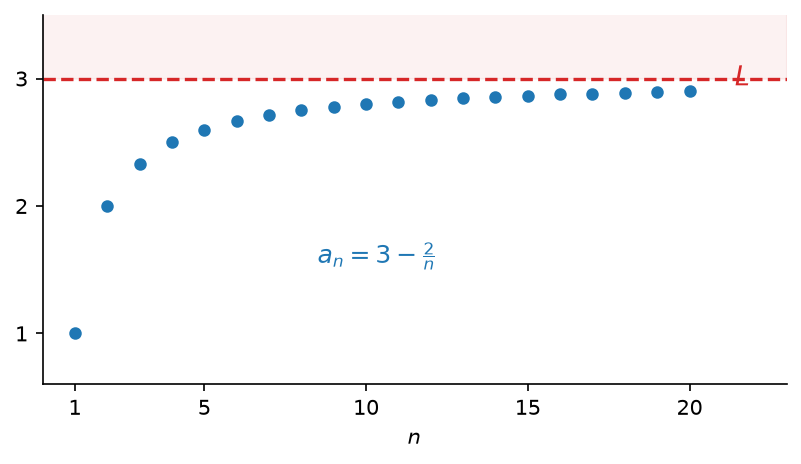
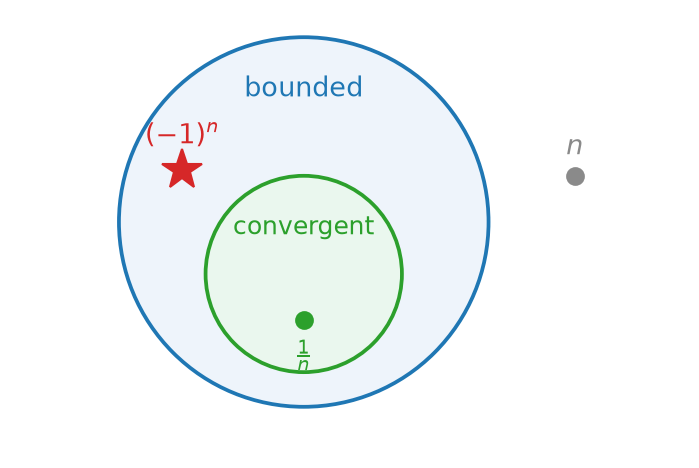

# כלים לחישוב גבולות ולהוכחת התכנסות {chapter="8"}

## הקדמה

בפרק הקודם הגדרנו את המושג גבול של סדרה והבאנו מספר דוגמאות. בשלב הזה, כמו שהערנו, אנו יכולים רק לבדוק האם המספר $L$ הוא גבול של סדרה $(a_n)_{n=1}^\infty$, ולפעמים לשלול קיום גבול מתוך ההגדרה, אבל אין לנו עדיין יכולת לענות על שאלות כגון: האם הגבול קיים בכלל, או מה הוא הגבול כאשר הוא קיים. בפרק הזה נפתח את הכלים הבסיסיים שיעזרו לנו לענות על שאלות מהסוג הזה.

## חסימוּת של סדרה מתכנסת (וההיפך השגוי)

### סדרה חסומה

נתחיל את הדיון בסוג נוסף של סדרות — כאלה שכל איבריהן נמצאים בטווח מסוים.

::: {#box-def-bounded-sequence .thmdef}
תהי $(a_n)_{n=1}^{\infty}$ סדרה. נגיד כי הסדרה **חסומה** אם קיימים $m, M \in \mathbb{R}$ כך שלכל $n$ מתקיים $$.m \leq a_n \leq M$$
:::

::: {#box-exm-bounded-sequences .thmexm title="סדרות חסומות ושאינן חסומות"}
- $a_n = \dfrac{1}{n}$ סדרה חסומה, כי: $0 \le a_n \le 1$ לכל $.n$

- $a_n = (-1)^n$ סדרה חסומה, כי: $-1 \le (-1)^n \le 1$ לכל $.n$

- $a_n = n$ **לא** סדרה חסומה, כי: לכל $M$, יהיה $a_n > M$

  למשל, ניקח את $n = \lfloor M \rfloor + 1$ עבורו $a_n = n > M$
:::

תנאי שקול ופשוט יותר, שלעיתים נלקח כהגדרה של סדרה חסומה, הוא שקיים מספר אחד החוסם את כל איברי הסדרה בערך מוחלט.

::: {#box-thm-bounded-abs .thmthm}
תהי $(a_n)_{n=1}^{\infty}$ סדרה. הסדרה חסומה אם ורק אם קיים $M \geq 0$ כך שלכל $n$ מתקיים $$.\left|a_n\right| \leq M$$
:::

::::::::: thmproof
נניח תחילה שקיים $M \geq 0$ כזה. אי-השוויון $\left|a_n\right| \leq M$ שקול ל-$,-M \leq a_n \leq M$ וזוהי בדיוק ההגדרה של סדרה חסומה, עם החסם מלרע $-M$ והחסם מלעיל $.M$

בכיוון השני, נניח שהסדרה חסומה, כלומר קיימים $k, K$ כך שלכל $n$ מתקיים $.k \leq a_n \leq K$ נשאלת השאלה איזה $M$ לבחור, והתשובה תלויה במקומם של $k$ ו-$K$ ביחס לאפס.

**המקרה הראשון:** שניהם אינם שליליים, כלומר $.0 \leq k \leq K$ אז $\left|k\right| = k$ ו-$,\left|K\right| = K$ ולכן $.\left|K\right| \geq \left|k\right|$ נבחר $,M = \left|K\right|$ ואז לכל $n$ מתקיים $.-M \leq 0 \leq k \leq a_n \leq K = M$

```{python}
#| echo: false
#| output: false
import matplotlib.pyplot as plt

def frame(k, K, fname, mlabel):
    M = max(abs(k), abs(K))
    fig, ax = plt.subplots(figsize=(6.4, 2.2))
    ax.axhline(0, color="black", lw=1.2, zorder=1)

    # the strip the terms are confined to
    ax.plot([k, K], [0, 0], color="tab:green", lw=7, alpha=0.32, zorder=2,
            solid_capstyle="butt")

    # The symmetric band [-M, M] that contains it. One arrow per side, measured from
    # the origin outward: a single arrow spanning -M to M reads as if that whole span
    # were M, when it is 2M. The identity defining M sits above, clear of both.
    for sgn in (-1, 1):
        ax.annotate("", xy=(0, 0.52), xytext=(sgn * M, 0.52),
                    arrowprops=dict(arrowstyle="<->", color="tab:purple", lw=1.4))
        ax.annotate(r"$M$", xy=(sgn * M / 2, 0.52), xytext=(sgn * M / 2, 0.57),
                    ha="center", fontsize=12, color="tab:purple")
    ax.annotate(mlabel, xy=(0, 0.78), xytext=(0, 0.78), ha="center",
                fontsize=12, color="tab:purple")

    # k and K above the line, 0 and +-M below, so coincident points never collide
    for p, lab, col in [(k, r"$k$", "tab:blue"), (K, r"$K$", "tab:red")]:
        ax.plot([p], [0], "o", color=col, ms=6, zorder=4)
        ax.annotate(lab, xy=(p, 0), xytext=(p, 0.10), ha="center", fontsize=12, color=col)
    for p, lab, col in [(-M, r"$-M$", "tab:purple"), (0, r"$0$", "black"),
                        (M, r"$M$", "tab:purple")]:
        ax.plot([p], [0], "o", color=col, ms=5, zorder=3)
        ax.annotate(lab, xy=(p, 0), xytext=(p, -0.12), ha="center", va="top",
                    fontsize=12, color=col)

    ax.set_xlim(-3.3, 3.3)
    ax.set_ylim(-0.42, 0.98)
    ax.axis("off")
    fig.savefig(fname, dpi=150, bbox_inches="tight")
    plt.close(fig)

frame(1.0, 2.6, "figures/c08_fig01.png", r"$M=|K|$")
```

```{=latex}
\par\medskip
\noindent\beginL\hbox to \linewidth{\hss\includegraphics[width=0.62\linewidth]{figures/c08_fig01.png}\hss}\endL\par
\medskip
```

::: {style="text-align:center"}
תרשים: כאשר $0 \leq k \leq K$, הקטע שבו נמצאים האיברים כלוא בקטע הסימטרי שקצהו $\left|K\right|$
:::

::: {.content-visible when-format="html"}
{#fig-bound-case-nonneg width="62%" fig-align="center"}
:::

**המקרה השני:** שניהם אינם חיוביים, כלומר $.k \leq K \leq 0$ אז $\left|k\right| = -k$ ו-$,\left|K\right| = -K$ ולכן $.\left|k\right| \geq \left|K\right|$ נבחר $,M = \left|k\right|$ ואז לכל $n$ מתקיים $.-M = k \leq a_n \leq K \leq 0 \leq M$

```{python}
#| echo: false
#| output: false
frame(-2.6, -1.0, "figures/c08_fig02.png", r"$M=|k|$")
```

```{=latex}
\par\medskip
\noindent\beginL\hbox to \linewidth{\hss\includegraphics[width=0.62\linewidth]{figures/c08_fig02.png}\hss}\endL\par
\medskip
```

::: {style="text-align:center"}
תרשים: כאשר $k \leq K \leq 0$, הקצה הרחוק מאפס הוא $,\left|k\right|$ והוא הקובע את $M$
:::

::: {.content-visible when-format="html"}
{#fig-bound-case-nonpos width="62%" fig-align="center"}
:::

**המקרה השלישי:** הסימנים שונים, כלומר $.k < 0 < K$ כאן אף אחד משני הקצוות אינו בהכרח הרחוק יותר מאפס, ולכן נבחר את הגדול מביניהם: $,M = \max\left\{\left|k\right|, \left|K\right|\right\}$ ואז $.-M \leq k \leq a_n \leq K \leq M$

```{python}
#| echo: false
#| output: false
frame(-1.5, 2.6, "figures/c08_fig03.png", r"$M=\max\{|k|,|K|\}$")
```

```{=latex}
\par\medskip
\noindent\beginL\hbox to \linewidth{\hss\includegraphics[width=0.62\linewidth]{figures/c08_fig03.png}\hss}\endL\par
\medskip
```

::: {style="text-align:center"}
תרשים: כאשר הסימנים שונים, $M$ נקבע לפי הקצה הרחוק יותר מאפס
:::

::: {.content-visible when-format="html"}
{#fig-bound-case-mixed width="62%" fig-align="center"}
:::

שימו לב שבשלושת המקרים הבחירה הייתה אותה בחירה עצמה, $.M = \max\left\{\left|k\right|, \left|K\right|\right\}$ במקרה הראשון המקסימום הוא $,\left|K\right|$ בשני הוא $,\left|k\right|$ ובשלישי הוא הגדול מביניהם. לכן אפשר לוותר על חלוקת המקרים ולכתוב את כל הטיעון בשורה אחת: בבחירה זו מתקיים $\left|k\right| \leq M$ וגם $,\left|K\right| \leq M$ ולכל מספר ממשי $x$ מתקיים $,-\left|x\right| \leq x \leq \left|x\right|$ ולכן $$.-M \leq -\left|k\right| \leq k \leq a_n \leq K \leq \left|K\right| \leq M$$

מכאן $\left|a_n\right| \leq M$ לכל $,n$ כנדרש.
:::::::::

היתרון של הניסוח הזה הוא שמעורבים בו שני סימנים בלבד, $a_n$ ו-$,M$ ואי-שוויון אחד במקום שניים: כדי להראות שסדרה חסומה די למצוא $M$ אחד, וכדי להשתמש בחסימוּת די לדעת ש-$.\left|a_n\right| \leq M$

אפשר גם למדוד את המרחק מנקודה כלשהי ולא דווקא מאפס. למעשה, די למצוא נקודת ייחוס אחת שעובדת, ומיד נובע שכל נקודה אחרת עובדת אף היא.

::: {#box-thm-bounded-iff-L .thmthm}
תהי $(a_n)_{n=1}^{\infty}$ סדרה. שלושת התנאים הבאים שקולים:

(א) הסדרה חסומה.

(ב) קיימים $L \in \mathbb{R}$ ו-$M \geq 0$ כך שלכל $n$ מתקיים $.\left|a_n - L\right| \leq M$

(ג) לכל $L \in \mathbb{R}$ קיים $M \geq 0$ כך שלכל $n$ מתקיים $.\left|a_n - L\right| \leq M$
:::

::::: thmproof
נוכיח את המעגל: (א) גורר (ג), (ג) גורר (ב), ו-(ב) גורר (א). מכאן ששלושת התנאים שקולים זה לזה.

**(א) גורר (ג).** נניח שהסדרה חסומה. לפי המשפט הקודם קיים $K \geq 0$ כך שלכל $n$ מתקיים $.\left|a_n\right| \leq K$ יהי $L \in \mathbb{R}$ כלשהו. המרחק בין $a_n$ ל-$L$ אינו יכול להיות גדול מסכום המרחק בין $a_n$ לאפס והמרחק בין אפס ל-$,L$ וזהו בדיוק [אי-שוויון המשולש](04-abs-value.qmd): $$.\left|a_n - L\right| \leq \left|a_n\right| + \left|L\right| \leq K + \left|L\right|$$

לכן הבחירה $M = K + \left|L\right|$ מתאימה, וזאת לכל $L$ שנבחר.

```{python}
#| echo: false
#| output: false
import matplotlib.pyplot as plt

fig, ax = plt.subplots(figsize=(6.4, 2.9))

K, L = 1.5, 1.0
M = K + abs(L)
terms = [-1.3, -0.6, 0.2, 0.9, 1.4]

ax.axhline(0, color="black", lw=1.2, zorder=1)
ax.plot(terms, [0] * len(terms), "o", color="tab:green", ms=6, zorder=4)

for p, lab in [(0.0, r"$0$"), (L, r"$L$")]:
    ax.plot([p, p], [-0.07, 0.07], color="black", lw=1.4, zorder=5)
    ax.annotate(lab, xy=(p, 0), xytext=(p, -0.14), ha="center", va="top", fontsize=12)

def band(y, c, r, colour, label):
    """One symmetric interval [c-r, c+r], drawn above the line at height y."""
    ax.plot([c - r, c + r], [y, y], color=colour, lw=6, alpha=0.30, zorder=2,
            solid_capstyle="butt")
    for e in (c - r, c + r):
        ax.plot([e, e], [y - 0.07, y + 0.07], color=colour, lw=1.4, zorder=3)
    ax.plot([c], [y], "o", color=colour, ms=5, zorder=4)
    # one arrow each way from the centre, so the label reads as a radius
    for sgn in (-1, 1):
        ax.annotate("", xy=(c, y + 0.16), xytext=(c + sgn * r, y + 0.16),
                    arrowprops=dict(arrowstyle="<->", color=colour, lw=1.2))
        ax.annotate(label, xy=(c + sgn * r / 2, y + 0.16),
                    xytext=(c + sgn * r / 2, y + 0.21),
                    ha="center", fontsize=11, color=colour)
    ax.plot([c, c], [0.05, y], color=colour, lw=0.7, ls=":", zorder=1)

band(0.55, 0.0, K, "tab:blue", r"$K$")
band(1.20, L,   M,  "tab:red",  r"$K+|L|$")

ax.set_xlim(-2.3, 4.3)
ax.set_ylim(-0.48, 1.62)
ax.axis("off")
fig.savefig("figures/c08_fig04.png", dpi=150, bbox_inches="tight")
plt.close(fig)
```

```{=latex}
\par\medskip
\noindent\beginL\hbox to \linewidth{\hss\includegraphics[width=0.62\linewidth]{figures/c08_fig04.png}\hss}\endL\par
\medskip
```

::: {style="text-align:center"}
תרשים: הבחירה $M = K + \left|L\right|$ שבהוכחה. שני הקטעים מכילים את כל איברי הסדרה, והקצה השמאלי של הקטע שסביב $L$ נופל בדיוק על $,-K$ שהיא הנקודה הרחוקה ביותר שאליה הסדרה עשויה להגיע
:::

::: {.content-visible when-format="html"}
{#fig-shift-reference-point width="62%" fig-align="center"}
:::

**(ג) גורר (ב).** מיידי: אם התנאי מתקיים לכל $,L$ הוא מתקיים בפרט עבור נקודת ייחוס אחת, למשל $.L = 0$

**(ב) גורר (א).** נניח שקיימים $L$ ו-$M$ כאלה. אי-השוויון $\left|a_n - L\right| \leq M$ שקול ל-$,L - M \leq a_n \leq L + M$ וזוהי בדיוק ההגדרה של סדרה חסומה, עם החסם מלרע $L-M$ והחסם מלעיל $.L+M$
:::::

שימו לב שהמעבר מ-(ג) ל-(ב) מיידי, ואילו הכיוון ההפוך, מנקודת ייחוס אחת לכל נקודת ייחוס, אינו ישיר והוא עובר דרך החסימוּת.

בתרגילים הבאים נשתמש בכך שלכל $x$ ממשי מתקיים $\left|\sin x\right| \leq 1$ וגם $.\left|\cos x\right| \leq 1$

::: {#box-qst-bounded-examples .thmqst title="אילו מהסדרות חסומות?"}
עבור כל אחת מהסדרות הבאות, קבעו אם היא חסומה, ונמקו.

(א) $a_n = \dfrac{1}{n^2+1}$

(ב) $a_n = \sin n$

(ג) $a_n = \sin\left(n^2\right) + \cos\left(n!\right)$

(ד) $a_n = \dfrac{n \sin n}{n^2+1}$

(ה) $a_n = \left(-1\right)^n - n$

(ו) $a_n = \sqrt{n} - \left\lfloor \sqrt{n} \right\rfloor$
:::

::: {.thmsol .foldable}
(א) לכל $n \geq 1$ מתקיים $,n^2 + 1 \geq 2$ ולכן $,0 < a_n \leq \dfrac{1}{2}$ ובפרט $.\left|a_n\right| \leq 1$ הסדרה חסומה.

(ב) לכל $n$ מתקיים $,\left|\sin n\right| \leq 1$ ולכן הסדרה חסומה.

(ג) לפי אי-שוויון המשולש, $$.\left|\sin\left(n^2\right) + \cos\left(n!\right)\right| \leq \left|\sin\left(n^2\right)\right| + \left|\cos\left(n!\right)\right| \leq 1 + 1 = 2$$ שימו לב שלא השתמשנו בשום מידע על $n^2$ או על $,n!$ אלא רק בתחום הערכים של הסינוס והקוסינוס.

(ד) מ-$\left(n-1\right)^2 \geq 0$ נובע $,n^2 + 1 \geq 2n$ ולכן $$.\left|\frac{n \sin n}{n^2+1}\right| = \frac{n \left|\sin n\right|}{n^2+1} \leq \frac{n}{n^2+1} \leq \frac{n}{2n} = \frac{1}{2}$$ הסדרה חסומה.

(ה) הסדרה **אינה** חסומה. לכל $n$ מתקיים $,a_n \leq 1 - n$ ולכן לכל $n \geq 2$ מתקיים $.\left|a_n\right| \geq n - 1$ בהינתן $M \geq 0$ נבחר $,n > M + 1$ ואז $,\left|a_n\right| \geq n - 1 > M$ כלומר אף $M$ אינו חוסם את כל האיברים.

(ו) לפי הגדרת הערך השלם, לכל $x$ ממשי מתקיים $,\left\lfloor x \right\rfloor \leq x < \left\lfloor x \right\rfloor + 1$ ולכן $.0 \leq \sqrt{n} - \left\lfloor \sqrt{n} \right\rfloor < 1$ הסדרה חסומה.
:::

**תרגיל 1.** איזו מהסדרות הבאות **אינה** חסומה?

(א) $a_n = \dfrac{\sin n}{n}$

(ב) $a_n = \dfrac{n^2}{n^2+1}$

(ג) $a_n = \dfrac{n^2+1}{n}$

(ד) $a_n = \cos\left(n!\right)$

::: {.content-visible when-format="html"}
```{=html}
<div class="tf-quiz" data-correct="c" data-reveal>
<button class="tf-opt" data-val="a">(א)</button>
<button class="tf-opt" data-val="b">(ב)</button>
<button class="tf-opt" data-val="c">(ג)</button>
<button class="tf-opt" data-val="d">(ד)</button>
<div class="tf-feedback"></div>
</div>
```
:::

::: {.thmsol .foldable}
**התשובה היא (ג).** מתקיים $,\dfrac{n^2+1}{n} = n + \dfrac{1}{n} > n$ ולכן בהינתן $M \geq 0$ כל $n > M$ נותן $,a_n > M$ והסדרה אינה חסומה.

שאר הסדרות חסומות: $\left|\dfrac{\sin n}{n}\right| \leq \dfrac{1}{n} \leq 1$ לכל $,n$ מתקיים $0 < \dfrac{n^2}{n^2+1} < 1$ לכל $,n$ וכן $\left|\cos\left(n!\right)\right| \leq 1$ לכל $.n$
:::

**תרגיל 2.** נתונה הסדרה $.a_n = 17 + \dfrac{\left(-1\right)^n}{n}$ מצאו את המספר הקטן ביותר $M$ שעבורו $a_n \leq M$ לכל $,n$ ואת המספר הגדול ביותר $m$ שעבורו $m \leq a_n$ לכל $.n$

::: {.content-visible when-format="html"}
```{=html}
<div class="seq-quiz" data-answer="35/2"><span class="seq-label">(א) המספר הקטן ביותר \(M\)</span><input class="seq-input" type="text" placeholder="לדוגמה: 3/2"><button class="seq-check">בדיקה</button><span class="seq-feedback"></span></div>
<div class="seq-quiz" data-answer="16"><span class="seq-label">(ב) המספר הגדול ביותר \(m\)</span><input class="seq-input" type="text" placeholder="לדוגמה: 3/2"><button class="seq-check">בדיקה</button><span class="seq-feedback"></span></div>
```
:::

::: {.thmsol .foldable}
נפריד לפי זוגיות $.n$ עבור $n$ זוגי מתקיים $,a_n = 17 + \dfrac{1}{n}$ וזהו ביטוי יורד ב-$,n$ ולכן הגדול ביותר מתקבל ב-$n = 2$ ושווה $.\dfrac{35}{2}$ עבור $n$ אי-זוגי מתקיים $,a_n = 17 - \dfrac{1}{n}$ וזהו ביטוי עולה ב-$,n$ ולכן הקטן ביותר מתקבל ב-$n = 1$ ושווה $.16$

לכן לכל $n$ מתקיים $,16 \leq a_n \leq \dfrac{35}{2}$ ושני החסמים מתקבלים בפועל כערכים של הסדרה, ולכן אי אפשר להקטין את $M$ או להגדיל את $.m$
:::

**תרגיל 3.** אם $(a_n)$ ו-$(b_n)$ חסומות, אז גם $(a_n \cdot b_n)$ חסומה.

::: {.content-visible when-format="html"}
```{=html}
<div class="tf-quiz" data-correct="true" data-reveal>
<button class="tf-opt" data-val="true">נכון</button>
<button class="tf-opt" data-val="false">לא נכון</button>
<div class="tf-feedback"></div>
</div>
```
:::

::: {.thmsol .foldable}
**נכון.** לפי המשפט שלמעלה קיימים $M_1 \geq 0$ ו-$M_2 \geq 0$ כך שלכל $n$ מתקיים $\left|a_n\right| \leq M_1$ וגם $.\left|b_n\right| \leq M_2$ מכפליות הערך המוחלט נובע $$,\left|a_n \cdot b_n\right| = \left|a_n\right| \cdot \left|b_n\right| \leq M_1 M_2$$ ולכן $M_1 M_2$ הוא חסם למכפלה.
:::

**תרגיל 4.** אם $(a_n + b_n)$ חסומה, אז $(a_n)$ חסומה.

::: {.content-visible when-format="html"}
```{=html}
<div class="tf-quiz" data-correct="false" data-reveal>
<button class="tf-opt" data-val="true">נכון</button>
<button class="tf-opt" data-val="false">לא נכון</button>
<div class="tf-feedback"></div>
</div>
```
:::

::: {.thmsol .foldable}
**לא נכון.** ניקח $a_n = n$ ו-$.b_n = -n$ לכל $n$ מתקיים $,a_n + b_n = 0$ כלומר הסכום הוא הסדרה הקבועה $,0$ שהיא חסומה. אבל $a_n = n$ אינה חסומה, כפי שראינו בדוגמה שלמעלה.
:::

### הקשר בין התכנסות לחסימות של סדרה

למדנו אפוא תכונה נוספת של סדרות — חסימוּת. במבט ראשון היא נראית דרישה חלשה מהתכנסות: היא מבקשת רק שהאיברים לא יברחו לאינסוף, ואינה מבקשת מהם להתקרב לשום מספר מסוים.

ואכן, כבר ראינו סדרה חסומה שאינה מתכנסת: [הסדרה המתחלפת](07-sequences-limit.qmd#box-q-pm-one) $,a_n = \left(-1\right)^n$ שאיבריה הם $1, -1, 1, -1, \dots$ וכולם כלואים בין $-1$ ל-$,1$ אך אינם מתקרבים לשום מספר. את אי-ההתכנסות שלה הוכחנו בפרק הקודם, ולא נחזור על ההוכחה כאן.

זוהי עובדה חשובה, ולכן ננסח אותה כטענה.

::: {#box-prp-bounded-not-convergent .thmprp}
סדרה חסומה לא בהכרח מתכנסת.
:::

נשאלת השאלה אם בכל זאת יש קשר כלשהו בין שתי התכונות.

::: {#box-thm-convergent-bounded .thmthm}
אם $(a_n)_{n=1}^{\infty}$ סדרה מתכנסת, אז היא חסומה.
:::

::::: thmproof
נניח שהסדרה מתכנסת. אז יש לה גבול, ונסמן $.\lim\limits_{n\to\infty} a_n = L$

נפעיל את הגדרת הגבול עם $:\varepsilon = 1$ קיים $N \in \mathbb{N}$ כך שלכל $n \geq N$ מתקיים $.\left|a_n - L\right| < 1$

התנאי הזה מטפל בכל האיברים החל מ-$,N$ ומחוצה לו נשארו רק האיברים $a_1, \dots, a_N$ שהם מספר סופי של איברים. לכן אפשר לבחור $$.M = \max\left\{\left|a_1 - L\right|,\ \dots,\ \left|a_N - L\right|,\ 1\right\}$$

הבחירה אפשרית משום שמדובר בקבוצה סופית של מספרים, ולקבוצה סופית יש מקסימום.

נראה שלכל $n$ מתקיים $.\left|a_n - L\right| \leq M$ אם $,n \geq N$ אז $,\left|a_n - L\right| < 1 \leq M$ שכן $1$ נכלל ברשימה שממנה נלקח המקסימום. ואם $,n < N$ אז $\left|a_n - L\right|$ הוא בעצמו אחד מאיברי הרשימה, ולכן אינו גדול מן המקסימום שלה.

```{python}
#| echo: false
#| output: false
import matplotlib.pyplot as plt

fig, ax = plt.subplots(figsize=(6.4, 3.4))
L = 0.0
ax.axhline(0, color="black", lw=1.2, zorder=1)

# band (L-1, L+1): the tail a_n for n > N lives here
ax.plot([L-1, L+1], [0, 0], color="tab:blue", lw=4, alpha=0.45, zorder=2)
for x, lab in [(L-1, r"$L-1$"), (L, r"$L$"), (L+1, r"$L+1$")]:
    ax.plot([x, x], [-0.05, 0.05], color="black", lw=1.2, zorder=3)
    ax.annotate(lab, xy=(x, 0), xytext=(x, -0.12), ha="center", va="top", fontsize=12)

# tail terms (n > N) inside the band
tail = [L-0.6, L-0.2, L+0.3, L+0.7]
ax.plot(tail, [0]*len(tail), "o", color="tab:green", ms=6, zorder=4)
ax.annotate(r"$a_n,\ n \geq N$", xy=(L+0.7, 0), xytext=(L+0.7, 0.18),
            ha="center", fontsize=11, color="tab:green")

# early terms a_1,...,a_N possibly outside; m and M are the overall bounds
ax.plot([-2.6, -1.9, 2.2], [0, 0, 0], "o", color="tab:orange", ms=6, zorder=4)
for x, lab in [(-2.6, r"$a_1$"), (-1.9, r"$a_N$"), (2.2, r"$a_2$")]:
    ax.annotate(lab, xy=(x, 0), xytext=(x, 0.15), ha="center", fontsize=11, color="tab:orange")

# M is the largest of those distances and 1, so the sequence is trapped within M
# of L. The bound is SYMMETRIC about L — not two independent bounds m and M.
M = max(max(abs(x - L) for x in (-2.6, -1.9, 2.2)), 1.0)
for sgn, lab in ((-1, r"$L-M$"), (1, r"$L+M$")):
    ax.plot([L + sgn*M, L + sgn*M], [-0.08, 0.08], color="purple", lw=1.8, zorder=3)
    ax.annotate(lab, xy=(L + sgn*M, 0), xytext=(L + sgn*M, -0.13), ha="center",
                va="top", fontsize=12, color="purple")
    ax.annotate("", xy=(L, 0.34), xytext=(L + sgn*M, 0.34),
                arrowprops=dict(arrowstyle="<->", color="purple", lw=1.2))
    ax.annotate(r"$M$", xy=(L + sgn*M/2, 0.34), xytext=(L + sgn*M/2, 0.39),
                ha="center", fontsize=12, color="purple")

ax.set_xlim(-3.2, 3.2)
ax.set_ylim(-0.45, 0.62)
ax.axis("off")
fig.savefig("figures/c08_fig06.png", dpi=150, bbox_inches="tight")
plt.close(fig)
```

```{=latex}
\par\medskip
\noindent\beginL\hbox to \linewidth{\hss\includegraphics[width=0.62\linewidth]{figures/c08_fig06.png}\hss}\endL\par
\medskip
```

::: {style="text-align:center"}
תרשים: החל מ-$N$ כל האיברים נמצאים בקטע $,(L-1,\ L+1)$ ורק מספר סופי של איברים ראשונים עשוי לחרוג ממנו. הבחירה של $M$ לוקחת את הגדול שבמרחקים הללו, ולכן כל הסדרה כלואה בין $L-M$ ל-$L+M$
:::

::: {.content-visible when-format="html"}
{#fig-convergent-is-bounded width="62%" fig-align="center"}
:::

מצאנו אפוא נקודת ייחוס $L$ ומספר $M \geq 0$ שעבורם $\left|a_n - L\right| \leq M$ לכל $,n$ וזהו בדיוק תנאי (ב) שבמשפט הקודם. לכן הסדרה חסומה.
:::::

לסיכום, התכנסות גוררת חסימוּת אך לא להיפך. אפשר להתרשם מכך בתרשים הבא.

```{python}
#| echo: false
#| output: false
import matplotlib.pyplot as plt
from matplotlib.patches import Circle

fig, ax = plt.subplots(figsize=(6.4, 3.8))

# Convergent sequences sit INSIDE the bounded ones. Two side-by-side circles with
# arrows between them (the earlier version) suggested two parallel categories, and
# then needed a crossed-out arrow to undo that impression. Containment says it once.
ax.add_patch(Circle((0, 0), 1.60, fc="#eef4fb", ec="tab:blue", lw=1.8, zorder=1))
ax.add_patch(Circle((0, -0.45), 0.85, fc="#eaf7ee", ec="tab:green", lw=1.8, zorder=2))

ax.annotate("bounded", xy=(0, 1.15), ha="center", va="center",
            fontsize=13, color="tab:blue", zorder=5)
ax.annotate("convergent", xy=(0, -0.05), ha="center", va="center",
            fontsize=12, color="tab:green", zorder=5)

# one specimen per region: inside, in the ring, and outside altogether
ax.plot([0], [-0.85], "o", color="tab:green", ms=8, zorder=6)
ax.annotate(r"$\frac{1}{n}$", xy=(0, -0.85), xytext=(0, -1.02), ha="center",
            va="top", fontsize=13, color="tab:green", zorder=6)

# the counterexample: starred, because this is the one worth remembering
ax.plot([-1.05], [0.45], "*", color="tab:red", ms=20, zorder=7)
ax.annotate(r"$(-1)^n$", xy=(-1.05, 0.45), xytext=(-1.05, 0.68), ha="center",
            fontsize=13, color="tab:red", zorder=7)

ax.plot([2.35], [0.40], "o", color="#8a8a8a", ms=8, zorder=6)
ax.annotate(r"$n$", xy=(2.35, 0.40), xytext=(2.35, 0.58), ha="center",
            fontsize=13, color="#8a8a8a", zorder=6)

ax.set_xlim(-2.5, 3.3)
ax.set_ylim(-2.0, 1.8)
ax.set_aspect("equal")
ax.axis("off")
fig.savefig("figures/c08_fig05.png", dpi=150, bbox_inches="tight")
plt.close(fig)
```

```{=latex}
\par\medskip
\noindent\beginL\hbox to \linewidth{\hss\includegraphics[width=0.62\linewidth]{figures/c08_fig05.png}\hss}\endL\par
\medskip
```

::: {style="text-align:center"}
תרשים: הסדרות המתכנסות הן תת-קבוצה של הסדרות החסומות. הסדרה $\frac{1}{n}$ נמצאת בעיגול הפנימי, הסדרה $\left(-1\right)^n$ חסומה אך אינה מתכנסת ולכן נמצאת בטבעת שביניהם, והסדרה $a_n = n$ אינה חסומה כלל
:::

::: {.content-visible when-format="html"}
{#fig-convergent-subset-bounded width="62%" fig-align="center"}
:::

מן המשפט מתקבל כלי שימושי להוכחת אי-התכנסות: אם ידוע שסדרה אינה חסומה, אין צורך לבדוק דבר נוסף, והיא בוודאי אינה מתכנסת.

::: {#box-cor-unbounded-diverges .thmcor}
אם $(a_n)_{n=1}^{\infty}$ סדרה שאינה חסומה, אז היא אינה מתכנסת.
:::

## אריתמטיקה של גבולות

בסעיף הזה נפתח ארגז כלים שימושי, שיאפשר לנו לחשב בקלות יחסית גבולות של סדרות רבות. הרעיון הוא לפרק סדרה מסובכת לסדרות פשוטות יותר, שאת הגבולות שלהן אנחנו כבר יודעים לחשב, ואז להרכיב מהגבולות האלה את הגבול המבוקש בעזרת פעולות החשבון המוכרות: חיבור, חיסור, כפל וחילוק.

::: {#box-thm-sequence-arithmetic .thmthm}
אם $(a_n)_{n=1}^{\infty}$ , $(b_n)_{n=1}^{\infty}$ סדרות המקיימות $a_n \to L_1$ , $b_n \to L_2$ אז:

(1) חיבור: הסדרה $(a_n + b_n)_{n=1}^{\infty}$ גם מתכנסת, ומתקיים $a_n + b_n \to L_1 + L_2$

(2) חיסור: הסדרה $(a_n - b_n)_{n=1}^{\infty}$ גם מתכנסת, ומתקיים $a_n - b_n \to L_1 - L_2$

(3) כפל: הסדרה $(a_n \cdot b_n)_{n=1}^{\infty}$ גם מתכנסת, ומתקיים $a_n \cdot b_n \to L_1 \cdot L_2$

(4) חילוק: הסדרה $\dfrac{a_n}{b_n}$ גם מתכנסת, ומתקיים $\dfrac{a_n}{b_n} \to \dfrac{L_1}{L_2}$ (רק כאשר $L_2 \ne 0$)
:::

### דוגמאות

::: {#box-exm-seq-rational-1 .thmqst title="מנת פולינומים מאותה דרגה"}
נראה כי הסדרה $\dfrac{3n-4}{n+2}$ מתכנסת, ונמצא לאן.
:::

::: thmsol
הסדרה $b_n = n+2$ לא מתכנסת, כי היא לא חסומה.

נפשט את $a_n$ לפי החזקה הכי גדולה. כלומר, נחלק ב-$n$ את המונה ואת המכנה: $$a_n = \frac{3 - \dfrac{4}{n}}{1 + \dfrac{2}{n}} = \frac{\rightarrow 3}{\rightarrow 1} \to 3$$

$\dfrac{4}{n} \to 4 \cdot \dfrac{1}{n} \to 0$ , $\quad$ $\dfrac{2}{n} \to 2 \cdot \dfrac{1}{n} \to 0$
:::

::: {#box-exm-seq-rational-2 .thmqst title="מנת פולינומים מדרגות שונות"}
מצאו את הגבול של הסדרה $$a_n = \frac{8n+3}{n^2+1}$$
:::

::: thmsol
נפשט ע"י חילוק בחזקה הכי גדולה במכנה: $$a_n = \frac{\dfrac{8}{n} + \dfrac{3}{n^2}}{1 + \dfrac{1}{n^2}} = \frac{\rightarrow 0}{\rightarrow 1} \to 0$$

$\dfrac{1}{n^2} = \dfrac{1}{n} \cdot \dfrac{1}{n} \to 0$ , $\quad$ $\dfrac{8}{n} \to 8 \cdot \dfrac{1}{n} \to 0$ , $\quad$ $\dfrac{3}{n^2} = 3 \cdot \dfrac{1}{n} \cdot \dfrac{1}{n} \to 0$
:::

<!-- מקור: הרצאה 5 -->

## משפט הסנדוויץ׳; כפל אפסה בחסומה

::: {#box-def-null-sequence .thmdef}
תהי $(a_n)_{n=1}^{\infty}$ סדרה. נאמר כי היא **סדרה אפסה** אם היא מתכנסת ל-$0$, כלומר אם $\lim\limits_{n\to\infty} a_n = 0$.
:::

::: {#box-thm-squeeze-sequences .thmthm title="כלל הסנדוויץ׳"}
יהיו $(a_n)_{n=1}^{\infty}$ , $(b_n)_{n=1}^{\infty}$ , $(c_n)_{n=1}^{\infty}$ שלוש סדרות, ונניח כי קיים $N_0 \in \mathbb{N}$ כך שלכל $n \geq N_0$ מתקיים

$.a_n \leq b_n \leq c_n$

אם בנוסף שתי הסדרות החיצוניות מתכנסות לאותו גבול, כלומר

$,\lim_{n\to\infty} a_n = \lim_{n\to\infty} c_n = L$

אז גם $(b_n)_{n=1}^{\infty}$ מתכנסת, ומתקיים $\lim\limits_{n\to\infty} b_n = L$.
:::

::: {#box-thm-null-times-bounded .thmthm title="אפסה כפול חסומה"}
תהי $(a_n)_{n=1}^{\infty}$ סדרה אפסה, ותהי $(b_n)_{n=1}^{\infty}$ סדרה חסומה. אז גם הסדרה $(a_n \cdot b_n)_{n=1}^{\infty}$ אפסה, כלומר

$.\lim_{n\to\infty} a_n \cdot b_n = 0$

שימו לב כי $(b_n)_{n=1}^{\infty}$ אינה נדרשת להתכנס, אלא רק להיות חסומה.
:::

## מונוטוניות של סדרות; דוגמה

::: {#box-def-monotone-sequence .thmdef}
תהי $(a_n)_{n=1}^{\infty}$ סדרה. נאמר כי היא:

- **מונוטונית עולה**, אם $a_n \le a_{n+1}$ לכל $n \ge 1$.
- **מונוטונית יורדת**, אם $a_n \ge a_{n+1}$ לכל $n \ge 1$.
- **מונוטונית עולה ממש**, אם $a_n < a_{n+1}$ לכל $n \ge 1$.
- **מונוטונית יורדת ממש**, אם $a_n > a_{n+1}$ לכל $n \ge 1$.

הסדרה תיקרא **מונוטונית** אם היא מונוטונית עולה או מונוטונית יורדת.
:::

::: {#box-exm-monotone-examples .thmexm title="בדיקת מונוטוניות"}
$a_n = n$ מונוטונית עולה ממש

כי לכל $n \ge 1$: $a_n = n < n+1 = a_{n+1}$

$c_n = \dfrac{1}{n}$ מונוטונית יורדת

כי לכל $n \ge 1$: $c_n = \dfrac{1}{n} > \dfrac{1}{n+1} = c_{n+1}$

$d_n = (-1)^n$ אינה מונוטונית

$d_1 = -1$ , $d_2 = 1$ , $d_3 = -1$

$d_1 < d_2 , d_3 < d_2$
:::

## סדרה חסומה ומונוטונית מתכנסת (ללא הוכחה)

::: {#box-rem-monotone-vs-convergent .thmrem title="מונוטוניות והתכנסות אינן גוררות זו את זו"}
$a_n$ מונוטונית $\not\Leftarrow$ $a_n$ מתכנסת

דוגמא: $$a_n = n$$

$a_n$ מתכנסת $\not\Leftarrow$ $a_n$ מונוטונית

דוגמא: $a_n = \dfrac{(-1)^n}{n}$ ($a_n \to 0$)
:::

::: {#box-thm-monotone-bounded-converges .thmthm}
אם $(a_n)_{n=1}^{\infty}$ סדרה מונוטונית **וגם** חסומה, אז היא מתכנסת.
:::

```{=html}
<!-- בהרצאה של דניס המשפט מופיע בשם ״משפט בולצאנו״. כאן הוא נשאר ללא שם, כדי שלא
     יתנגש עם ״משפט התכנסות הסדרות המונוטוניות״ שבפרק 11. -->
```

::: {#box-rem-monotone-limit-is-sup .thmrem title="מהו הגבול בהוכחה"}
בהוכחה מראים כי $a_n$ עולה ומתכנסת ל-$M$, כאשר הוא לא סתם חסם שלה מלמעלה, אלא הוא החסם הכי קטן.
:::

::: {#box-q-recursive-sequence .thmqst title="סדרה רקורסיבית"}
נתונה סדרה $(a_n)_{n=1}^{\infty}$ [באופן הרקורסיבי](05-induction.qmd#sec-recursive-definition) הבא:

$$a_1 = 1$$

$$a_{n+1} = \dfrac{a_n + 2}{2}$$

הראו כי הסדרה מתכנסת ומצאו את הגבול שלה.
:::

::: thmsol
ננסה להראות שהיא חסומה ומונוטונית, ולכן תתכנס.

חושדים שהיא עולה, כי $a_3 > a_2 > a_1$ אז ננסה להראות ש $a_n \le a_{n+1}$ , לכל $n \ge 1$

ננסה בעזרת אינדוקציה:

בסיס: נציב $n=1$ ונבדוק: $a_1 = 1 \le a_2 = \dfrac{3}{2}$

כעת נניח כי $a_n \le a_{n+1}$ , ונראה כי $a_{n+1} \le a_{n+2}$ :

$$a_{n+1} = \dfrac{a_n + 2}{2} \le \dfrac{a_{n+1} + 2}{2} = a_{n+2}$$

<!-- הערה: חץ המצביע על אי-השוויון, מסומן "מהנחת האינדוקציה" -->

ולכן $a_n$ עולה.

מכך שהיא עולה: $1 = a_1 \le a_n$ , לכל $n \ge 1$.

אבל עדיין חסר: $a_n \le M$

נקבע מהו M בהמשך, אבל בינתיים ננסה להראות באינדוקציה כי: $a_n \le M$ לכל $n \ge 1$.

בסיס: עבור n=1: $a_1 = 1 \le M$

$$\downarrow$$

נדרוש $M \ge 1$

נניח כי $a_n \le M$ , ונראה כי $a_{n+1} \le M$ : $a_{n+1} = \dfrac{a_n + 2}{2} \le \dfrac{M + 2}{2}$

<!-- הערה: חץ המצביע על אי-השוויון, מסומן "מהנחת האינדוקציה" -->

לכן נדרוש ש: $\dfrac{M + 2}{2} \le M$

$$M + 2 \le 2M$$

$$2 \le M$$

$$\downarrow$$

$$a_{n+1} \le \dfrac{M + 2}{2} \le M$$

הראנו כי $a_n$ עולה וחסומה, ולכן מתכנסת.

נסמן: $a_n \to L$

ואז: $\dfrac{a_n + 2}{2} \to \dfrac{L + 2}{2}$

<!-- הערה: מסומן "כל ארתמטיקה" ליד הביטוי -->

מצד שני, מתקיים $a_n \to L$ כי $a_{n+1} \to L$ אבל $a_{n+1} = \dfrac{a_n + 2}{2}$

לכן מיחידות הגבול: $L = \dfrac{L + 2}{L} \Rightarrow \boxed{L = 2}$
:::

<!-- בדיקה: בכתב היד נראה L = (L+2)/L אך מהמשוואה הרקורסיבית מצופה L = (L+2)/2; נשמר כפי שנכתב -->

## המספר $e$ והסדרה המתאימה

::: {#box-lem-bernoulli .thmlem title="אי-שוויון ברנולי"}
לכל $n \in \mathbb{N}$ ולכל $x > -1$ מתקיים

$.\left(1+x\right)^{n} \geq 1 + nx$
:::

```{=html}
<!-- מקומו הטבעי של אי-שוויון ברנולי הוא פרק 5 (אינדוקציה), שאינו בתחום העדכון הזה.
     הוא מובא כאן משום שהוא הכלי המרכזי בהוכחת המונוטוניות של הסדרה שמגדירה את e. -->
```

::: {#box-thm-e-sequence-monotone-bounded .thmthm}
הסדרה $a_n = \left(1 + \dfrac{1}{n}\right)^{n}$ מונוטונית עולה, ומתקיים $2 \le a_n \le 3$ לכל $n \ge 1$. בפרט היא מונוטונית וחסומה, ולכן היא מתכנסת.
:::

::: {#box-def-number-e .thmdef}
**המספר** $e$ מוגדר כגבול של הסדרה שבמשפט הקודם:

$.e = \lim_{n\to\infty} \left(1 + \frac{1}{n}\right)^{n}$

מן החסמים שבמשפט נובע $2 < e < 3$.
:::

::: todo
המספר $e$ והסדרה $(1+\tfrac1n)^n$ נדונים יחד עם המשפט על התכנסות סדרה חסומה ומונוטונית (לעיל) ובסעיף ״משפטי התכנסות״. יש לרכז ולהרחיב כאן.
:::