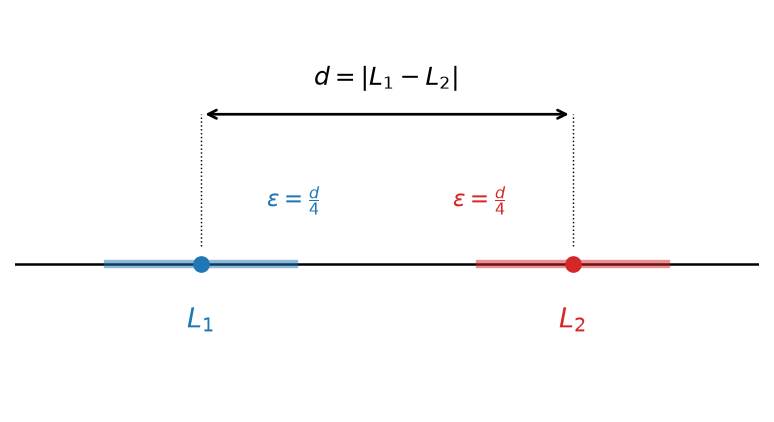

# כלים לחישוב גבולות ולהוכחת התכנסות {chapter="8"}

## הקדמה

בפרק הקודם הגדרנו את המושג גבול של סדרה והבאנו מספר דוגמאות. בשלב הזה, כמו שהערנו, אנו יכולים רק לבדוק האם המספר $L$ הוא גבול של סדרה $(a_n)_{n=1}^\infty$, ולפעמים לשלול קיום גבול מתוך ההגדרה, אבל אין לנו עדיין יכולת לענות על שאלות כגון: האם הגבול קיים בכלל, או מה הוא הגבול כאשר הוא קיים. בפרק הזה נפתח את הכלים הבסיסיים שיעזרו לנו לענות על שאלות מהסוג הזה.

## חסימוּת של סדרה מתכנסת (וההיפך השגוי)

### סדרה חסומה

נתחיל את הדיון בסוג נוסף של סדרות — כאלה שכל איבריהן נמצאים בטווח מסוים.

::: {#box-def-bounded-sequence .thmdef}
תהי $(a_n)_{n=1}^{\infty}$ סדרה, נגיד כי $a_n$ חסומה, אם קיימים $m,M \in R$ כך שלכל $n$: $$m \le a_n \le M$$
:::

::: {#box-exm-bounded-sequences .thmexm title="סדרות חסומות ושאינן חסומות"}
- $a_n = \dfrac{1}{n}$ סדרה חסומה, כי: $0 \le a_n \le 1$ לכל ח.

- $a_n = (-1)^n$ סדרה חסומה, כי: $-1 \le (-1)^n \le 1$ לכל ח.

- $a_n = n$ <u>לא</u> סדרה חסומה, כי: לכל $M$, יהיה $a_n > M$

  למשל, ניקח את $n = \lfloor M \rfloor + 1$ עבורו $a_n = n > M$
:::

את החסימוּת אפשר לנסח גם בעזרת ערך מוחלט, ואז די באי-שוויון אחד במקום שניים.

::: {#box-thm-bounded-iff .thmthm}
תהי $(a_n)_{n=1}^{\infty}$ סדרה. הסדרה חסומה אם ורק אם לכל $L \in \mathbb{R}$ קיים $M > 0$ כך שלכל $n$ מתקיים $$.\left|a_n - L\right| \leq M$$
:::

::: thmproof
נניח תחילה שהתנאי מתקיים, ונפעיל אותו עם $.L = 0$ אז קיים $M > 0$ כך שלכל $n$ מתקיים $,\left|a_n\right| \leq M$ כלומר $$.-M \leq a_n \leq M$$ זוהי בדיוק ההגדרה של סדרה חסומה, עם החסם התחתון $-M$ והחסם העליון $.M$

בכיוון השני, נניח שהסדרה חסומה, כלומר קיימים $m, M_0 \in \mathbb{R}$ כך שלכל $n$ מתקיים $.m \leq a_n \leq M_0$ נסמן $k = m - 1$ ו-$,K = M_0 + 1$ ואז לכל $n$ מתקיים $,k < a_n < K$ ובפרט $.k < K$

יהי $L \in \mathbb{R}$ כלשהו. נבחר $$.M = \max\left\{\left|L-k\right|,\ \left|L-K\right|\right\}$$ מכיוון ש-$,k < K$ אי אפשר ש-$L$ יהיה שווה גם ל-$k$ וגם ל-$,K$ ולכן לפחות אחד משני הביטויים חיובי, כלומר $.M > 0$

נראה כעת שלכל $n$ מתקיים $.\left|a_n - L\right| \leq M$ מצד אחד, מ-$a_n < K$ נובע $$,a_n - L < K - L \leq \left|K - L\right| \leq M$$ ומצד שני, מ-$a_n > k$ נובע $$.a_n - L > k - L \geq -\left|k - L\right| \geq -M$$

קיבלנו $,-M < a_n - L < M$ כלומר $,\left|a_n - L\right| < M$ ובפרט $.\left|a_n - L\right| \leq M$
:::

בבחירת $L = 0$ במשפט הקודם מתקבל תנאי שקול נוסף לחסימוּת, שנראה בהמשך שהוא שימושי מאוד.

::: {#box-cor-bounded-abs .thmcor}
הסדרה $(a_n)_{n=1}^{\infty}$ חסומה אם ורק אם קיים $M > 0$ כך שלכל $n$ מתקיים $$.\left|a_n\right| < M$$
:::

בתרגילים הבאים נשתמש בכך שלכל $x$ ממשי מתקיים $\left|\sin x\right| \leq 1$ וגם $.\left|\cos x\right| \leq 1$

::: {#box-qst-bounded-examples .thmqst title="אילו מהסדרות חסומות?"}
עבור כל אחת מהסדרות הבאות, קבעו אם היא חסומה, ונמקו.

(א) $a_n = \dfrac{1}{n^2+1}$

(ב) $a_n = \sin n$

(ג) $a_n = \sin\left(n^2\right) + \cos\left(n!\right)$

(ד) $a_n = \dfrac{n \sin n}{n^2+1}$

(ה) $a_n = \left(-1\right)^n - n$

(ו) $a_n = \sqrt{n} - \left\lfloor \sqrt{n} \right\rfloor$
:::

::: {.thmsol .foldable}
(א) לכל $n \geq 1$ מתקיים $,n^2 + 1 \geq 2$ ולכן $,0 < a_n \leq \dfrac{1}{2}$ ובפרט $.\left|a_n\right| \leq 1$ הסדרה חסומה.

(ב) לכל $n$ מתקיים $,\left|\sin n\right| \leq 1$ ולכן הסדרה חסומה.

(ג) לפי אי-שוויון המשולש, $$.\left|\sin\left(n^2\right) + \cos\left(n!\right)\right| \leq \left|\sin\left(n^2\right)\right| + \left|\cos\left(n!\right)\right| \leq 1 + 1 = 2$$ שימו לב שלא השתמשנו בשום מידע על $n^2$ או על $,n!$ אלא רק בתחום הערכים של הסינוס והקוסינוס.

(ד) מ-$\left(n-1\right)^2 \geq 0$ נובע $,n^2 + 1 \geq 2n$ ולכן $$.\left|\frac{n \sin n}{n^2+1}\right| = \frac{n \left|\sin n\right|}{n^2+1} \leq \frac{n}{n^2+1} \leq \frac{n}{2n} = \frac{1}{2}$$ הסדרה חסומה.

(ה) הסדרה **אינה** חסומה. לכל $n$ מתקיים $,a_n \leq 1 - n$ ולכן לכל $n \geq 2$ מתקיים $.\left|a_n\right| \geq n - 1$ בהינתן $M > 0$ נבחר $,n > M + 1$ ואז $,\left|a_n\right| \geq n - 1 > M$ כלומר אף $M$ אינו חוסם את כל האיברים.

(ו) לפי הגדרת הערך השלם, לכל $x$ ממשי מתקיים $,\left\lfloor x \right\rfloor \leq x < \left\lfloor x \right\rfloor + 1$ ולכן $.0 \leq \sqrt{n} - \left\lfloor \sqrt{n} \right\rfloor < 1$ הסדרה חסומה.
:::

**תרגיל 1.** איזו מהסדרות הבאות **אינה** חסומה?

(א) $a_n = \dfrac{\sin n}{n}$

(ב) $a_n = \dfrac{n^2}{n^2+1}$

(ג) $a_n = \dfrac{n^2+1}{n}$

(ד) $a_n = \cos\left(n!\right)$

::: {.content-visible when-format="html"}
```{=html}
<div class="tf-quiz" data-correct="c" data-reveal>
<button class="tf-opt" data-val="a">(א)</button>
<button class="tf-opt" data-val="b">(ב)</button>
<button class="tf-opt" data-val="c">(ג)</button>
<button class="tf-opt" data-val="d">(ד)</button>
<div class="tf-feedback"></div>
</div>
```
:::

::: {.thmsol .foldable}
**התשובה היא (ג).** מתקיים $,\dfrac{n^2+1}{n} = n + \dfrac{1}{n} > n$ ולכן בהינתן $M > 0$ כל $n > M$ נותן $,a_n > M$ והסדרה אינה חסומה.

שאר הסדרות חסומות: $\left|\dfrac{\sin n}{n}\right| \leq \dfrac{1}{n} \leq 1$ לכל $,n$ מתקיים $0 < \dfrac{n^2}{n^2+1} < 1$ לכל $,n$ וכן $\left|\cos\left(n!\right)\right| \leq 1$ לכל $.n$
:::

**תרגיל 2.** נתונה הסדרה $.a_n = 17 + \dfrac{\left(-1\right)^n}{n}$ מצאו את המספר הקטן ביותר $M$ שעבורו $a_n \leq M$ לכל $,n$ ואת המספר הגדול ביותר $m$ שעבורו $m \leq a_n$ לכל $.n$

::: {.content-visible when-format="html"}
```{=html}
<div class="seq-quiz" data-answer="35/2"><span class="seq-label">\(M = \)</span><input class="seq-input" type="text" placeholder="לדוגמה: 3/2"><button class="seq-check">בדיקה</button><span class="seq-feedback"></span></div>
<div class="seq-quiz" data-answer="16"><span class="seq-label">\(m = \)</span><input class="seq-input" type="text" placeholder="לדוגמה: 3/2"><button class="seq-check">בדיקה</button><span class="seq-feedback"></span></div>
```
:::

::: {.thmsol .foldable}
נפריד לפי זוגיות $.n$ עבור $n$ זוגי מתקיים $,a_n = 17 + \dfrac{1}{n}$ וזהו ביטוי יורד ב-$,n$ ולכן הגדול ביותר מתקבל ב-$n = 2$ ושווה $.\dfrac{35}{2}$ עבור $n$ אי-זוגי מתקיים $,a_n = 17 - \dfrac{1}{n}$ וזהו ביטוי עולה ב-$,n$ ולכן הקטן ביותר מתקבל ב-$n = 1$ ושווה $.16$

לכן לכל $n$ מתקיים $,16 \leq a_n \leq \dfrac{35}{2}$ ושני החסמים מתקבלים בפועל כערכים של הסדרה, ולכן אי אפשר להקטין את $M$ או להגדיל את $.m$
:::

**תרגיל 3.** אם $(a_n)$ ו-$(b_n)$ חסומות, אז גם $(a_n \cdot b_n)$ חסומה.

::: {.content-visible when-format="html"}
```{=html}
<div class="tf-quiz" data-correct="true" data-reveal>
<button class="tf-opt" data-val="true">נכון</button>
<button class="tf-opt" data-val="false">לא נכון</button>
<div class="tf-feedback"></div>
</div>
```
:::

::: {.thmsol .foldable}
**נכון.** לפי המסקנה שלמעלה קיימים $M_1 > 0$ ו-$M_2 > 0$ כך שלכל $n$ מתקיים $\left|a_n\right| < M_1$ וגם $.\left|b_n\right| < M_2$ מכפליות הערך המוחלט נובע $$,\left|a_n \cdot b_n\right| = \left|a_n\right| \cdot \left|b_n\right| < M_1 M_2$$ ולכן $M_1 M_2$ הוא חסם למכפלה.
:::

**תרגיל 4.** אם $(a_n + b_n)$ חסומה, אז $(a_n)$ חסומה.

::: {.content-visible when-format="html"}
```{=html}
<div class="tf-quiz" data-correct="false" data-reveal>
<button class="tf-opt" data-val="true">נכון</button>
<button class="tf-opt" data-val="false">לא נכון</button>
<div class="tf-feedback"></div>
</div>
```
:::

::: {.thmsol .foldable}
**לא נכון.** ניקח $a_n = n$ ו-$.b_n = -n$ לכל $n$ מתקיים $,a_n + b_n = 0$ כלומר הסכום הוא הסדרה הקבועה $,0$ שהיא חסומה. אבל $a_n = n$ אינה חסומה, כפי שראינו בדוגמה שלמעלה.
:::

### הקשר בין התכנסות לחסימות של סדרה

::: {#box-rem-bounded-not-convergent .thmrem title="חסימות אינה גוררת התכנסות"}
סדרה חסומה לא גוררת שהיא מתכנסת.

לדוגמא: $a_n = (-1)^n$
:::

```{python}
#| echo: false
#| output: false
import numpy as np
import matplotlib.pyplot as plt
from matplotlib.patches import Circle, FancyArrowPatch

fig, ax = plt.subplots(figsize=(6.4, 3.4))

c1 = Circle((-1.4, 0), 0.95, fill=False, lw=1.6, ec="tab:blue")
c2 = Circle(( 1.4, 0), 0.95, fill=False, lw=1.6, ec="tab:green")
ax.add_patch(c1)
ax.add_patch(c2)
ax.annotate("bounded", xy=(-1.4, 0), ha="center", va="center", fontsize=12, color="tab:blue")
ax.annotate("convergent", xy=(1.4, 0), ha="center", va="center", fontsize=12, color="tab:green")

# convergent => bounded  (this implication holds)
a1 = FancyArrowPatch((0.4, 0.25), (-0.4, 0.25), arrowstyle="->",
                     mutation_scale=15, lw=1.5, color="black")
ax.add_patch(a1)
ax.annotate(r"$\Rightarrow$ ok", xy=(0, 0.45), ha="center", fontsize=11)

# bounded => convergent  (this one fails)
a2 = FancyArrowPatch((-0.4, -0.25), (0.4, -0.25), arrowstyle="->",
                     mutation_scale=15, lw=1.5, color="tab:red")
ax.add_patch(a2)
# cross it out
ax.plot([-0.07, 0.07], [-0.18, -0.32], color="tab:red", lw=2)
ax.plot([-0.07, 0.07], [-0.32, -0.18], color="tab:red", lw=2)

ax.set_xlim(-3.0, 3.0)
ax.set_ylim(-1.3, 1.0)
ax.set_aspect("equal")
ax.axis("off")
fig.savefig("figures/c08_fig01.png", dpi=150, bbox_inches="tight")
plt.close(fig)
```

```{=latex}
\par\medskip
\noindent\beginL\hbox to \linewidth{\hss\includegraphics[width=0.62\linewidth]{figures/c08_fig01.png}\hss}\endL\par
\medskip
```

::: {style="text-align:center"}
תרשים: סדרה מתכנסת גוררת חסומה, אך סדרה חסומה אינה גוררת מתכנסת (אין גרירה הדדית)
:::

::: {.content-visible when-format="html"}
{#fig-bounded-not-convergent width="62%" fig-align="center"}
:::

::: {#box-thm-convergent-bounded .thmthm}
אם $(a_n)_{n=1}^{\infty}$ סדרה מתכנסת, אז היא חסומה.
:::

::: thmproof
נסמן $a_n \to L$. מהגדרת הגבול, נבחר $\varepsilon = 1$, אז קיים $N$ כך שלכל $n>N$ מתקיים: $$|a_n - L| < 1 \ \leftarrow \ L-1 < a_n < L+1$$

כלומר, בשביל לחסום את <u>כל</u> איברי הסדרה <u>מלמעלה</u>, ניקח: $M = max\{L+1, a_1, \ldots, a_N\}$

ואז בוודאות <u>לכל ח</u>: $a_n \le M$

ובשביל לחסום את <u>כל</u> איברי הסדרה <u>מלמטה</u>, ניקח: $m = min\{L-1, a_1, \ldots, a_N\}$

ואז בוודאות <u>לכל ח</u>: $m \le a_n$
:::

```{python}
#| echo: false
#| output: false
import numpy as np
import matplotlib.pyplot as plt

fig, ax = plt.subplots(figsize=(6.4, 3.4))
L = 0.0
ax.axhline(0, color="black", lw=1.2, zorder=1)

# band (L-1, L+1): the tail a_n for n > N lives here
ax.plot([L-1, L+1], [0, 0], color="tab:blue", lw=4, alpha=0.45, zorder=2)
for x, lab in [(L-1, r"$L-1$"), (L, r"$L$"), (L+1, r"$L+1$")]:
    ax.plot([x, x], [-0.05, 0.05], color="black", lw=1.2, zorder=3)
    ax.annotate(lab, xy=(x, 0), xytext=(x, -0.12), ha="center", va="top", fontsize=12)

# tail terms (n > N) inside the band
tail = [L-0.6, L-0.2, L+0.3, L+0.7]
ax.plot(tail, [0]*len(tail), "o", color="tab:green", ms=6, zorder=4)
ax.annotate(r"$a_n,\ n>N$", xy=(L+0.7, 0), xytext=(L+0.7, 0.18),
            ha="center", fontsize=11, color="tab:green")

# early terms a_1,...,a_N possibly outside; m and M are the overall bounds
ax.plot([-2.6, -1.9, 2.2], [0, 0, 0], "o", color="tab:orange", ms=6, zorder=4)
for x, lab in [(-2.6, r"$a_1$"), (-1.9, r"$a_N$"), (2.2, r"$a_2$")]:
    ax.annotate(lab, xy=(x, 0), xytext=(x, 0.15), ha="center", fontsize=11, color="tab:orange")

# overall bounds m and M
for x, lab, col in [(-2.9, r"$m$", "purple"), (2.6, r"$M$", "purple")]:
    ax.plot([x, x], [-0.07, 0.07], color=col, lw=1.6, zorder=3)
    ax.annotate(lab, xy=(x, 0), xytext=(x, -0.12), ha="center", va="top", fontsize=12, color=col)

ax.set_xlim(-3.3, 3.0)
ax.set_ylim(-0.4, 0.4)
ax.axis("off")
fig.savefig("figures/c08_fig02.png", dpi=150, bbox_inches="tight")
plt.close(fig)
```

```{=latex}
\par\medskip
\noindent\beginL\hbox to \linewidth{\hss\includegraphics[width=0.62\linewidth]{figures/c08_fig02.png}\hss}\endL\par
\medskip
```

::: {style="text-align:center"}
תרשים: הזנב $a_n$ (עבור $n>N$) בקטע $(L-1,L+1)$, והאיברים הראשונים שמחוץ לו — כל הסדרה חסומה בין $m$ ל-$M$
:::

::: {.content-visible when-format="html"}
{#fig-convergent-is-bounded width="62%" fig-align="center"}
:::

::: {#box-cor-unbounded-diverges .thmcor}
אם $(a_n)_{n=1}^{\infty}$ סדרה שאינה חסומה, אז היא אינה מתכנסת.
:::

## אריתמטיקה של גבולות

### כלי להראות התכנסות של סדרה ומציאת גבול - אריתמטיקה

מתוך סדרות מתכנסות, נייצר סדרות נוספות שהן מתכנסות, ע"י: $+$ , $-$ , $\cdot$ , $:$ .

::: {#box-thm-sequence-arithmetic .thmthm}
אם $(a_n)_{n=1}^{\infty}$ , $(b_n)_{n=1}^{\infty}$ סדרות המקיימות $a_n \to L_1$ , $b_n \to L_2$ אז:

(1) חיבור: הסדרה $(a_n + b_n)_{n=1}^{\infty}$ גם מתכנסת, ומתקיים $a_n + b_n \to L_1 + L_2$

(2) חיסור: הסדרה $(a_n - b_n)_{n=1}^{\infty}$ גם מתכנסת, ומתקיים $a_n - b_n \to L_1 - L_2$

(3) כפל: הסדרה $(a_n \cdot b_n)_{n=1}^{\infty}$ גם מתכנסת, ומתקיים $a_n \cdot b_n \to L_1 \cdot L_2$

(4) חילוק: הסדרה $\dfrac{a_n}{b_n}$ גם מתכנסת, ומתקיים $\dfrac{a_n}{b_n} \to \dfrac{L_1}{L_2}$ (רק כאשר $L_2 \ne 0$)
:::

### דוגמאות

::: {#box-exm-seq-rational-1 .thmqst title="מנת פולינומים מאותה דרגה"}
נראה כי הסדרה $\dfrac{3n-4}{n+2}$ מתכנסת, ונמצא לאן.
:::

::: thmsol
הסדרה $b_n = n+2$ לא מתכנסת, כי היא לא חסומה.

נפשט את $a_n$ לפי החזקה הכי גדולה. כלומר, נחלק ב-ח את המונה ואת המכנה: $$a_n = \frac{3 - \dfrac{4}{n}}{1 + \dfrac{2}{n}} = \frac{\rightarrow 3}{\rightarrow 1} \to 3$$

$\dfrac{4}{n} \to 4 \cdot \dfrac{1}{n} \to 0$ , $\quad$ $\dfrac{2}{n} \to 2 \cdot \dfrac{1}{n} \to 0$
:::

::: {#box-exm-seq-rational-2 .thmqst title="מנת פולינומים מדרגות שונות"}
מצאו את הגבול של הסדרה $$a_n = \frac{8n+3}{n^2+1}$$
:::

::: thmsol
נפשט ע"י חילוק בחזקה הכי גדולה במכנה: $$a_n = \frac{\dfrac{8}{n} + \dfrac{3}{n^2}}{1 + \dfrac{1}{n^2}} = \frac{\rightarrow 0}{\rightarrow 1} \to 0$$

$\dfrac{1}{n^2} = \dfrac{1}{n} \cdot \dfrac{1}{n} \to 0$ , $\quad$ $\dfrac{8}{n} \to 8 \cdot \dfrac{1}{n} \to 0$ , $\quad$ $\dfrac{3}{n^2} = 3 \cdot \dfrac{1}{n} \cdot \dfrac{1}{n} \to 0$
:::

<!-- מקור: הרצאה 5 -->

## משפט הסנדוויץ׳; כפל אפסה בחסומה

::: {#box-def-null-sequence .thmdef}
תהי $(a_n)_{n=1}^{\infty}$ סדרה. נאמר כי היא **סדרה אפסה** אם היא מתכנסת ל-$0$, כלומר אם $\lim\limits_{n\to\infty} a_n = 0$.
:::

::: {#box-thm-squeeze-sequences .thmthm title="כלל הסנדוויץ׳"}
יהיו $(a_n)_{n=1}^{\infty}$ , $(b_n)_{n=1}^{\infty}$ , $(c_n)_{n=1}^{\infty}$ שלוש סדרות, ונניח כי קיים $N_0 \in \mathbb{N}$ כך שלכל $n \geq N_0$ מתקיים

$.a_n \leq b_n \leq c_n$

אם בנוסף שתי הסדרות החיצוניות מתכנסות לאותו גבול, כלומר

$,\lim_{n\to\infty} a_n = \lim_{n\to\infty} c_n = L$

אז גם $(b_n)_{n=1}^{\infty}$ מתכנסת, ומתקיים $\lim\limits_{n\to\infty} b_n = L$.
:::

::: {#box-thm-null-times-bounded .thmthm title="אפסה כפול חסומה"}
תהי $(a_n)_{n=1}^{\infty}$ סדרה אפסה, ותהי $(b_n)_{n=1}^{\infty}$ סדרה חסומה. אז גם הסדרה $(a_n \cdot b_n)_{n=1}^{\infty}$ אפסה, כלומר

$.\lim_{n\to\infty} a_n \cdot b_n = 0$

שימו לב כי $(b_n)_{n=1}^{\infty}$ אינה נדרשת להתכנס, אלא רק להיות חסומה.
:::

## מונוטוניות של סדרות; דוגמה

::: {#box-def-monotone-sequence .thmdef}
תהי $(a_n)_{n=1}^{\infty}$ סדרה. נאמר כי היא:

- **מונוטונית עולה**, אם $a_n \le a_{n+1}$ לכל $n \ge 1$.
- **מונוטונית יורדת**, אם $a_n \ge a_{n+1}$ לכל $n \ge 1$.
- **מונוטונית עולה ממש**, אם $a_n < a_{n+1}$ לכל $n \ge 1$.
- **מונוטונית יורדת ממש**, אם $a_n > a_{n+1}$ לכל $n \ge 1$.

הסדרה תיקרא **מונוטונית** אם היא מונוטונית עולה או מונוטונית יורדת.
:::

::: {#box-exm-monotone-examples .thmexm title="בדיקת מונוטוניות"}
$a_n = n$ מונוטונית עולה ממש

כי לכל $n \ge 1$: $a_n = n < n+1 = a_{n+1}$

$c_n = \dfrac{1}{n}$ מונוטונית יורדת

כי לכל $n \ge 1$: $c_n = \dfrac{1}{n} > \dfrac{1}{n+1} = c_{n+1}$

$d_n = (-1)^n$ אינה מונוטונית

$d_1 = -1$ , $d_2 = 1$ , $d_3 = -1$

$d_1 < d_2 , d_3 < d_2$
:::

## סדרה חסומה ומונוטונית מתכנסת (ללא הוכחה)

::: {#box-rem-monotone-vs-convergent .thmrem title="מונוטוניות והתכנסות אינן גוררות זו את זו"}
$a_n$ מונוטונית $\not\Leftarrow$ $a_n$ מתכנסת

דוגמא: $$a_n = n$$

$a_n$ מתכנסת $\not\Leftarrow$ $a_n$ מונוטונית

דוגמא: $a_n = \dfrac{(-1)^n}{n}$ ($a_n \to 0$)
:::

::: {#box-thm-monotone-bounded-converges .thmthm}
אם $(a_n)_{n=1}^{\infty}$ סדרה מונוטונית **וגם** חסומה, אז היא מתכנסת.
:::

```{=html}
<!-- בהרצאה של דניס המשפט מופיע בשם ״משפט בולצאנו״. כאן הוא נשאר ללא שם, כדי שלא
     יתנגש עם ״משפט התכנסות הסדרות המונוטוניות״ שבפרק 11. -->
```

::: {#box-rem-monotone-limit-is-sup .thmrem title="מהו הגבול בהוכחה"}
בהוכחה מראים כי $a_n$ עולה ומתכנסת ל-$M$, כאשר הוא לא סתם חסם שלה מלמעלה, אלא הוא החסם הכי קטן.
:::

::: {#box-q-recursive-sequence .thmqst title="סדרה רקורסיבית"}
נתונה סדרה $(a_n)_{n=1}^{\infty}$ [באופן הרקורסיבי](05-induction.qmd#sec-recursive-definition) הבא:

$$a_1 = 1$$

$$a_{n+1} = \dfrac{a_n + 2}{2}$$

הראו כי הסדרה מתכנסת ומצאו את הגבול שלה.
:::

::: thmsol
ננסה להראות שהיא חסומה ומונוטונית, ולכן תתכנס.

חושדים שהיא עולה, כי $a_3 > a_2 > a_1$ אז ננסה להראות ש $a_n \le a_{n+1}$ , לכל $n \ge 1$

ננסה בעזרת אינדוקציה:

בסיס: נציב $n=1$ ונבדוק: $a_1 = 1 \le a_2 = \dfrac{3}{2}$

כעת נניח כי $a_n \le a_{n+1}$ , ונראה כי $a_{n+1} \le a_{n+2}$ :

$$a_{n+1} = \dfrac{a_n + 2}{2} \le \dfrac{a_{n+1} + 2}{2} = a_{n+2}$$

<!-- הערה: חץ המצביע על אי-השוויון, מסומן "מהנחת האינדוקציה" -->

ולכן $a_n$ עולה.

מכך שהיא עולה: $1 = a_1 \le a_n$ , לכל $n \ge 1$.

אבל עדיין חסר: $a_n \le M$

נקבע מהו M בהמשך, אבל בינתיים ננסה להראות באינדוקציה כי: $a_n \le M$ לכל $n \ge 1$.

בסיס: עבור n=1: $a_1 = 1 \le M$

$$\downarrow$$

נדרוש $M \ge 1$

נניח כי $a_n \le M$ , ונראה כי $a_{n+1} \le M$ : $a_{n+1} = \dfrac{a_n + 2}{2} \le \dfrac{M + 2}{2}$

<!-- הערה: חץ המצביע על אי-השוויון, מסומן "מהנחת האינדוקציה" -->

לכן נדרוש ש: $\dfrac{M + 2}{2} \le M$

$$M + 2 \le 2M$$

$$2 \le M$$

$$\downarrow$$

$$a_{n+1} \le \dfrac{M + 2}{2} \le M$$

הראנו כי $a_n$ עולה וחסומה, ולכן מתכנסת.

נסמן: $a_n \to L$

ואז: $\dfrac{a_n + 2}{2} \to \dfrac{L + 2}{2}$

<!-- הערה: מסומן "כל ארתמטיקה" ליד הביטוי -->

מצד שני, מתקיים $a_n \to L$ כי $a_{n+1} \to L$ אבל $a_{n+1} = \dfrac{a_n + 2}{2}$

לכן מיחידות הגבול: $L = \dfrac{L + 2}{L} \Rightarrow \boxed{L = 2}$
:::

<!-- בדיקה: בכתב היד נראה L = (L+2)/L אך מהמשוואה הרקורסיבית מצופה L = (L+2)/2; נשמר כפי שנכתב -->

## המספר $e$ והסדרה המתאימה

::: {#box-lem-bernoulli .thmlem title="אי-שוויון ברנולי"}
לכל $n \in \mathbb{N}$ ולכל $x > -1$ מתקיים

$.\left(1+x\right)^{n} \geq 1 + nx$
:::

```{=html}
<!-- מקומו הטבעי של אי-שוויון ברנולי הוא פרק 5 (אינדוקציה), שאינו בתחום העדכון הזה.
     הוא מובא כאן משום שהוא הכלי המרכזי בהוכחת המונוטוניות של הסדרה שמגדירה את e. -->
```

::: {#box-thm-e-sequence-monotone-bounded .thmthm}
הסדרה $a_n = \left(1 + \dfrac{1}{n}\right)^{n}$ מונוטונית עולה, ומתקיים $2 \le a_n \le 3$ לכל $n \ge 1$. בפרט היא מונוטונית וחסומה, ולכן היא מתכנסת.
:::

::: {#box-def-number-e .thmdef}
**המספר** $e$ מוגדר כגבול של הסדרה שבמשפט הקודם:

$.e = \lim_{n\to\infty} \left(1 + \frac{1}{n}\right)^{n}$

מן החסמים שבמשפט נובע $2 < e < 3$.
:::

::: todo
המספר $e$ והסדרה $(1+\tfrac1n)^n$ נדונים יחד עם המשפט על התכנסות סדרה חסומה ומונוטונית (לעיל) ובסעיף ״משפטי התכנסות״. יש לרכז ולהרחיב כאן.
:::